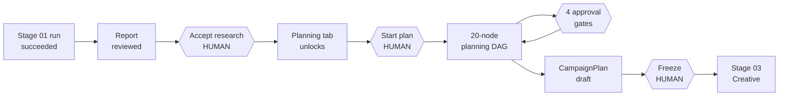
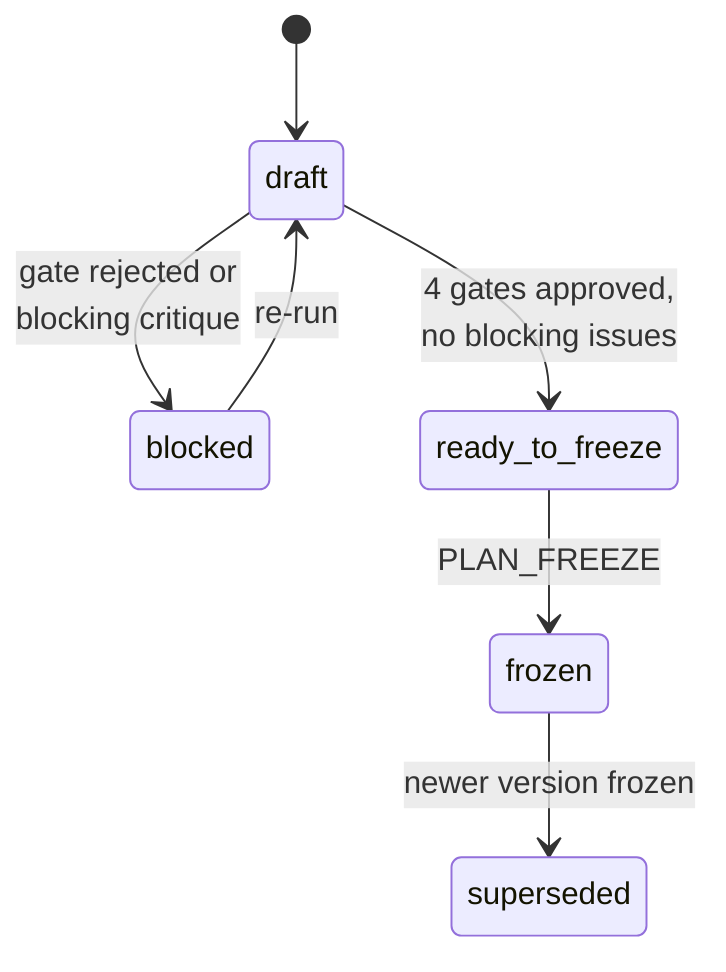

# PRD: Campaign Planning Agent (Stage 02 — Campaign Plan)

**Type:** Internal Tool PRD · **Owner:** Soham Sarker · **Version:** 1.0 · **Date:** 2026-09-21
**Status:** Ready to build
**Depends on:** `PRD-Paid-Ads-Research-Agent.md` (Stage 01) v1.2 — shipped and functional

---

## 0. Assumptions locked in this version

Stage 02 ships into the existing `ads-research-agent` codebase. Nothing here creates a second application.

| # | Assumption | Source |
|---|---|---|
| B1 | Stage 01 (Paid Ads Research Agent v1.2) is shipped and functional. Stage 02 ships into the **same repo, same five Railway services, same auth, same orchestrator, same Evidence store**. No new infrastructure, no second app. | Confirmed |
| B2 | Stage 02 is triggered **manually by a human** from a separate Campaign Planning tab, after the Stage 01 report has been reviewed and explicitly accepted. No auto-chaining, no schedule, no cascade. | Confirmed |
| B3 | Stage 02 reads Stage 01 only through the versioned `ResearchReport` contract plus its `Evidence` rows. It never re-executes a research node and never re-queries a research connector for facts research already established. | Confirmed |
| B4 | Scope = **Stage 02 Campaign Plan only**. Stages 03–07 (creative, build, launch, optimise, report) are out of scope; the `CampaignPlan` output contract is designed to feed Stage 03. | Confirmed |
| B5 | Stage 02 **writes nothing to the Google Ads account**. It reads the account and emits a plan artifact. Every mutation belongs to Stage 04. | Derived — the diagram's "expensive to undo" |
| B6 | **Four approval gates**, matching the stage diagram: campaign targets, lead definition, budget allocation, channel slate. No auto-approve, no expiry-based approval. | Confirmed (diagram) |
| B7 | Approvers are existing `approver`-role accounts. Stage 02 **adds no roles**. It adds two named humans to that role: a sales lead (lead definition) and a budget owner (allocation). | Inferred |
| B8 | All money, forecast, sizing and statistical-power arithmetic runs in **pandas/Python**. The LLM writes labels, rationale, names and prose only. | Carried from Stage 01, Law 3 |
| B9 | **One plan covers every market declared on the Project**, with a per-market allocation inside it. Not one plan per market. | Assumption — see Q5 |
| B10 | The Google Ads account is **brownfield**: live campaigns, existing naming, existing conversion actions. The planner must detect and avoid collisions, not assume an empty account. | Inferred from Stage 01 §9.1 |
| B11 | Platform scope for v1 is **Google Ads only** (Search, Performance Max, Demand Gen, Display remarketing, YouTube). No Meta, LinkedIn or Microsoft Ads. | Assumption — see Q11 |
| B12 | A **frozen plan is immutable**. Any change after freeze is a new plan version produced by a new plan run, diffable against the previous one. | Confirmed — "signed off before anything is built" |
| B13 | Google's bid-strategy learning thresholds, campaign minimums and structural rules are **configuration, not code or prompt text**. Google changes them; we version them in one file. | Derived constraint |

---

## 1. Executive Summary

Stage 02 turns an approved research report into a signed-off media plan in under 30 minutes of machine time.

The Campaign Planning Agent is a second 20-node DAG inside the existing app. An approver reviews the Stage 01 report, accepts it, opens the **Campaign Planning** tab and clicks Start. The agent then sets one measurable target per campaign, computes the most we can pay per customer, forecasts demand, builds three budget scenarios, picks the channel slate, generates the account structure down to keyword level, and writes the measurement and test plan.

Four decisions stop for a human yes — targets, lead definition, budget split, channel slate — because they are expensive to undo.

Output: a frozen, versioned `CampaignPlan` — forecast, account structure importable into Google Ads Editor, measurement plan. Nothing is written to the ad account. Stage 03 consumes the frozen plan.

---

## 2. Problem & Current Workflow

Research now finishes in 45 minutes. Turning it into a plan still takes two weeks, and the plan is built from memory of the research rather than from the research object.

| Step today | Owner | Time | Failure mode |
|---|---|---|---|
| Translate the business goal into a campaign target | Soham + leadership | 2h | One account-level target, set from last year, not from margin. No target per campaign |
| Decide which conversions count and what each is worth | ad-hoc | 1–2h | Every form fill counted equally. Smart Bidding optimises toward job applicants |
| Compute the most we can pay per customer | rarely done | 1h | Usually skipped. Budget is set by what is available, not by unit economics |
| Agree with sales what a good lead is | email threads | 1–3h across days | Never written down. Marketing and sales run on two different definitions |
| Build the budget split | Sheets | 3h | One scenario, no sensitivity. Nobody checks a campaign has enough conversions to exit learning |
| Choose campaign types | gut | 1h | Performance Max added because it is new. It eats brand traffic; nobody notices for a quarter |
| Name and structure the account | ad-hoc | 2–3h | Inconsistent names. Reporting is unreadable six months later |
| Write the measurement plan | rarely | 1h | GA4 and Google Ads disagree. Closed-won never flows back into the platform |
| Write the test list | never | — | Tests are improvised mid-flight, unranked, and never powered |

**Total ≈ 11–14 hours of work stretched across 1–2 weeks of waiting on approvals, produced once and never revised.**

Three structural failures sit underneath the hours:

1. **The handoff is lossy.** Research output is a document a human reads and partially remembers. Nothing forces the plan to be consistent with it.
2. **The expensive decisions are undocumented.** Budget, targets and structure get decided in a meeting or a thread, with no record of what was proposed, who approved it, or on what evidence.
3. **The plan is not a machine artifact.** It cannot be diffed, re-forecast, exported to Google Ads Editor, or handed to the next stage without a human retyping it.

---

## 3. Proposed Solution

A second DAG in the same application, behind a second tab, fed by the first stage's frozen output and unlocked only by a human.



Two of the five human touch points are new manual triggers (accept, start); one is new and terminal (freeze); the four gates behave exactly like Stage 01's gates.

An `operator` or `approver` opens a completed research run, reads the report, and clicks **Accept research**. That writes a `ResearchAcceptance` row and unlocks the Campaign Planning tab on that project. In the tab they click **Start campaign planning**. The planner then executes 20 typed nodes against the accepted `ResearchReport`, the project's Evidence store, CRM exports and a read-only pull of the live Google Ads account. Each node writes a validated JSON artifact. Every numeric output is computed in pandas and persisted as a `derived` Evidence row carrying its inputs, formula id and code version.

Four nodes halt their branch and land in the assigned approver's inbox: campaign targets, lead definition, budget allocation, channel slate. An approver can edit the proposal before approving — the budget gate re-forecasts server-side on edit, so the approver sees the consequence of their number before committing to it.

When all four are decided and the critique node returns no blocking issues, the plan reaches `ready_to_freeze`. A user with `PLAN_FREEZE` freezes it. Freezing snapshots an immutable, versioned `CampaignPlan` — the only artifact Stage 03 is permitted to read.

### Design principles

1. **The LLM never sources facts** — carried over from Stage 01. Connectors and the Stage 01 report supply facts; nodes classify, cluster, rank and write.
2. **The LLM never does arithmetic.** Every number in the plan resolves to a `derived` Evidence row with `inputs_hash`, `formula_id` and `calc_version`. A number without one fails validation.
3. **Four gates, no more.** Anything that is not expensive to undo runs unattended.
4. **Read-only against Google Ads.** Stage 02 has no write scope on the ad account, enforced at the connector layer, not by convention.
5. **Freeze is the boundary.** Draft plans are mutable and disposable; frozen plans are immutable and versioned. Stage 03 sees only frozen plans.

---

## 4. Stage 01 → Stage 02 Handshake

Two explicit human actions separate the stages, and one typed object crosses between them. There is no automatic chaining in either direction.

### 4.1 The two manual steps

1. **Accept research.** On `/projects/{id}/runs/{runId}/report`, a user holding `APPROVAL_DECIDE` clicks **Accept research** and leaves an optional note. This writes `ResearchAcceptance` and an `AuditLog` row in one transaction. Accepting is not the same as approving a gate — the three research gates are already decided by then; this records that a human read the finished report and considers it fit to plan from.
2. **Start campaign planning.** The user opens the **02 Campaign Planning** tab on the same project and clicks **Start campaign planning**. This creates a `Run` with `stage='plan'` and `source_run_id` pointing at the accepted research run.

Before acceptance the Campaign Planning tab is visible but locked, with the specific blocker named on the lock state. Never a hidden tab, never a silent disabled button.

### 4.2 Eligibility — binary preconditions

`GET /projects/{id}/plan/eligibility` returns `{eligible: bool, blockers: Blocker[]}`. The Start button reads that response; it never computes eligibility client-side.

| # | Check | On failure |
|---|---|---|
| E1 | A `ResearchAcceptance` exists for this project and is not superseded | `no_accepted_research` — link to the latest research run |
| E2 | The accepted report's `schema_version` is in `PLAN_SUPPORTED_RESEARCH_SCHEMAS` | `research_schema_unsupported` — names both versions |
| E3 | `launch_readiness != 'no_go'` | `research_says_no_go` — startable only with an `admin` override carrying a written reason, audit-logged |
| E4 | No plan run in flight for this project (Redis `project:{id}:plan_lock`) | `plan_in_flight` — names the holder and links to the running plan |
| E5 | No **frozen** plan already exists for this acceptance | `plan_already_frozen` — offers "start a new version" instead |
| E6 | An OpenRouter credential resolves for this project | `missing_credential` — names the credential kind |
| E7 | Acceptance age ≤ `PLAN_SOURCE_MAX_AGE_DAYS` (default 30) | `source_stale` — **warning only**, startable. Above 90 days it becomes a blocker with `admin` override |
| E8 | Actor holds `PLAN_EXECUTE` | `403` with the missing permission named |

### 4.3 The crossing contract — `PlanInput`

```python
class PlanInput(BaseModel):
    schema_version: Literal["1.0"]
    project_id: UUID
    research_run_id: UUID
    research_report_id: UUID
    research_schema_version: str        # validated against PLAN_SUPPORTED_RESEARCH_SCHEMAS
    accepted_by: UUID
    accepted_at: datetime
    acceptance_note: str | None
    override_reason: str | None         # set only when E3 was overridden

    launch_readiness: Literal["go", "go_with_fixes", "no_go"]
    launch_blockers: list[Claim]
    business_context: BusinessContext           # from 1.1.*
    account_learnings: AccountLearnings         # from 1.2.*
    competitive_landscape: CompetitiveLandscape # from 1.3.*
    demand_map: DemandMap                       # from 1.4.*
    readiness: Readiness                        # from 1.5.*
    priced_keyword_list: list[PricedKeyword]
    degraded_sources: list[str]
    markets: list[Market]
    product_context: dict
```

**Rules on the contract**

1. `PlanInput` is assembled once, at plan-run start, by `orchestrator/plan_input.py`. It is hashed into `Run.input_hash` and passed to every node read-only. No node re-reads the `Report` row.
2. Stage 01 `Evidence` rows stay resolvable inside the same project. Plan `Claim` objects may cite research `evidence_ids` directly.
3. A research section that came back empty or `insufficient_evidence` does not become a guess. The dependent plan node emits `status='insufficient_input'` with the named gap, and the plan carries it in `open_dependencies[]`.
4. `degraded_sources` from Stage 01 is carried through verbatim into the `CampaignPlan` and is displayed on the budget gate, because a forecast built on degraded demand data must not look as confident as one that is not.
5. Version skew is caught at trigger time, not mid-run. An unsupported `research_schema_version` returns `422` before a single token is spent.

### 4.4 Re-running research after a plan exists

A newer accepted research run does **not** invalidate a frozen plan. It marks it `source_superseded` and shows a banner offering a re-plan. A draft plan whose source acceptance is superseded cannot be frozen until it is re-run against the new acceptance.

---

## 5. Users, Roles & Permissions — delta only

Stage 02 adds **no roles** and **two permissions**. Everything in Stage 01 §4 stands unchanged.

### 5.1 New permissions

| Permission | Granted to | Guards |
|---|---|---|
| `PLAN_EXECUTE` | `admin`, `operator` | Start, cancel, retry a plan run |
| `PLAN_FREEZE` | `admin`, `approver` | Freeze a draft plan into an immutable version |

Accepting a research report reuses `APPROVAL_DECIDE`, because it is an approval-class act: the same people who decided the research gates sign off that the report is fit to plan from. Both new permissions go into the existing `rbac.py` `ROLE_PERMISSIONS` table. No route reads a role string.

### 5.2 Permission matrix — Stage 02 actions

| Action | admin | operator | approver | viewer |
|---|:--:|:--:|:--:|:--:|
| Read plan, structure, forecast, test backlog | ✅ | ✅ | ✅ | ✅ |
| Export plan (PDF/DOCX/JSON/CSV/XLSX) | ✅ | ✅ | ✅ | ✅ |
| Accept a research report | ✅ | ❌ | ✅ | ❌ |
| Start / cancel / retry a plan run | ✅ | ✅ | ❌ | ❌ |
| Decide a plan gate | ✅ | ❌ | ✅ (own gates) | ❌ |
| Edit a gate proposal before approving | ✅ | ❌ | ✅ (own gates) | ❌ |
| Run a budget what-if recalculation | ✅ | ✅ | ✅ | ❌ |
| Freeze a plan | ✅ | ❌ | ✅ | ❌ |
| Override a `no_go` research verdict | ✅ | ❌ | ❌ | ❌ |
| Edit planning constants | ✅ | ❌ | ❌ | ❌ |
| Assign default gate approvers | ✅ | ✅ | ❌ | ❌ |

**Rule carried from Stage 01:** an `operator` cannot decide a gate, including on a run they triggered themselves.

### 5.3 Gate routing

Four gates, each with a `required_role` and a default assignee set per project in the planning setup step. Unassigned means any holder of `approver` or `admin` may claim it.

| Gate | Node | Default assignee | The decision being made |
|---|---|---|---|
| G1 | 2.1.3 `campaign_targets` | Marketing lead | One measurable target per campaign, and whether the agent's target is accepted or edited |
| G2 | 2.1.4 `lead_definition` | Sales lead | What counts as a qualified lead, and the disqualifiers |
| G3 | 2.2.4 `budget_allocation` | Budget owner | The monthly envelope, the chosen scenario, and the split across campaigns and markets |
| G4 | 2.3.1 `channel_slate` | Marketing lead | Which campaign types run, and in which launch wave |

G1 and G2 run in parallel and do not block each other. G3 depends on G1. G4 depends on G3. A rejected gate fails its branch and leaves the plan in `blocked`, with the rejection note surfaced on the plan header — it is never silently retried.

---

## 6. Architecture — delta only

**No new services.** The same five Railway services (`web`, `api`, `worker`, `postgres`, `redis`), the same Docker Compose mirror, the same private network, the same Volume on `worker`. Stage 02 is new modules inside `apps/api` and new routes inside `apps/web`.

Everything in Stage 01 §5 and §5.2 applies verbatim: bind `::`, read `$PORT`, relative `/api/v1` paths only, migrations in `preDeployCommand`, all durable artifacts through `storage/backend.py`, no `if RAILWAY` branch.

### 6.1 New modules in `apps/api/src/agent/`

```
agent/
├─ orchestrator/
│  ├─ dag.py               # EXTENDED: dag_research + dag_plan, both validated acyclic
│  ├─ registry.py          # EXTENDED: nodes keyed by (stage, node_id)
│  └─ plan_input.py        # NEW: builds + hashes PlanInput from an accepted research run
├─ nodes/plan/             # NEW: n2_1_1_*.py … n2_6_2_plan_critique.py  (20 nodes)
├─ calc/                   # NEW: the arithmetic layer — no LLM, no I/O beyond Evidence
│  ├─ economics.py         #   max CPA/CPL, LTV, payback, blended targets
│  ├─ forecast.py          #   clicks · CPC · CVR · seasonality → cost, conv, CPA
│  ├─ scenarios.py         #   cautious | expected | aggressive envelopes
│  ├─ allocation.py        #   split solver + what-if recalculation for the budget gate
│  ├─ structure.py         #   ad-group grouping, volume floors, naming validation
│  ├─ power.py             #   MDE and sample size for the test backlog
│  └─ derived.py           #   writes every result as a `derived` Evidence row
├─ planning/
│  ├─ constants.py         # NEW: loads + validates planning_constants.yaml
│  ├─ freeze.py            # NEW: draft → frozen transition, version minting
│  └─ diff.py              # NEW: plan-vs-plan structural diff
├─ connectors/
│  ├─ google_ads.py        # EXTENDED: read-only account snapshot + forecast metrics
│  └─ base.py              # EXTENDED: ReadOnlyConnector marker, asserted for stage=plan
└─ export/
   ├─ editor_csv.py        # NEW: Google Ads Editor import sheets
   ├─ budget_xlsx.py       # NEW: the media plan as a workbook
   └─ templates/plan_*.jinja  # NEW: plan markdown, plan PDF stylesheet, plan reference.docx
```

`planning_constants.yaml` lives at `apps/api/src/agent/planning/planning_constants.yaml`, is loaded at startup, validated against a Pydantic model, and is overridable per project in Settings. Its version string is written into every `derived` Evidence row.

### 6.2 New surfaces in `apps/web/`

```
app/(routes)/projects/[id]/
├─ layout.tsx              # EXTENDED: stage tabs — 01 Research | 02 Campaign Planning
└─ plan/
   ├─ page.tsx             # Stage 02 landing: eligibility, start, plan history
   └─ runs/[planRunId]/
      ├─ page.tsx          # Plan Console (the Run Console, stage-aware)
      └─ plan/page.tsx     # Plan Viewer
components/plan/
├─ StageTabs.tsx  EligibilityLock.tsx  StartPlanDialog.tsx
├─ AllocationEditor.tsx    # the budget gate's editable split, server-recalculated
├─ StructureTree.tsx       # campaign → ad group → keywords → landing page
├─ ForecastChart.tsx  TestBacklogTable.tsx  FreezeDialog.tsx
└─ PlanDiff.tsx
```

### 6.3 What is reused without modification

The LLM gateway, cost ledger, model router, SSE channel, retry/repair loop, checkpointing, cancellation, budget guard, approvals inbox, Evidence store and search, audit log, credential vault, session layer, export job queue and file server. Stage 02 adds node types and contracts to an engine that already exists — if a Stage 02 task requires touching the executor's core loop, that is a signal the design is wrong.

---

## 7. Data Model — delta only

Three new tables, four altered columns, one generalised table. Everything else in Stage 01 §6 is untouched, including `WorkspaceScopedRepo` on every query.

### 7.1 Altered

```python
Run:
  + stage         enum[research|plan] NOT NULL DEFAULT 'research'
  + source_run_id fk->Run NULL        # plan run → the research run it consumes
  + input_hash    text NULL           # hash of PlanInput; enables cache reuse
  # parent_run_id keeps its Stage 01 meaning: the previous run of the SAME stage
  # CHECK (stage = 'plan') = (source_run_id IS NOT NULL)

Approval:
  + gate_key      text NOT NULL       # 'G1'..'G4' for plan gates, 'R1'..'R3' for research
  + recalc_state  jsonb NULL          # last what-if payload shown to the approver

Project.settings:
  + plan_approvers   {G1,G2,G3,G4} -> user_id | null
  + planning_overrides  # per-project overrides of planning_constants.yaml

Export:
  ~ report_id fk  ->  artifact_type enum[research_report|campaign_plan] + artifact_id uuid
  ~ format enum   ->  + editor_csv, xlsx
```

Indexes added: `Run(project_id, stage, started_at desc)`, `Approval(gate_key, status)`, `CampaignPlan(project_id, version desc)`.

### 7.2 New tables

```python
ResearchAcceptance(
    id uuid pk, workspace_id fk, project_id fk,
    run_id fk->Run unique,            # the research run being accepted
    report_id fk->Report,
    accepted_by fk->User, accepted_at,
    note text null,
    launch_readiness_at_acceptance text,
    override_reason text null,        # non-null only when E3 was overridden
    superseded_by fk->ResearchAcceptance null,
    created_at)
    # One acceptance per research run. A project may hold many over time;
    # exactly one is current (superseded_by IS NULL), enforced by a partial
    # unique index on (project_id) WHERE superseded_by IS NULL.

CampaignPlan(
    id uuid pk, workspace_id fk, project_id fk,
    plan_run_id fk->Run unique,
    acceptance_id fk->ResearchAcceptance,
    schema_version text, version int,           # 1, 2, 3 … per project
    status enum[draft|blocked|ready_to_freeze|frozen|superseded],
    payload jsonb,                              # the CampaignPlan object (§12)
    markdown text,
    frozen_at null, frozen_by fk->User null,
    frozen_approval_ids uuid[] null,            # the four gates sealed by the freeze
    source_superseded bool default false,
    created_at, updated_at)
    UNIQUE(project_id, version)
    # Rows with status='frozen' are append-only: an UPDATE that changes payload,
    # markdown or version on a frozen row is rejected by a BEFORE UPDATE trigger.

PlanCalc(
    id uuid pk, plan_run_id fk->Run, node_id text,
    formula_id text,            # 'economics.max_cpa_v1'
    calc_version text,          # constants file version + code version
    inputs jsonb, inputs_hash text,
    result jsonb,
    evidence_id fk->Evidence,   # the `derived` row this calculation produced
    created_at)
    UNIQUE(plan_run_id, formula_id, inputs_hash)
    # The audit trail for every number in the plan. Re-running with identical
    # inputs reuses the row instead of recomputing.
```

### 7.3 Evidence usage

No schema change. Stage 02 writes two kinds of rows into the existing table:

| `source` | `kind` | Written by |
|---|---|---|
| `google_ads` | `account_snapshot`, `conversion_actions`, `keyword_forecast` | the read-only account connector |
| `derived` | `calc_economics`, `calc_forecast`, `calc_scenario`, `calc_allocation`, `calc_structure`, `calc_power` | `calc/derived.py` |

A `derived` row's `payload` carries `{formula_id, calc_version, inputs_hash, inputs, result}` and its `content_text` is a one-line human rendering of the calculation, so it is searchable in the Evidence Explorer alongside everything else.

### 7.4 Migration notes

1. One Alembic revision. `Run.stage` backfills to `'research'` for every existing row before the `NOT NULL` is applied.
2. `Export` migration copies `report_id` into `artifact_id` with `artifact_type='research_report'`, then drops `report_id`. Existing download URLs keep working because they resolve by `Export.id`.
3. The frozen-row trigger ships in the same revision, with a `pytest` case that asserts an `UPDATE` on a frozen plan raises.

---

## 8. Orchestration — delta only

One executor runs both stages. The DAG it executes is selected by `Run.stage`.

### 8.1 Registry and DAG

1. `registry.py` keys nodes by `(stage, node_id)`. `dag.py` exports `DAGS = {"research": …, "plan": …}`; both are static edge lists validated acyclic at import, and a CI test asserts every registered node appears in exactly one DAG.
2. `NodeSpec` gains three fields:
   - `stage_group: str` — `"2.1"` … `"2.6"`, used by the console's left rail
   - `calc: list[str]` — the `formula_id`s this node is permitted to invoke. A node calling a formula outside its list raises at runtime
   - `gate_key: str | None` — `"G1"`…`"G4"`
3. A plan node's `gather()` returns Stage 01 Evidence plus any `derived` rows its `calc` step produced. `reason()` receives them and `PlanInput`, and may not open a network connection.

### 8.2 Unchanged mechanics

Topological wavefront execution with `asyncio.Semaphore(4)`; 3 retries with exponential backoff; one schema-repair pass before an attempt is counted; a `NodeRun` persisted on every completion; resume skips `succeeded` nodes; cooperative cancellation via `run:{id}:cancel`; SSE event types and the 15s heartbeat. None of this is re-implemented.

### 8.3 What is new

| Concern | Behaviour |
|---|---|
| **Plan lock** | Redis `project:{id}:plan_lock`, 2h TTL, separate from the research lock. A project may run research and hold a draft plan at the same time, but never two plan runs |
| **Budget guard** | `project.settings.max_plan_cost_usd`, default **$8.00**. Lower than research because there is no crawling and no 2,000-keyword classification pass |
| **Cache reuse** | `Run.input_hash` is the hash of `PlanInput` plus the constants version. A re-run with an identical hash and `reuse_cache=true` skips deterministic nodes and reuses their `NodeRun` output. Gate nodes are never cache-skipped |
| **Gate what-if** | `POST /approvals/{id}/recalc` runs `calc/allocation.py` against the approver's edited numbers and returns the new forecast **without resuming the run** and without an LLM call. The result is stored on `Approval.recalc_state` so a second approver sees the same working |
| **Terminal states** | A plan run ends `succeeded` with `CampaignPlan.status ∈ {ready_to_freeze, blocked}`. `blocked` means a gate was rejected or the critique returned a blocking issue. `succeeded` never means "approved" |
| **Read-only enforcement** | Connectors used by `stage='plan'` must subclass `ReadOnlyConnector`. The executor asserts this before `gather()`. Any Google Ads mutate operation raises `MutationForbidden` at the connector layer |

### 8.4 Gate resumption

Identical to Stage 01: the node writes `Approval(pending, required_role, assignee_id, gate_key)`, sets `Run.status='awaiting_approval'`, and halts **that branch only**. G2 (`lead_definition`) is off the critical path, so 2.5.1 and 2.5.2 keep executing while sales deliberates.

On approval the branch resumes with the approver's `edited_proposal` if present, otherwise the agent's `proposal`. The edited object is re-validated against the node's `output_model` before the branch resumes — an approver cannot hand the DAG a shape it cannot consume. A failed re-validation returns `422` to the approver with the offending field named, and the gate stays pending.

---

## 9. Calculation Engine, Planning Constants & LLM Routing

Every number in a campaign plan is produced by a registered formula, not by a model. This section is the mechanism that makes Law 3 enforceable rather than aspirational.

### 9.1 The `calc/` contract

1. Every public function in `calc/` is decorated `@formula("economics.max_cpa_v1")` and returns `CalcResult(value, inputs, formula_id, calc_version)`. `calc_version` = code version + `planning_constants.yaml` version.
2. `calc/` functions are pure: pandas in, dataclass out. No network, no ORM, no LLM. They are unit-tested against fixture frames with hand-checked expected values.
3. `calc/derived.py` is the only writer. It persists a `PlanCalc` row and an `Evidence(source='derived')` row, and returns the `evidence_id`.
4. Every plan node whose output contains a number declares `calc_evidence_ids: list[UUID] = Field(min_length=1)` on its output model. The executor validates that set is a subset of the `derived` rows this node produced. **A number with no calculation behind it fails schema validation**, exactly as an unsupported claim does in Stage 01.
5. A CI test walks `nodes/plan/` and fails the build if an output model declares a numeric field without `calc_evidence_ids`.

### 9.2 Core formulas

The ceiling that every target is derived from:

```
maxCPL = (ACV × grossMargin ÷ targetCacRatio) × closeRate(lead→won)
```

| `formula_id` | Computes | Primary inputs |
|---|---|---|
| `economics.max_cpa_v1` | Max payable per closed-won customer and per lead | ACV, gross margin, close rate, target CAC ratio (Stage 01 node 1.1.1 + CRM) |
| `economics.payback_v1` | CAC payback in months, LTV:CAC | ACV, margin, contract term, max CPA |
| `forecast.traffic_v1` | Impressions → clicks → conversions → cost → CPA per cluster per month | Search volume, CPC range, account CTR and CVR, seasonality index (Stage 01 node 1.4.3) |
| `scenarios.envelope_v1` | Cautious / expected / aggressive totals | Traffic forecast, impression-share headroom, budget floors |
| `allocation.split_v1` | Budget split across campaign × market × funnel stage | Envelope, forecast CPA, target CPA, strategic weights |
| `allocation.whatif_v1` | Re-forecast from an approver's edited split | The above, plus the edited allocation |
| `structure.volume_check_v1` | Forecast conversions per campaign per 30 days vs the learning threshold | Allocation, forecast CVR, constants |
| `structure.grouping_v1` | Keyword → ad-group assignment, coherence score, orphan list | Priced keyword list, intent labels, page map (Stage 01 node 1.4.5) |
| `power.sample_size_v1` | Conversions per arm and days to significance per test | Baseline CVR, MDE, alpha, power, forecast traffic |

### 9.3 `planning_constants.yaml`

Google changes its thresholds. Hardcoding them in a prompt or a function body means a silent wrong plan six months from now.

```yaml
version: "2026.09.1"
learning:
  tcpa_min_conv_30d:      { value: 30, source: "<url>", reviewed_at: 2026-09-15 }
  troas_min_conv_30d:     { value: 50, source: "<url>", reviewed_at: 2026-09-15 }
  absolute_min_conv_30d:  { value: 15, source: "<url>", reviewed_at: 2026-09-15 }
  learning_period_days:   { value: 7,  source: "<url>", reviewed_at: 2026-09-15 }
structure:
  min_keywords_per_ad_group: { value: 5,  source: "internal", reviewed_at: 2026-09-15 }
  max_keywords_per_ad_group: { value: 20, source: "internal", reviewed_at: 2026-09-15 }
  min_ad_groups_per_campaign:{ value: 3,  source: "internal", reviewed_at: 2026-09-15 }
economics:
  target_cac_ratio:       { value: 3.0, source: "internal", reviewed_at: 2026-09-15 }
  safety_margin_pct:      { value: 15,  source: "internal", reviewed_at: 2026-09-15 }
budget:
  min_monthly_per_campaign_usd: { value: 1000, source: "internal", reviewed_at: 2026-09-15 }
  experiment_reserve_pct:       { value: 10,   source: "internal", reviewed_at: 2026-09-15 }
test:
  alpha:       { value: 0.05, source: "internal", reviewed_at: 2026-09-15 }
  power:       { value: 0.80, source: "internal", reviewed_at: 2026-09-15 }
  min_mde_pct: { value: 20,   source: "internal", reviewed_at: 2026-09-15 }
```

**Rules.** Every constant carries `value`, `source` and `reviewed_at`. A constant missing `source` fails startup validation. The file's `version` is stamped into every `PlanCalc` row, so any plan can be re-derived against the constants it was actually built with. Per-project overrides live in `Project.settings.planning_overrides` and are merged at run start, then hashed into `Run.input_hash`.

The values above are **seed values, not verified constants** — see Q7.

### 9.4 Model routing

Same `llm/router.py`, same per-task-class map, same runtime-hydrated model IDs, same per-project override. Stage 02's distribution differs from Stage 01's: far less extraction, more synthesis.

| Task class | Stage 02 usage | Seed model |
|---|---|---|
| `EXTRACT` | Account snapshot normalisation, naming-collision parsing | `google/gemini-2.5-flash` |
| `CLASSIFY` | Conversion categorisation (2.1.1), ad-group theme labelling (2.4.2) | `anthropic/claude-haiku-4.5` |
| `SYNTHESIZE` | Targets, lead definition, channel slate, plan synthesis (2.1.3, 2.1.4, 2.3.1, 2.6.1) | `anthropic/claude-opus-4.6` |
| `CRITIQUE` | Plan critique (2.6.2), different model family | `openai/gpt-5.2` |

`temperature=0`, `top_p=1` on `EXTRACT` and `CLASSIFY`, as in Stage 01. Expected token spend is roughly 40% of a research run, which is where the $8 default cap comes from.

---

## 10. Data Inputs & Connectors

Stage 02 adds **one connector extension and no new connectors**. Most of its input is already in the database.

### 10.1 Input map

| Input | Source | Feeds |
|---|---|---|
| Offer economics, ICP, negative ICP, market coverage, compliance guardrails | `PlanInput.business_context` (Stage 01 1.1.*) | 2.1.1, 2.1.2, 2.1.4, 2.3.1 |
| Historical winners, search-term P&L, failed experiments | `PlanInput.account_learnings` (1.2.*) | 2.1.1, 2.2.1, 2.3.1, 2.5.3 |
| Competitor set, creative corpus, spend estimates, differentiation claim | `PlanInput.competitive_landscape` (1.3.*) | 2.3.1, 2.4.2, 2.5.3 |
| Priced keyword list, intent labels, negatives, keyword→page map | `PlanInput.demand_map` (1.4.*) | 2.2.1, 2.4.2, 2.4.3 |
| Landing-page audit, tracking probe, consent check, opportunity sizing | `PlanInput.readiness` (1.5.*) | 2.2.3, 2.4.2, 2.5.1, 2.5.2 |
| Live account structure, conversion actions, CTR/CVR by campaign type | `google_ads` connector, **read-only** | 2.1.1, 2.2.1, 2.4.1, 2.5.1 |
| Keyword forecast metrics | `google_ads` forecast extension | 2.2.1 |
| Closed-won / closed-lost rows | existing `csv_ingest` Evidence | 2.1.1, 2.1.2, 2.1.4 |
| GCLID capture check on the site | existing `web_crawler` Evidence (form fields) | 2.5.2 |

### 10.2 `google_ads` — new read operations

Added to the existing connector, all under a `ReadOnlyConnector` subclass. The plan stage never instantiates a client with mutate scope.

| Operation | GAQL / service | Emits `Evidence.kind` |
|---|---|---|
| Account structure snapshot | `campaign`, `ad_group`, `ad_group_criterion` | `account_snapshot` |
| Conversion actions | `conversion_action` (name, category, counting, value settings, status, last conversion) | `conversion_actions` |
| Performance by campaign type | `campaign` + `metrics` segmented by `advertising_channel_type` | `channel_benchmarks` |
| Budget and bid strategy state | `campaign_budget`, `bidding_strategy` | `account_snapshot` |
| Forecast metrics | `KeywordPlanIdeaService` / `GenerateKeywordForecastMetrics` for the planned keyword set | `keyword_forecast` |

**Fallback, per Stage 01 §9.1.** If the forecast service is unavailable or the developer token lacks the operation, `forecast.traffic_v1` falls back to arithmetic on the Stage 01 demand data: `volume × estimated CTR × CPC × account CVR`, seasonally weighted. The connector raises `ConnectorDegraded`, `degraded_sources` gains `google_ads_forecast`, and the budget gate renders a wider confidence band with the substitution named on the card. The run never stops for this.

### 10.3 Outputs

| Output | Consumer |
|---|---|
| `CampaignPlan` JSON (§12) | Stage 03, the Plan Viewer, the diff engine |
| Google Ads Editor CSV set | A human importing the structure into Editor; Stage 04 later |
| Budget workbook (XLSX) | Finance, the budget owner |
| Plan PDF / DOCX | Leadership sign-off record |
| `PlanCalc` rows | Audit — how every number was reached |

---

## 11. Agent Nodes — the planning DAG

20 nodes: 18 planning plus 2 report. Four carry gates, marked **⛳**. Node IDs are ordered by dependency, not by the reading order of the stage diagram — the diagram lists the approval first in 2.1, but a target cannot be drafted before the ceiling that bounds it is computed.

### Stage 2.1 — Set the goal and the numbers

| ID | Node | Inputs | Output (core fields) |
|---|---|---|---|
| 2.1.1 | `conversion_taxonomy` | `business_context`, CRM won/lost, `conversion_actions` | `actions[]{name, ads_action_id, category, counting ∈ {one_per_click, every}, value_model ∈ {fixed, dynamic, none}, assigned_value_usd, lead_to_won_rate_pct, rank, primary bool, include_in_conversions bool, rationale}`, `deprecate[]{action, reason}` |
| 2.1.2 | `unit_economics_ceiling` | 1.1.1, CRM won, 2.1.1 | `by_segment[]{segment, acv_usd, gross_margin_pct, lead_to_won_pct, max_cpa_won_usd, max_cpl_usd, target_cpl_usd, target_roas, payback_months}`, `blended{…}`, `method_notes` — **pandas only, LLM writes `method_notes`** |
| 2.1.3 ⛳ | `campaign_targets` | 2.1.1, 2.1.2, `demand_map`, `account_learnings` | `objectives[]{campaign_ref, objective ∈ {lead_gen, demo, trial, brand_defense, remarketing}, primary_kpi ∈ {cpl, cpa, roas, conv_volume}, target_value, ceiling_value, basis, ramp[]{month, target}, confidence, evidence_ids}`, `north_star{metric, target, period}` — **G1 → marketing lead** |
| 2.1.4 ⛳ | `lead_definition` | CRM won + lost, 2.1.1, 1.1.2, 1.1.3 | `qualified_lead{required_signals[], disqualifiers[], scoring[]{signal, weight, source_field}, threshold}`, `expected_mql_to_sql_pct`, `sla_response_hours`, `routing[]{segment, owner}`, `observed_rejection_reasons[]` — **G2 → sales lead** |

### Stage 2.2 — Decide the budget

| ID | Node | Inputs | Output (core fields) |
|---|---|---|---|
| 2.2.1 | `demand_forecast` | `demand_map`, `keyword_forecast`, `channel_benchmarks`, `account_learnings` | `forecast[]{cluster, market, month, impressions, ctr_pct, clicks, avg_cpc_usd, cvr_pct, conversions, cost_usd, cpa_usd}`, `method ∈ {google_forecast, derived_arithmetic}`, `confidence_band{low_pct, high_pct}`, `impression_share_headroom_pct` |
| 2.2.2 | `learning_capacity_check` | 2.2.1, 2.1.3, constants | `campaigns[]{ref, forecast_conv_30d, threshold, bid_strategy_recommended ∈ {manual_cpc, max_clicks, max_conv, tcpa, troas}, verdict ∈ {clears, marginal, below}, remedy ∈ {merge, broaden, switch_strategy, raise_budget, defer_to_wave_2}}` |
| 2.2.3 | `budget_scenarios` | 2.2.1, 2.2.2, 2.1.2, 2.1.3 | `scenarios[]{name ∈ {cautious, expected, aggressive}, monthly_total_usd, allocation[]{campaign_ref, market, funnel_stage, pct, usd}, est_clicks, est_conv, est_cpa, est_pipeline_usd, payback_months, assumptions[], risks[]}`, `recommended` |
| 2.2.4 ⛳ | `budget_allocation` | 2.2.3, 2.2.2, `degraded_sources` | `chosen_scenario`, `envelope{monthly_cap_usd, quarterly_cap_usd, currency}`, `allocation[]{…}`, `experiment_reserve_pct`, `edits_applied[]` — **G3 → budget owner, what-if recalculation enabled** |
| 2.2.5 | `reallocation_rules` | 2.2.4, 2.1.3 | `rules[]{id, trigger_metric, comparison, threshold, lookback_days, from_campaign, to_campaign, max_shift_pct, cooldown_days, requires_human bool, rationale}`, `review_cadence` |

### Stage 2.3 — Choose the campaign types

| ID | Node | Inputs | Output (core fields) |
|---|---|---|---|
| 2.3.1 ⛳ | `channel_slate` | 2.2.4, 2.1.3, `competitive_landscape`, `readiness` | `slate[]{campaign_type, market, launch_wave, rationale, entry_criteria[], exit_criteria[], prerequisites[], est_share_of_budget_pct}`, `rejected[]{campaign_type, why_not}` — **G4 → marketing lead** |
| 2.3.2 | `automation_boundaries` | 2.3.1, 2.3.3 | `pmax{allowed, included_themes[], excluded_urls[], brand_exclusion_required bool, account_negatives[]}`, `broad_match{allowed_campaigns[], guardrails[]}`, `overlap[]{campaign_a, campaign_b, overlap_pct, resolution}` |
| 2.3.3 | `brand_isolation` | 2.3.1, `demand_map`, `competitive_landscape` | `brand_terms[]{term, variant_type}`, `brand_campaign{match_types[], budget_pct, target}`, `negatives_for_nonbrand[]`, `reporting_rule`, `competitor_bidding_policy` |

### Stage 2.4 — Decide how the account is organised

| ID | Node | Inputs | Output (core fields) |
|---|---|---|---|
| 2.4.1 | `naming_convention` | 2.3.1, `account_snapshot` | `patterns{campaign, ad_group, ad, asset_group, audience, budget}`, `tokens[]{token, allowed_values[], source}`, `validator_regex`, `examples[]`, `collisions[]{existing_name, conflict_type, resolution}` |
| 2.4.2 | `account_structure` | 2.3.1, 2.3.3, 2.4.1, 2.2.4, `demand_map` | `campaigns[]{name, type, market, language, daily_budget_usd, bid_strategy, target, locations[], ad_groups[]{name, theme, landing_url, primary_message, keywords[]{term, match_type, forecast_cpc_usd}, negatives[]}}`, `account_negatives[]`, `orphan_terms[]`, `coherence_scores[]` |
| 2.4.3 | `structure_volume_check` | 2.4.2, 2.2.4, 2.2.2 | `campaigns[]{ref, ad_group_count, keyword_count, forecast_clicks_30d, forecast_conv_30d, budget_to_cpc_ratio, verdict, action ∈ {ship, merge_into, split, defer}}`, `structure_verdict ∈ {sound, needs_merge, too_thin}` |

### Stage 2.5 — Decide how we measure and what we test

| ID | Node | Inputs | Output (core fields) |
|---|---|---|---|
| 2.5.1 | `measurement_source_of_truth` | 2.1.1, 1.5.2 tracking probe, `account_snapshot` | `primary_source ∈ {google_ads, ga4, crm, warehouse}`, `metric_definitions[]{metric, formula, source_field, owner, refresh}`, `reconciliation[]{metric, tolerance_pct, cadence, owner}`, `known_discrepancies[]{metric, systems[], cause, tolerated}`, `dashboard_spec{fields[], grain, cadence}` |
| 2.5.2 | `offline_conversion_plan` | 2.1.1, 2.1.4, 1.5.3 consent, crawler form fields | `gclid_capture{point, form_field, storage_object, present_today bool}`, `upload{method ∈ {ads_api, sheets_link, manual_csv}, cadence, lag_days, backfill_days}`, `stage_map[]{crm_stage, ads_conversion_action, value_field}`, `consent{markets_allowed[], markets_blocked[], basis}`, `prerequisites[]{task, owner, blocking bool}` |
| 2.5.3 | `experiment_backlog` | 2.4.2, 2.2.4, 2.3.1, `competitive_landscape` | `tests[]{id, hypothesis, campaign_ref, variable ∈ {bid_strategy, landing_page, audience, match_type, budget, ad_schedule, geo}, primary_metric, baseline, mde_pct, required_conv_per_arm, est_days_to_significance, impact_1_5, confidence_1_5, effort_1_5, ice_score, rank, earliest_wave, reserve_usd}`, `not_yet[]{test, blocked_by}` — **sample sizes from `power.sample_size_v1`, never estimated by the model** |

### Stage 2.6 — Plan

| ID | Node | Output |
|---|---|---|
| 2.6.1 | `plan_synthesis` | The full `CampaignPlan` object (§12). `SYNTHESIZE` class |
| 2.6.2 | `plan_critique` | `issues[]{severity ∈ {blocking, warning, note}, section, finding, fix}`, `verdict`. `CRITIQUE` class, different model family. Any `blocking` issue re-runs 2.6.1 **once** with the critique appended |

**The critique's checklist is fixed and asserted in tests, not left to the model's discretion:**

1. Allocation sums to the approved envelope within ±0.5%.
2. Every campaign carries a target, a primary conversion action and a bid strategy consistent with 2.2.2.
3. No `target_value` exceeds its `ceiling_value` from 2.1.2.
4. No keyword appears in two ad groups; no ad group lacks a landing URL.
5. Brand terms appear only in the brand campaign and as negatives everywhere else.
6. Every campaign either clears its learning threshold or carries a named remedy.
7. Every `Claim` has ≥1 `evidence_id`; every number has ≥1 `calc_evidence_id`.
8. Markets blocked by the Stage 01 consent gate carry no audience-list dependency.
9. Every generated name passes `validator_regex` and collides with nothing in the live account.
10. Every Stage 01 `launch_blocker` is either resolved in the plan or listed in `open_dependencies`.

### DAG edges

```
2.1.1←{}            2.1.2←{2.1.1}
2.1.3←{2.1.1,2.1.2} ⛳G1        2.1.4←{2.1.1} ⛳G2
2.2.1←{2.1.1}       2.2.2←{2.2.1,2.1.3}     2.2.3←{2.2.1,2.2.2,2.1.2,2.1.3}
2.2.4←{2.2.3,2.2.2} ⛳G3        2.2.5←{2.2.4}
2.3.1←{2.2.4,2.1.3} ⛳G4        2.3.3←{2.3.1}      2.3.2←{2.3.1,2.3.3}
2.4.1←{2.3.1}       2.4.2←{2.3.1,2.3.3,2.4.1,2.2.4}      2.4.3←{2.4.2,2.2.4,2.2.2}
2.5.1←{2.1.1}       2.5.2←{2.1.1,2.1.4}     2.5.3←{2.4.2,2.2.4,2.3.1}
2.6.1←{all}         2.6.2←{2.6.1}
```

The critical path runs 2.1.1 → 2.1.2 → **G1** → 2.2.1–2.2.3 → **G3** → **G4** → 2.4.2 → 2.6.1. G2 and the 2.5 branch execute in parallel with it, so a slow sales approver never blocks the structure build.

---

## 12. Plan Contract

`CampaignPlan` is the handoff artifact to Stage 03 and the only thing Stage 03 may read. Versioned with `schema_version`.

```python
class Number(BaseModel):
    """Any figure that appears in the plan. Traceable by construction."""
    value: Decimal
    unit: Literal["usd", "pct", "count", "days", "months", "ratio"]
    calc_evidence_id: UUID                    # resolves to a PlanCalc + derived Evidence row
    confidence: Literal["high", "medium", "low"]

class CampaignPlan(BaseModel):
    schema_version: Literal["1.0"]
    project_id: UUID; plan_run_id: UUID; version: int; generated_at: datetime

    source: PlanSource                        # research_run_id, report_id, acceptance_id,
                                              # accepted_by, accepted_at, degraded_sources
    executive_summary: str                    # <= 250 words
    plan_status: Literal["draft", "blocked", "ready_to_freeze", "frozen"]

    objectives: Objectives                    # 2.1.1, 2.1.2, 2.1.3, 2.1.4
    media_plan: MediaPlan                     # 2.2.* — forecast, scenarios, envelope,
                                              #         allocation, reallocation rules
    channel_slate: ChannelSlate               # 2.3.*
    account_structure: AccountStructure       # 2.4.*
    measurement_plan: MeasurementPlan         # 2.5.1, 2.5.2
    experiment_backlog: list[Experiment]      # 2.5.3

    decisions: list[GateDecision]             # the four gates: proposal, edits, decider,
                                              # timestamp, note
    open_dependencies: list[Dependency]       # blocking prerequisites carried from Stage 01
                                              # or raised by 2.5.2, each with an owner
    assumptions: list[Claim]
    risks: list[Claim]
    constants_version: str
    cost_usd: float
```

**Invariants enforced at validation, not in review:**

1. Every `Number` resolves to a `PlanCalc` row belonging to this plan run.
2. Every `Claim` carries ≥1 `evidence_id` that resolves inside this project.
3. `decisions` contains exactly four entries, one per gate, each `approved`.
4. `sum(media_plan.allocation[].usd) == media_plan.envelope.monthly_cap_usd` within ±0.5%.
5. `account_structure` passes `naming_convention.validator_regex` on every generated name.

### 12.1 Markdown and rendering

`markdown` is rendered from the object by a deterministic Jinja2 template. **The LLM does not write the final markdown** — it fills the object. PDF, DOCX and JSON therefore cannot diverge. Same rule as Stage 01 §11.

### 12.2 Freeze semantics



Freezing is a single transaction that: asserts all four `Approval` rows are `approved`, asserts `plan_critique` returned no `blocking` issue, mints `version = max(version)+1` for the project, copies the four approval ids into `frozen_approval_ids`, sets `frozen_at` and `frozen_by`, marks any prior frozen plan `superseded`, and writes an `AuditLog` row. A database trigger rejects any later `UPDATE` to a frozen row's `payload`, `markdown` or `version`.

### 12.3 Handoff to Stage 03

Stage 03 reads `CampaignPlan` where `status='frozen'` and `source_superseded=false`. It needs three things from this contract and they are guaranteed present:

1. `account_structure.campaigns[].ad_groups[]` — the container every ad and asset group is written into, each with `theme`, `landing_url` and `primary_message`.
2. `objectives` — what each campaign is optimising toward, so creative is briefed against a target rather than a vibe.
3. `source.research_run_id` — the chain back to the differentiation claim, compliance guardrails and competitor creative corpus that Stage 03's copy must respect.

---

## 13. Compliance & Data Protection

Stage 02 plans the flow of customer data into an ad platform. That plan is the compliance artifact, so the constraints are enforced in the schema rather than reviewed afterwards.

| Concern | Where it bites | Requirement |
|---|---|---|
| **Consent basis per market** | 2.5.2 `offline_conversion_plan`, 2.3.1 remarketing in the slate | The Stage 01 consent gate (1.5.3) output is authoritative. A market with `usable=false` may not appear in `consent.markets_allowed`, may not carry an audience-list dependency, and the critique fails blocking if it does |
| **GCLID is personal data** | 2.5.2 `gclid_capture` | The plan must name the storage object and the retention window. It does not plan collection in a market the consent gate blocks |
| **Customer Match / audience upload** | 2.3.1, 2.5.2 | Planned only where the consent gate records a lawful basis for that specific purpose. The plan states the basis inline, not by reference |
| **EU consent signals** | 2.5.1 `measurement_source_of_truth` | Where EU markets are in scope, the measurement plan must name the consent-signal mechanism in use and flag it as a `blocking` open dependency if absent |
| **CRM exports** | 2.1.1, 2.1.2, 2.1.4 | Won/lost rows are already normalised by `csv_ingest`. Stage 02 reads aggregates. No individual record, name, email or company identifier enters a prompt or the plan payload |
| **Sensitive categories** | 2.1.4 `lead_definition` | Scoring signals are firmographic and behavioural. Health, union membership, religion and the rest of the GDPR Article 9 list are rejected at schema level via a blocklist on `scoring[].signal` |

**Prompt hygiene.** Plan nodes receive aggregated CRM statistics — close rates, ACV by segment, rejection-reason frequencies — never raw rows. `calc/` reads the rows; the model reads the aggregate. This is a side effect of Law 3 rather than a separate control, which is why it holds.

**Audit position.** Because every number resolves to a `PlanCalc` row and every gate decision is an `Approval` with a named decider, a plan answers "who agreed to spend this, on what basis, on what date" without anyone reconstructing a thread. That is the compliance value of the freeze.

---

## 14. Export System

Same mechanism as Stage 01 §12: `POST /plans/{id}/export?format=…` enqueues an arq job, returns `202 {job_id}`, generation happens in `worker`, output lands at `$STORAGE_DIR/exports/{plan_run_id}/`, `GET /exports/{id}/download` streams it through the internal file server. Two new formats.

| Format | Library | Contents |
|---|---|---|
| **PDF** | WeasyPrint | Cover (project, plan version, status, source research run), TOC, objectives, media plan with forecast charts, channel slate timeline, full account structure, measurement plan, ranked test backlog, the four gate decisions with decider and date |
| **DOCX** | `python-docx` + `plan_reference.docx` | Real Heading 1–3 styles, native tables, live `TOC` field marked dirty |
| **MD** | Jinja2 | Source of truth for PDF and DOCX |
| **JSON** | `CampaignPlan.payload` | Machine handoff to Stage 03 |
| **EDITOR_CSV** | `csv` + `zipfile` | A ZIP of `campaigns.csv`, `ad_groups.csv`, `keywords.csv`, `negatives.csv` with the exact column headers Google Ads Editor's import expects. Ads and assets are deliberately absent — Stage 03 owns them |
| **XLSX** | `openpyxl` | The media plan as a workbook: one sheet per scenario, one allocation sheet, one forecast sheet. Allocation cells carry **live formulas**, not baked values, so finance can flex a number and watch the total move |

### Draft vs frozen

Every export of a non-frozen plan is watermarked `DRAFT — NOT APPROVED` on every page and carries `status` and `version` in the footer. Frozen exports carry `version`, `frozen_by` and `frozen_at`. A draft PDF must not be able to circulate as a signed-off plan.

### Acceptance (binary)

1. `EDITOR_CSV` imports into Google Ads Editor with **zero errors**, and the imported campaign, ad-group and keyword counts equal the counts in `CampaignPlan.account_structure`.
2. PDF ≤ 10 MB for a plan with 40 campaigns and 4,000 keywords; every section present in the JSON is present in the PDF.
3. DOCX opens in Word 2019+ and its TOC populates on F9.
4. XLSX: editing `envelope.monthly_cap_usd` on the allocation sheet updates every dependent cell through formulas, with no recalculation by us.
5. An export of a `draft` plan is watermarked on page 1 and on every subsequent page.
6. Exporting a frozen plan twice produces byte-identical PDFs.

---

## 15. Frontend Specification

Same stack, same tokens, same `SessionProvider`, same `<Can>` wrapper, same relative-path rule. Stage 02 adds a tab, four routes and six components.

### 15.1 Stage tabs

A tab strip sits at the top of every project route, directly under the project header:

```
[ 01 Research ]  [ 02 Campaign Planning ]  [ 03 Creative — coming ]
```

- **01 Research** — everything that exists today, unmoved.
- **02 Campaign Planning** — always visible, never hidden. Locked until `GET /projects/{id}/plan/eligibility` returns `eligible: true`.
- Stage 03+ render as disabled placeholders so the pipeline is legible from day one.

The locked state renders the **named blocker**, not a generic message: "Research run #7 finished, but nobody has accepted it yet" with a button to the report, or "Legal has not decided gate 1.1.5" with a link to the approval. Never a grey tab with a tooltip saying "unavailable".

### 15.2 New routes

| Route | Auth | Purpose |
|---|---|---|
| `/projects/[id]/plan` | any | Stage 02 landing: eligibility panel, **Start campaign planning**, plan version history, the current frozen plan |
| `/projects/[id]/plan/runs/[planRunId]` | any | Plan Console — the Run Console, stage-aware. Read-only for `viewer` |
| `/projects/[id]/plan/runs/[planRunId]/plan` | any | Plan Viewer |
| `/projects/[id]/plan/compare?a=&b=` | any | Version diff |

`/approvals` gains a stage column and a gate badge (`G1`–`G4`). No new inbox.

### 15.3 Key screens

**A. Stage 02 landing** (`/projects/[id]/plan`)

Three stacked blocks. *Source* — the accepted research run: who accepted it, when, its readiness verdict, its `degraded_sources`, and an age chip that turns amber past 30 days. *Action* — the Start button, enabled only on `eligible: true`, with every failing check listed underneath as a row with its own fix link. *History* — plan versions, newest first: version, status, envelope, blended target CPA, frozen by, frozen at, and a compare checkbox.

**B. Plan Console** (`/projects/[id]/plan/runs/[planRunId]`)

The Stage 01 Run Console component with `stage="plan"`. Left rail shows 2.1 → 2.6 with 20 nodes. Centre shows the reactflow DAG. Right panel keeps its four tabs and gains a fifth: **Calc** — for any node that produced numbers, the `PlanCalc` rows with `formula_id`, inputs, result and constants version, so an approver can audit a figure without leaving the console.

**C. The budget gate card** — the one genuinely new interaction

When G3 fires, the approval card renders an **allocation editor**, not a JSON blob:

1. A scenario selector: cautious / expected / aggressive, with each scenario's totals.
2. An editable table: campaign × market × funnel stage, with `%` and absolute currency inputs that stay in sync.
3. A live remainder chip — "$1,400 unallocated" — that blocks Approve while non-zero.
4. **Recalculate** — posts to `/approvals/{id}/recalc` and returns, server-side, the new estimated clicks, conversions, CPA and pipeline for the edited split. No LLM call, no run resumption.
5. Every campaign the edit pushes below its learning threshold gets an inline amber warning naming the threshold and the shortfall, before the approver commits.
6. Approve / Reject with note, exactly as Stage 01.

The other three gate cards render the agent's proposal as structured, editable fields with the evidence behind each — the same card pattern as Stage 01, no new mechanics.

**D. Plan Viewer** (`/projects/[id]/plan/runs/[planRunId]/plan`)

Sticky TOC on the left, plan on the right, header bar pinned.

- **Header:** plan version, status chip, source research run link, monthly envelope, blended target CPA, **Freeze plan** (only for `PLAN_FREEZE`, only at `ready_to_freeze`), and the Export split-button.
- **Objectives** — target per campaign, with the ceiling from 2.1.2 shown alongside so an over-ambitious target is visible rather than buried.
- **Media plan** — scenario comparison bars, the allocation table, a 12-month forecast line with the confidence band drawn as a band, and the reallocation rules as a plain list.
- **Channel slate** — launch waves on a horizontal timeline, entry and exit criteria on hover.
- **Account structure** — a virtualised tree: campaign → ad group → keywords, with landing URL and primary message per ad group, a naming-validator tick per node, and a per-campaign learning-threshold badge.
- **Measurement plan** — source of truth, metric definitions, the offline-conversion pipeline as a small flow, prerequisites as an owner-assigned checklist.
- **Test backlog** — sortable table, default sort by ICE, with `required_conv_per_arm` and `est_days_to_significance` visible so nobody schedules a test that cannot finish inside the quarter.
- Every `Number` renders with a superscript chip; hovering shows `formula_id`, inputs and result; clicking opens the Evidence Explorer filtered to that `derived` row.

**E. Freeze dialog**

Lists the four gate decisions with decider and timestamp, the critique verdict, the envelope, and the campaign and keyword counts. Requires typing the plan version to confirm. States plainly that freezing is irreversible and that changes require a new version.

**F. Plan diff** (`/projects/[id]/plan/compare`)

Section-by-section added / removed / changed, driven by `planning/diff.py`. Budget and target changes render as before → after with the delta. Structure changes render as a tree diff.

### 15.4 Frontend non-functional

1. The structure tree renders 40 campaigns / 400 ad groups / 4,000 keywords at ≤ 16 ms frame budget, virtualised.
2. The allocation editor recalculates through the server; no forecast arithmetic exists in TypeScript. A duplicated formula in the frontend is a bug, not an optimisation.
3. The Freeze button is absent — not merely disabled — for users without `PLAN_FREEZE`. The API enforces it regardless.
4. Every Stage 02 mutation carries `X-CSRF-Token`; SSE reconnects with `Last-Event-ID` and reconciles via `GET /runs/{id}`.
5. `zod` schemas for `CampaignPlan` and `PlanInput` are generated from the API's JSON Schema, never hand-written.

---

## 16. API Contract — new endpoints only

Everything under `/api/v1`, served by `api`, reachable only through the `web` rewrite. Every route declares `require(Permission)`; the CI route-guard check covers them from the first commit.

```
# Handshake
POST   /runs/{research_run_id}/accept          APPROVAL_DECIDE  # {note?, override_reason?}
DELETE /runs/{research_run_id}/accept          APPROVAL_DECIDE  # supersede an acceptance
GET    /projects/{id}/plan/eligibility         READ             # {eligible, blockers[]}

# Plan runs — reuse the Stage 01 run surface
POST   /projects/{id}/plan/runs                PLAN_EXECUTE     # {reuse_cache?} -> 202 {run_id}
GET    /runs/{id}                              READ             # unchanged; stage='plan'
GET    /runs/{id}/events                       READ             # unchanged SSE channel
POST   /runs/{id}/cancel                       PLAN_EXECUTE
POST   /runs/{id}/retry-failed                 PLAN_EXECUTE

# Approvals — one new verb
POST   /approvals/{id}/recalc                  READ             # what-if; no state change
POST   /approvals/{id}                         APPROVAL_DECIDE  # unchanged

# The plan
GET    /plans/{plan_run_id}                    READ
GET    /plans/{id}/structure                   READ             # the tree, paginated by campaign
GET    /plans/{id}/calcs?node_id=              READ             # PlanCalc rows behind the numbers
POST   /plans/{id}/freeze                      PLAN_FREEZE      # {confirm_version}
GET    /plans/{id}/diff?against={plan_id}      READ
GET    /projects/{id}/plans                    READ             # version history
POST   /plans/{id}/export?format=              READ             # 202 {job_id}

# Settings
GET    /planning-constants                     READ
PATCH  /planning-constants                     SETTINGS_WRITE   # per-project overrides
PATCH  /projects/{id}/plan-approvers           PROJECT_WRITE    # {G1..G4: user_id|null}
```

**Contract rules**

1. Errors are RFC 9457 `application/problem+json`. Eligibility failures return `409` with a `blockers[]` array, each carrying `code`, `detail` and a `fix_url`. The UI renders that array directly; it never re-derives the reason.
2. `POST /plans/{id}/freeze` is idempotent on `confirm_version`: freezing an already-frozen plan at the same version returns `200` with the existing row, not an error. A mismatched version returns `409`.
3. `POST /approvals/{id}/recalc` is side-effect-free apart from writing `Approval.recalc_state`. It never advances the run and never calls a model.
4. `GET /plans/{id}/structure` is cursor-paginated by campaign. A 4,000-keyword plan is never returned in one payload.
5. No response contains `password_hash`, `ciphertext`, `nonce`, `token_hash`, or a raw CRM row.

---

## 17. Non-Functional Requirements

| # | Requirement | Threshold |
|---|---|---|
| PF1 | Full 20-node plan run, cold cache, **excluding human approval wait** | ≤ 20 min wall clock |
| PF2 | Time from a gate approval to the branch resuming | ≤ 5 s |
| PF3 | Budget what-if recalculation round trip | ≤ 2 s for 40 campaigns × 4 markets |
| PF4 | Cost per full plan run | ≤ $6 at default routing; hard cap `max_plan_cost_usd`, default $8 |
| PT1 | Number traceability | 100% of `Number` objects resolve to a `PlanCalc` row with `formula_id`, `inputs_hash` and `calc_version` |
| PT2 | Claim traceability | 100% of `Claim` objects carry ≥1 resolvable `evidence_id` |
| PT3 | Determinism | Identical `PlanInput` + identical constants version + `reuse_cache` ⇒ byte-identical non-gate node outputs |
| PT4 | Arithmetic isolation | A CI test greps `nodes/plan/` for arithmetic operators on numeric fields outside `calc/` calls and fails on a hit |
| PS1 | Read-only guarantee | A plan run makes zero Google Ads mutate calls. Asserted by a connector-level test that fails if a mutate service is instantiated under `stage='plan'` |
| PS2 | Freeze immutability | An `UPDATE` to a frozen plan's `payload`, `markdown` or `version` is rejected at the database level |
| PS3 | Authz | Every new route carries `require(Permission)`; the 4-role × mutating-route matrix is green |
| PS4 | Auditability | Acceptance, start, each gate decision, each override and the freeze each write an `AuditLog` row in the same transaction as the change |
| PC1 | Consent | No market with `usable=false` from gate 1.5.3 appears in any audience or offline-conversion plan. Asserted by the critique and by a test |
| PC2 | PII | No raw CRM row reaches a prompt or the plan payload. Asserted by a fixture test with a canary email in the CRM data |
| PR1 | Partial failure | A degraded connector never stops the run; `degraded_sources` is carried into the plan and displayed on the budget gate |
| PR2 | Resume | Zero completed nodes re-execute after an API or worker crash mid-run |
| PR3 | Handoff integrity | An unsupported `research_schema_version` fails at trigger time with `422`, before any token is spent |
| PQ1 | Export fidelity | `EDITOR_CSV` imports into Google Ads Editor with zero errors and matching entity counts |
| PQ2 | Test coverage | ≥ 85% on `calc/`, ≥ 80% on `nodes/plan/`, `planning/`, `export/` |
| PQ3 | Golden fixtures | 5 golden `PlanInput` fixtures produce plans that pass every §11 critique assertion on every CI run |

---

## 18. Failure Modes

| Failure | Handling |
|---|---|
| Research run not accepted | Campaign Planning tab locked with `no_accepted_research` and a link to the report. Never a silent disabled button |
| Research verdict is `no_go` | Start blocked. An `admin` may override with a written reason, which is stored on `ResearchAcceptance.override_reason`, printed on the plan cover page, and audit-logged |
| Research schema version unsupported | `422` at trigger. The error names both versions and points at the migration note. Zero tokens spent |
| Research re-run and re-accepted after a plan was frozen | Frozen plan marked `source_superseded`, banner offers a re-plan. The frozen plan stays valid and downloadable |
| Google Ads forecast service unavailable or unauthorised | `forecast.traffic_v1` falls back to derived arithmetic on Stage 01 demand data. `degraded_sources += google_ads_forecast`, wider confidence band, substitution named on the budget gate card |
| Google Ads account not connected at all | 2.2.1 runs on Stage 01 data only; 2.4.1 emits no collision report and flags `account_snapshot_unavailable`; the plan marks `structure_collision_check: skipped`. Never assume an empty account |
| CRM close-rate data too thin for `max_cpa` | 2.1.2 emits `insufficient_input` naming the missing field. 2.1.3's gate card shows the ceiling as unknown and the approver must enter a target manually, recorded as `basis: human_supplied` |
| Envelope too small for the slate | 2.2.3 returns `infeasible` with the minimum viable envelope and a recommendation to cut markets or channels — never a silent thin spread across everything |
| Approver edits the split so it does not sum to the envelope | Approve is blocked client-side by the remainder chip and server-side by `422` naming the delta. No partial write |
| Approver's edit pushes a campaign below its learning threshold | Inline amber warning naming the threshold and the shortfall. The approver may proceed; the decision is recorded and the plan carries it as a risk |
| Approver edit fails `output_model` validation | `422` with the field named, gate stays `pending`, run does not resume |
| Gate rejected | Branch fails, plan status → `blocked`, rejection note on the plan header. Never an automatic retry |
| Two approvers decide the same gate | `UPDATE … WHERE status='pending'` — the loser gets `409` and the UI shows who decided |
| Two operators start a plan run | Redis plan lock → second request `409` naming the holder, UI offers "open the running plan" |
| Keyword appears in two ad groups | Blocking critique issue; 2.6.1 re-runs once; if still present, plan status → `blocked` with the duplicate listed |
| Naming collision with a live campaign | 2.4.1 emits `collisions[]` with a suggested resolution; a collision is a `warning`, an unresolved collision at freeze time is `blocking` |
| Consent-blocked market appears in an audience plan | Blocking critique issue. The plan cannot reach `ready_to_freeze` |
| Freeze attempted with an undecided gate | `409` listing the outstanding gates and their assignees |
| Freeze attempted on an already-frozen plan | Idempotent `200` at the same version; `409` at a different one |
| Budget cap hit mid-run | Remaining nodes cancelled, completed nodes persisted, partial plan labelled `blocked` with `budget_cap_reached` |
| Worker killed mid-run | Startup reaper marks the run `failed` after a 5-minute stale heartbeat; resumable from the last checkpoint; gates already decided are not re-asked |
| `planning_constants.yaml` missing a `source` field | Startup fails loudly with the offending key named. A constant nobody can justify does not ship |
| Export requested on a draft | Allowed, watermarked `DRAFT — NOT APPROVED` on every page |

---

## 19. Non-Goals & Scope Boundaries

Explicit, so scope creep has to argue with a line in this document.

| Not doing | Why | Where it belongs |
|---|---|---|
| Writing anything to the Google Ads account | Expensive to undo, and the plan is the thing being approved, not the build | Stage 04 |
| Ad copy, headlines, descriptions, assets, images, video | Creative is briefed from the plan, not inside it | Stage 03 |
| Bid management, in-flight optimisation, budget pacing | Requires live performance data that does not exist before launch | Stage 06 |
| Automatic chaining from Stage 01 | The whole point of the gate. A human reads the research and decides | — |
| Scheduled or cron-triggered plan runs | A plan is triggered by a decision, not a clock | — |
| Platforms other than Google Ads | v1 scope. The structure contract is Google-shaped and will need generalising | v2, see Q11 |
| One plan per market | One plan, with per-market allocation inside it | See Q5 |
| New roles, multi-tenancy, billing, SSO | Unchanged from Stage 01 | — |
| New infrastructure or a second deployment | Five Railway services, unchanged | — |
| Editing a frozen plan | Immutability is what the sign-off means | New version |
| A separate approvals inbox for Stage 02 | One inbox, stage-tagged | — |

---

## 20. Success Metrics

| Metric | Today | Target | Measured by |
|---|---|---|---|
| Accepted research → frozen plan | 1–2 weeks | **≤ 3 working days**, of which ≤ 30 min is machine time | `frozen_at − accepted_at` |
| Human hours per plan | 11–14 h | **≤ 2.5 h**, all of it review and approval | Timesheet sample, first 5 plans |
| Plans produced per quarter | ~1, ad hoc | **≥ 4** | Count of frozen plans |
| Numbers with a traceable calculation | ~0% | **100%** | PT1 assertion in CI |
| Campaigns launched below their learning threshold | unmeasured | **0 unflagged** — flagged and accepted is fine, unnoticed is not | 2.2.2 verdicts vs the frozen plan |
| Structure imported to Google Ads Editor without rework | n/a | **zero-error import**, every frozen plan | PQ1 acceptance |
| Gate decisions with a recorded decider, date and basis | 0% — threads and meetings | **100%** | `frozen_approval_ids` |
| Model spend per plan | analyst time only | **≤ $6** | `Run.cost_usd` |

---

## 21. Build Phases

Seven phases, each sized to roughly 70% of one Claude Code context window. Ship order is strict; every phase ends green and runnable. Start each session by pasting §22 plus the phase block.

| Phase | Scope | Exit criteria | Est. files |
|---|---|---|---|
| **S2-P0 — Handshake & contracts** | Alembic revision (§7: `Run.stage`, `source_run_id`, `input_hash`, `Approval.gate_key`, `ResearchAcceptance`, `CampaignPlan`, `PlanCalc`, `Export` generalisation, frozen-row trigger), `PLAN_EXECUTE` + `PLAN_FREEZE` in `rbac.py`, `PlanInput` model + `plan_input.py` builder, accept/supersede endpoints, `/plan/eligibility`, plan-run creation with lock + preconditions, stage tabs + locked state + Start dialog on the frontend | Admin accepts a finished research run; the tab unlocks; starting a plan creates a `Run(stage='plan')`; every E1–E8 blocker is reproducible in a test and renders its named message; a second start returns `409`; an `UPDATE` on a frozen plan row raises | ~22 |
| **S2-P1 — Calculation engine** | `planning/constants.py` + `planning_constants.yaml` with startup validation, all nine `calc/` modules, `@formula` registry, `calc/derived.py` writing `PlanCalc` + `derived` Evidence, the arithmetic-isolation CI grep, unit tests with hand-checked fixtures | `pytest calc/` green with hand-verified expected values; a missing `source` on any constant fails startup with the key named; `PlanCalc` dedupes on `(plan_run_id, formula_id, inputs_hash)` | ~18 |
| **S2-P2 — Planning orchestrator + Stage 2.1** | `registry` keyed by `(stage, node_id)`, `DAGS` map, `NodeSpec` extensions, plan executor wiring, read-only connector assertion, nodes 2.1.1–2.1.4 with prompts, gates G1 + G2 with routing, `calc_evidence_ids` validation | A partial run of 2.1 produces validated outputs, halts on G1 and G2, an `approver` resumes each, an `operator` gets `403`, every number resolves to a `PlanCalc` row | ~22 |
| **S2-P3 — Stage 2.2 + the budget gate** | Nodes 2.2.1–2.2.5, Google Ads forecast extension + its fallback path, `POST /approvals/{id}/recalc`, `allocation.whatif_v1`, degraded-source propagation | Three scenarios generate from real demand data; recalc returns a new forecast in ≤ 2 s for 40 campaigns; an edit that breaks the envelope returns `422` with the delta; forecast-service failure degrades without stopping the run | ~20 |
| **S2-P4 — Stages 2.3 + 2.4** | Nodes 2.3.1–2.3.3 (gate G4), 2.4.1–2.4.3, naming validator, collision check against the live account, structure builder and volume floors | A run produces a full campaign → ad group → keyword tree; every name passes `validator_regex`; brand terms appear only in the brand campaign; no keyword appears twice | ~20 |
| **S2-P5 — Stage 2.5, synthesis, exports** | Nodes 2.5.1–2.5.3 with `power.sample_size_v1`, 2.6.1 synthesis, 2.6.2 critique with all ten assertions, Jinja2 plan markdown, PDF, DOCX, `editor_csv.py`, `budget_xlsx.py`, draft watermarking, `planning/freeze.py` | A full 20-node run on one project emits a `CampaignPlan` passing every invariant; all six export formats generate; the Editor CSV imports with zero errors; freeze is transactional and irreversible | ~22 |
| **S2-P6 — Frontend** | Stage 02 landing, Plan Console (stage-aware reuse), Calc tab, allocation editor, structure tree, forecast charts, test backlog, Plan Viewer, freeze dialog, diff view, approvals inbox stage badges | An approver accepts research, starts a plan, decides all four gates including an edited budget, reads the plan, and freezes it — entirely from the UI; a `viewer` can read all of it and change none of it | ~32 |
| **S2-P7 — Hardening** | Staleness rules, `source_superseded` banners, `planning/diff.py` + compare view, five golden `PlanInput` fixtures with critique assertions, 4-role authz matrix for every new route, consent and PII canary tests, coverage, `docs/stage-02.md` runbook | Eval suite green on all five fixtures; coverage ≥ 85% on `calc/` and ≥ 80% elsewhere in scope; every §17 threshold has a test that would fail if regressed | ~18 |

**Total ≈ 174 files across 7 phases.** S2-P1 can be built in parallel with S2-P0 by a second session — it has no dependency on the handshake — but nothing after S2-P2 can start before both are green.

---

## 22. Global Build Context (paste at the top of every phase session)

```
PROJECT: ads-research-agent — Stage 02, the Campaign Planning Agent.
        SAME repo, SAME five Railway services, SAME auth, SAME orchestrator,
        SAME Evidence store as Stage 01. Not a new application.
        ONE workspace, MANY users, invite-only, 4 roles:
        admin | operator | approver | viewer. No multi-tenancy.

STACK: Python 3.12 + FastAPI + SQLAlchemy 2.0 + Alembic + arq + pandas,
       self-managed Postgres 16 (pgvector/pgvector:pg16), Redis 7.
       Frontend: Next.js 15 App Router, TS strict, Tailwind v4, shadcn/ui,
       TanStack Query v5, Zustand, reactflow, recharts.
DEPLOY: Railway — the same 5 services. No new service, no new volume.
LLM:   OpenRouter only. Strict JSON-schema structured outputs. Model IDs are
       runtime config, never hardcoded. Per-task-class routing.

STAGE 01 LAWS STILL APPLY IN FULL (Stage 01 PRD section 18). On top of them:

 12. STAGE 02 NEVER WRITES TO GOOGLE ADS. Plan-stage connectors subclass
     ReadOnlyConnector; instantiating a mutate service under stage='plan'
     raises MutationForbidden. Mutations belong to Stage 04.
 13. Stage 02 reads Stage 01 ONLY through PlanInput, built once at run start
     from an accepted ResearchReport. Never re-run a research node, never
     re-query a research connector for a fact research already established.
 14. THE LLM NEVER DOES ARITHMETIC. Every number comes from a registered
     @formula in calc/, is persisted as a PlanCalc row plus a `derived`
     Evidence row, and is cited by calc_evidence_ids on the node output.
     A number with no calculation behind it fails schema validation.
 15. Google thresholds, minimums and benchmarks live in
     planning_constants.yaml with a source and a reviewed_at date.
     Never in a prompt, never in a function body. A constant without a
     source fails startup.
 16. FOUR GATES, NO MORE: G1 targets, G2 lead definition, G3 budget,
     G4 channel slate. Everything else runs unattended. No auto-approve.
 17. A frozen CampaignPlan is IMMUTABLE. Changes mean a new version from a
     new plan run. A DB trigger enforces it; do not work around it.
 18. The trigger is MANUAL and HUMAN. No cron, no auto-chain from Stage 01,
     no starting the plan because research happened to finish.
 19. Reuse the executor, SSE channel, approvals inbox, Evidence store,
     export queue and file server as they are. If a task seems to require
     changing the core executor loop, stop and raise it as an open question:
     it means the design is wrong.
 20. No raw CRM row reaches a prompt or the plan payload. calc/ reads rows;
     the model reads aggregates.

SCOPE DISCIPLINE: build exactly the current phase. Do not scaffold future
phases. Do not add hardening, abstraction or features not in the phase block.
If something seems missing, list it as an open question instead of building it.
```

---

## 23. Claude Code Build Brief — Phase S2-P0

```
Build Phase S2-P0 of ads-research-agent: the Stage 01 to Stage 02 handshake.
Stage 01 is shipped — schema, auth, orchestrator, connectors, nodes, exports,
Railway deploy. Read the global build context in section 22 first.

DELIVERABLES (backend)
1. Alembic revision `stage02_handshake`:
   - Run: + stage enum(research|plan) NOT NULL DEFAULT 'research',
     + source_run_id fk->Run NULL, + input_hash text NULL,
     CHECK ((stage = 'plan') = (source_run_id IS NOT NULL)).
     Backfill existing rows to 'research' before applying NOT NULL.
   - Approval: + gate_key text NOT NULL DEFAULT 'R0', + recalc_state jsonb NULL.
   - New tables exactly as PRD section 7.2: ResearchAcceptance, CampaignPlan,
     PlanCalc — including the partial unique index on
     ResearchAcceptance(project_id) WHERE superseded_by IS NULL, and
     UNIQUE(project_id, version) on CampaignPlan.
   - Export: add artifact_type enum(research_report|campaign_plan) and
     artifact_id uuid, copy report_id into artifact_id, drop report_id.
     Extend the format enum with editor_csv and xlsx.
   - BEFORE UPDATE trigger on campaign_plan rejecting any change to payload,
     markdown or version when the existing row has status = 'frozen'.
   - Indexes: Run(project_id, stage, started_at desc),
     Approval(gate_key, status), CampaignPlan(project_id, version desc).
2. auth/rbac.py: add PLAN_EXECUTE (admin, operator) and PLAN_FREEZE (admin,
   approver) to the Permission enum and ROLE_PERMISSIONS. No route reads a
   role string.
3. schemas/plan_input.py: the PlanInput model from PRD section 4.3.
   config: PLAN_SUPPORTED_RESEARCH_SCHEMAS = {'1.0'},
   PLAN_SOURCE_MAX_AGE_DAYS = 30, PLAN_SOURCE_HARD_AGE_DAYS = 90,
   MAX_PLAN_COST_USD = 8.00.
4. orchestrator/plan_input.py: build_plan_input(acceptance_id) -> PlanInput.
   Loads the Report payload, validates research_schema_version, assembles the
   object, returns it with its sha256 hash. Raises PlanInputError -> 422 on an
   unsupported version. No network calls, no LLM.
5. api/routes_plan.py:
   - POST /runs/{research_run_id}/accept  [APPROVAL_DECIDE]
     Body {note?, override_reason?}. Preconditions: run.stage='research',
     run.status='succeeded', a Report row exists, every research Approval is
     approved. launch_readiness='no_go' requires actor role admin AND a
     non-empty override_reason, else 409. Supersedes any prior acceptance for
     the project in the same transaction. Writes AuditLog in that transaction.
   - DELETE /runs/{research_run_id}/accept  [APPROVAL_DECIDE] — supersede only.
   - GET /projects/{id}/plan/eligibility  [READ] -> {eligible, blockers[]}
     implementing E1..E8 from PRD section 4.2. Each blocker is
     {code, detail, fix_url}. Pure read, no side effects.
   - POST /projects/{id}/plan/runs  [PLAN_EXECUTE]
     Re-checks eligibility server-side, takes the Redis lock
     project:{id}:plan_lock via SETNX with a 2h TTL, creates
     Run(stage='plan', source_run_id, input_hash), enqueues the arq job,
     returns 202 {run_id}. 409 naming the lock holder and run id if held.
   - GET /projects/{id}/plans  [READ] — version history.
6. A no-op plan DAG: register exactly two dummy plan nodes so the executor
   runs stage='plan' end to end over SSE. Real nodes are S2-P2.
7. Tests: one per E1..E8 blocker; concurrent double-start yields one Run and
   one 409; UPDATE on a frozen CampaignPlan raises; a 4-role authz matrix over
   every new mutating route; accepting a no_go run without an override returns
   409 and writes nothing.

DELIVERABLES (frontend)
8. components/plan/StageTabs.tsx mounted in projects/[id]/layout.tsx:
   01 Research | 02 Campaign Planning | 03 Creative (disabled placeholder).
9. app/(routes)/projects/[id]/plan/page.tsx — the Stage 02 landing:
   Source block (accepted run, who, when, readiness, degraded_sources, age chip
   turning amber past 30 days), Action block (Start button plus the blockers
   list, each row rendering blocker.detail with a link to blocker.fix_url),
   History block (plan versions table with an empty state).
10. components/plan/EligibilityLock.tsx — renders the named blocker. Never a
    generic disabled tooltip.
11. components/plan/StartPlanDialog.tsx — confirms the source run, posts to
    /projects/{id}/plan/runs, handles 409 by offering to open the running plan.
12. Accept-research action on the existing report page, wrapped in
    <Can permission='APPROVAL_DECIDE'>, with an admin-only no_go override
    dialog that requires a typed reason.
13. lib/schemas: regenerate zod from the API JSON Schema. No hand-written types.

ACCEPTANCE (binary)
- alembic upgrade head then downgrade -1 both succeed against a copy of a
  populated database; every pre-existing Run row reads stage='research'.
- An UPDATE to a frozen CampaignPlan payload raises; a test proves it.
- A second non-superseded ResearchAcceptance for one project fails on the
  partial unique index.
- A Run with stage='plan' and NULL source_run_id fails the CHECK constraint.
- With no acceptance, GET /plan/eligibility returns eligible=false with exactly
  one blocker coded no_accepted_research, and the tab renders that sentence.
- After accepting, eligible=true and Start enables without a page reload.
- Two concurrent POSTs to /plan/runs create exactly one Run; the loser gets 409
  naming the holder and the run id.
- An operator gets 403 on /accept; an approver gets 403 on /plan/runs. Both
  appear in the authz matrix test.
- scripts/check_route_guards.py passes with the new routes included.
- Accepting a no_go run as an approver returns 409; as an admin with a reason it
  succeeds, and the reason lands on ResearchAcceptance and in AuditLog.
- mypy src/agent and pnpm tsc --noEmit both exit 0.

START WITH: the Alembic revision and db/models.py, then rbac.py, then
plan_input.py, then the routes, then the tests, then the frontend.
Commit after each.

NOTE: S2-P0 is the handshake only. The calculation engine is S2-P1 and the
planning nodes are S2-P2. Do not build calc/, the planning nodes, freeze, the
budget gate or any export in this phase.
```

---

## 24. Open Questions

Ordered by what they block. Q1–Q4 need answers before S2-P2.

| # | Question | Blocks | Default if unanswered |
|---|---|---|---|
| Q1 | **Who owns the budget gate (G3)?** Marketing lead, or does finance sign the envelope? One named person, or one per market? | G3 routing, S2-P3 | Single `approver` account for the marketing lead, reassignable per project |
| Q2 | **Who signs the lead definition (G2)?** Sales needs an `approver` account. Is that the sales lead, or the RevOps owner? | G2 routing, S2-P2 | Unassigned — any `approver` may claim it, which is weaker than naming someone |
| Q3 | **Does the CRM capture GCLID today?** If not, 2.5.2 emits a blocking prerequisite on every plan until it does | 2.5.2 usefulness | Assume not captured; the plan opens with that as prerequisite #1 |
| Q4 | **Which upload path for offline conversions?** Google Ads API, a Sheets link, or manual CSV. Each has a different cadence and a different owner | 2.5.2 output shape | Manual CSV monthly, as the honest floor |
| Q5 | **One plan for all markets, or one per market?** B9 assumes one plan with per-market allocation. Separate plans per market means separate gates, separate envelopes and four approvals per market | Data model, gate volume | One plan, per-market allocation |
| Q6 | **Is the Google Ads forecast service available on our developer token?** Basic access limits operations per day. If not, every plan runs on derived arithmetic and every forecast carries a wider band | 2.2.1 fidelity, S2-P3 | Build the fallback first, treat the API as an upgrade |
| Q7 | **Who owns `planning_constants.yaml` and how often is it reviewed?** The learning thresholds in §9.3 are seed values with no verified source | Forecast and structure correctness | Quarterly review by the admin; every constant ships with `source: unverified` until checked |
| Q8 | **Should the experiment reserve be real budget?** §9.3 defaults to holding 10% of the envelope for tests. That either comes off the top or tests never get funded | 2.2.3, 2.5.3 | 10% reserve, shown as its own allocation line |
| Q9 | **Is Performance Max allowed at all?** Given the brand-cannibalisation risk in 2.3.2, this may be a standing policy rather than a per-plan decision | 2.3.1, 2.3.2 | Allowed, with brand exclusions mandatory and the overlap report on the G4 card |
| Q10 | **Should a frozen plan expire?** A plan built on a 90-day-old forecast is fiction, but auto-expiry can invalidate something mid-build | Freeze semantics | No expiry; an age banner past 60 days and `source_superseded` on re-accept |
| Q11 | **Platform scope beyond Google Ads.** `AccountStructure` is Google-shaped. Adding Meta or LinkedIn later means generalising the contract, which is cheaper to decide now than to retrofit | §12 contract shape | Google Ads only, contract stays Google-shaped |
| Q12 | **Does `viewer` see the budget and the unit economics?** Stage 01 gives `viewer` read access to everything. Margin, ACV and CAC are more sensitive than keyword volumes | RBAC, §15.3 | `viewer` sees everything, consistent with Stage 01 |
| Q13 | **Where does the frozen plan get distributed?** A PDF in Slack, a link, or the Plan Viewer itself as the single source | §14, adoption | The Plan Viewer link is canonical; PDF is the sign-off record |
