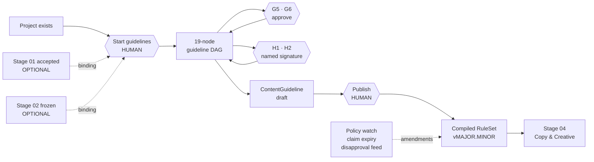
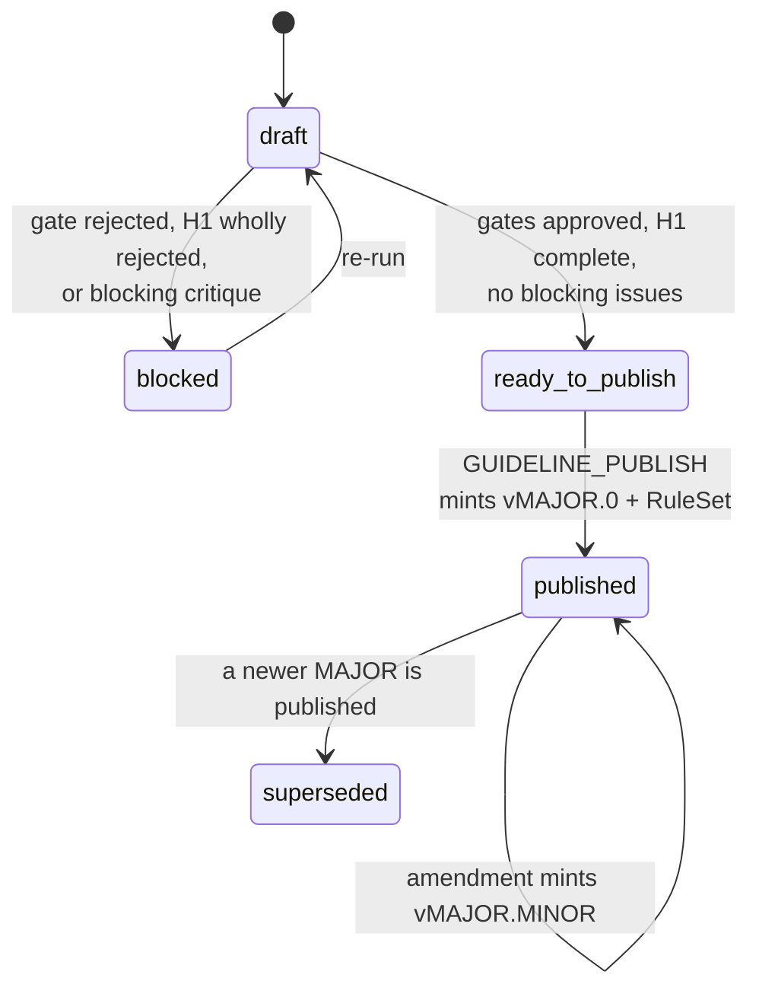

# PRD: Content Guidelines Agent (Stage 03 — Content Guidelines)

**Type:** Internal Tool PRD · **Owner:** Soham Sarker · **Version:** 1.0 · **Date:** 2026-09-22
**Status:** Ready to build
**Depends on:** `PRD-Paid-Ads-Research-Agent.md` (Stage 01) v1.2 and `PRD-Campaign-Planning-Agent.md` (Stage 02) v1.0 — both shipped
**Runtime dependency on either:** **none.** Stage 03 is the first stage in the pipeline that can start cold.

---

## 0. Assumptions locked in this version

Stage 03 ships into the existing `ads-research-agent` codebase. Nothing here creates a second application.

| # | Assumption | Source |
|---|---|---|
| C1 | Stage 01 and Stage 02 are shipped. Stage 03 ships into the **same repo, same five Railway services, same auth, same orchestrator, same Evidence store, same export queue**. No new infrastructure. | Confirmed |
| C2 | **Stage 03 has no upstream gate.** It is startable on a project that has never run research and has no frozen plan. Stages 01→02 stay strictly sequential; 03 is parallel-capable and self-sufficient. | Confirmed — the defining constraint of this PRD |
| C3 | Stage 01 and Stage 02 outputs are **optional enrichment**, bound at run start through `GuidelineBindings`. A missing binding narrows scope and is recorded; it never produces a guess. | Confirmed |
| C4 | Scope = **Stage 03 Content Guidelines only.** Ad copy, headlines, descriptions, images and video belong to Stage 04. Uploading anything to Google Ads belongs to Stage 05. | Confirmed |
| C5 | Stage 03 **writes nothing to the Google Ads account.** It reads creative and policy state and emits a rulebook. `ReadOnlyConnector` enforcement from Stage 02 §8.3 applies unchanged. | Carried from Stage 02, Law 12 |
| C6 | **Two approval gates and two person-tasks.** Gates: G5 visual identity, G6 sign-off matrix. Person-tasks: H1 legal claim signature, H2 verification attestation. Everything else runs unattended. | Confirmed (diagram) |
| C7 | A **person-task is not an approval.** An approval means the agent proposed and a human confirmed. A person-task means the agent *cannot* produce the artifact — a named human performs an act and attests to it under their own identity. New primitive, new table. | Confirmed — "this cannot be delegated to an agent" |
| C8 | **Published guidelines are living and versioned, not frozen.** A full run mints a MAJOR version; an amendment mints a MINOR. A published version's payload is immutable; changes mint a new version. | Confirmed |
| C9 | Stage 03 compiles the guideline into a deterministic, versioned **`RuleSet`** and exposes a **lint API**. Stage 04 calls it before emitting any asset. The rulebook is a program, not a document that happens to be readable. | Confirmed |
| C10 | **`CLAIM_SIGN` is identity-bound and `admin` does not hold it.** This is the first permission in the system that `admin` cannot exercise, and that is the point. Admin may reassign the legal owner; admin may never sign. | Confirmed |
| C11 | The **image precheck is deterministic**: OCR text-coverage ratio plus logo template matching, thresholds in `content_constants.yaml`. A vision model may add an advisory second opinion; it never renders the blocking verdict. | Confirmed |
| C12 | Google's asset specs, policy URLs, and image thresholds are **configuration, not code or prompt text**, in `content_constants.yaml` and `policy_sources.yaml`, each value carrying `source` and `reviewed_at`. | Carried from Stage 02, Law 15 |
| C13 | Stage 03 adds **no roles**. It adds four permissions and assigns named humans to three ownership slots (brand, legal, performance) inside the existing `approver` role. | Inferred from Stage 02 §5 |
| C14 | Platform scope is **Google Ads only** (Search, Performance Max, Demand Gen, Display, YouTube, Shopping). The asset spec sheet is Google-shaped. | Carried from Stage 02, B11 |
| C15 | Seed values in `content_constants.yaml` are **unverified until a human reviews them**. Every constant ships with `source: unverified` until checked — see Q7. | Derived constraint |

---

## 1. Executive Summary

Stage 03 turns "what we are allowed to say" from tribal knowledge into an executable rulebook.

The Content Guidelines Agent is a 19-node DAG inside the existing app, behind its own tab in the left panel, **startable without Stage 01 or Stage 02**. It profiles our voice from best-performing copy, compiles an always-use/never-use lexicon, harvests every factual claim we make and binds each to its evidence and expiry, maps which Google advertising policies actually apply to us, derives the exact asset specs and launch minimums, and turns every past disapproval into a rule that cannot be repeated.

Two decisions stop for a named human signature — which claims are legally safe to run, and any verification Google requires from a company officer. Those two are the only hard blockers on the whole seven-stage board.

Output: a published, versioned `ContentGuideline` plus a compiled `RuleSet` that Stage 04 lints every headline, description and image against before it exists.

---

## 2. Problem & Current Workflow

Stages 01 and 02 now produce research in 45 minutes and a plan in 30. Creative still stalls, and it stalls on permission rather than on ideas.

| Step today | Owner | Time | Failure mode |
|---|---|---|---|
| Recall the brand voice | whoever writes | 0h | Nothing written down. Voice drifts per writer and per quarter |
| Decide whether a claim is safe | Slack thread to legal | 2 days – 2 weeks | No record of what was approved, by whom, or on what evidence. The same claim is re-litigated every campaign |
| Check the offer language against live pricing | rarely | 0.5h | "From €X" survives a price change. Countdowns get renewed. Both are policy violations and both are invisible until a disapproval |
| Work out which Google policies apply | never, until rejected | — | Policy is learned by disapproval. The lesson lives in one person's memory |
| Look up asset specs | per campaign | 1h | Copied from a blog post, often stale. Assets get rebuilt after rejection |
| Check images for text and logos | never | — | The single most common rejection reason. Caught by Google, not by us |
| Name who signs off | never | — | Nobody owns brand, legal or performance sign-off. Everything escalates or nothing does |
| Learn from a rejected ad | ad-hoc | — | The same mistake ships again next quarter |

**Total ≈ 6–8 hours of work plus 2 days to 2 weeks of waiting on legal, per campaign, repeated per campaign.**

Three structural failures sit underneath the hours:

1. **The rules are not machine-readable.** A PDF brand book cannot stop a headline. Every check is a human remembering to look.
2. **Legal approval has no half-life.** A claim approved in 2024 against a statistic that expired in 2025 is still being run, and nothing in the system knows.
3. **Rejections teach nobody.** Google tells us exactly what is wrong, once, in an interface nobody re-reads. That signal is thrown away.

This stage exists because every downstream stage produces text and pixels, and every one of them needs the same answer to the same question: *am I allowed to say this?* Asking a human each time does not scale. Asking a model each time is not auditable. The answer has to be a compiled, versioned, signed artifact.

---

## 3. Proposed Solution

A third DAG in the same application, behind a third tab in the left panel, **unlocked from the moment a project exists**.



An `operator` opens the **03 Content Guidelines** tab on any project and clicks **Start**. There is no acceptance to wait for and no plan to freeze first. If an accepted research run or a frozen plan happens to exist, the start dialog offers them as bindings and the run uses them; if not, the run proceeds against the brand book, the website, the ad account's creative history and the project's product context.

The agent executes 19 typed nodes. Every rule it drafts carries an `authority` — brand, legal signature, Google policy, or a learned disapproval — and resolves to evidence. Two nodes halt for a named human signature. Two halt for a conventional approval.

When the critique returns no blocking issue, the guideline reaches `ready_to_publish`. A user with `GUIDELINE_PUBLISH` publishes it. Publishing compiles the guideline into a `RuleSet` — a deterministic, versioned program — and mints `vMAJOR.0`. Stage 04 pins that `ruleset_version` and lints every asset against it before the asset is written anywhere.

After publication the rulebook stays alive. A policy-source watcher, a claim-expiry sweeper and a disapproval ingester each open **amendments**. Mechanical amendments auto-apply and mint a MINOR. Substantive ones open a review task. Anything touching a signed claim voids that signature and re-queues it.

### Design principles

1. **The LLM never sources facts** — carried from Stage 01.
2. **The LLM never does arithmetic** — carried from Stage 02.
3. **The LLM drafts rules; it never adjudicates them.** Enforcement is a deterministic pass over a compiled `RuleSet`. There is no model call on the lint path. A model that decides whether a headline is compliant is a model that decides differently next Tuesday.
4. **A signature is an act, not a field.** Non-delegable, identity-bound, step-up authenticated, hash-scoped to the exact claim set, and expiring.
5. **Stage 03 starts cold.** Bindings enrich. Their absence narrows scope and is recorded. It never produces invention.
6. **Published is immutable; the rulebook is not.** Versions are frozen artifacts; the rulebook is the sequence of them.

---

## 4. Stage Independence & Optional Bindings

This section is the counterpart to Stage 02 §4. Where Stage 02 specified a handshake, Stage 03 specifies the **absence** of one — and the optional enrichment that replaces it.

### 4.1 Why Stage 03 is independent

Stages 01 and 02 answer *who we are selling to* and *what we are spending*. Stage 03 answers *what we are allowed to say*, and that answer is a property of the company, not of a campaign. It is true before any research runs and stays true after a plan is superseded. Coupling it to an upstream gate would mean a legal claim register that cannot be built until a keyword study finishes, which is nonsense.

Concretely: a user can land on a brand-new project, open the third tab and produce a published rulebook without ever touching the first two tabs. That path is a first-class, tested flow — not a degraded mode.

### 4.2 Binding modes

`GuidelineBindings` is resolved once at run start and hashed into `Run.input_hash`.

| Mode | Bindings present | What changes |
|---|---|---|
| `standalone` | none | Sources: brand book upload, website crawl, ad-account creative history, project product context, offer records. Scope is **unscoped**: asset specs are emitted for every Google campaign type, the lexicon covers every market on the Project |
| `research_linked` | accepted `ResearchReport` | Adds compliance guardrails (1.1.5), the differentiation claim (1.3.4), the competitor creative corpus (1.3.2), market coverage (1.1.4). The claim register inherits `substantiation_required[]` from 1.3.4; the lexicon inherits `regulated_terms[]` from 1.1.5 |
| `plan_linked` | frozen `CampaignPlan` | Adds the channel slate (2.3.1) → asset specs scope to the campaign types actually launching; the account structure (2.4.2) → per-ad-group `primary_message` is linted at guideline time, not at creative time; the measurement plan's consent outcome → disclosure scope |
| `fully_linked` | both | All of the above |

Bindings are **additive and independent**. `plan_linked` without `research_linked` is legal — a frozen plan already carries `source.research_run_id`, and Stage 03 may follow that pointer for evidence, but it does not require the acceptance itself.

### 4.3 Degradation contract

1. A node whose optional input is absent emits its output with `input_mode ∈ {bound, unbound}` and `scope ∈ {scoped, unscoped}`. It never substitutes a guess for a missing binding.
2. An unbound run records `unbound_inputs[]` on the guideline, rendered on the rulebook header and in every export. A rulebook built without legal guardrails from Stage 01 must not look as authoritative as one built with them.
3. `scope: unscoped` widens rather than narrows. Absent a channel slate, the asset spec sheet covers **all** campaign types — over-specification is safe, under-specification ships a campaign that cannot launch.
4. Binding a plan or acceptance later does not retro-fit a published version. It is a reason to run a new MAJOR version, surfaced as a banner, never applied silently.

### 4.4 Eligibility — binary preconditions

`GET /projects/{id}/guidelines/eligibility` returns `{eligible, blockers[], warnings[], available_bindings{}}`. The Start button reads that response; it never computes eligibility client-side.

| # | Check | On failure |
|---|---|---|
| C-E1 | At least one content source resolves: a brand-book upload, a crawlable domain on the Project, a connected Google Ads account, or non-empty `product_context` | `no_content_source` — blocker, links to project setup |
| C-E2 | No guideline run in flight for this project (Redis `project:{id}:guideline_lock`) | `guideline_in_flight` — blocker, names the holder |
| C-E3 | An OpenRouter credential resolves for this project | `missing_credential` — blocker |
| C-E4 | Actor holds `GUIDELINE_EXECUTE` | `403`, missing permission named |
| C-E5 | A `SignOffMatrix` exists, or at least one `approver` account exists to populate one | `no_eligible_owners` — blocker; you cannot route a non-delegable signature with nobody to route it to |
| C-E6 | An accepted research run or frozen plan exists | **warning `running_unlinked`** — never a blocker. The dialog names what would be gained and offers to bind it |
| C-E7 | A published guideline already exists | **warning `will_mint_major`** — the run produces `v{n+1}.0`; the current version stays published and serving until the new one is published |
| C-E8 | Open amendments exist in `needs_review` | **warning `unreviewed_amendments`** — links to the amendment inbox |

**C-E6 is the load-bearing line in this PRD.** It is a warning. Any implementation that turns it into a blocker has rebuilt Stage 02's handshake by accident.

### 4.5 The crossing contract — `GuidelineInput`

```python
class GuidelineBindings(BaseModel):
    research_run_id: UUID | None = None
    acceptance_id: UUID | None = None
    research_schema_version: str | None = None
    plan_id: UUID | None = None
    plan_version: int | None = None
    plan_schema_version: str | None = None

class GuidelineInput(BaseModel):
    schema_version: Literal["1.0"]
    project_id: UUID
    guideline_run_id: UUID
    mode: Literal["standalone", "research_linked", "plan_linked", "fully_linked"]
    bindings: GuidelineBindings

    # always present
    product_context: dict
    markets: list[Market]
    brand_assets: list[BrandAssetRef]        # brand book, logo files, prior creative
    site_pages: list[PageRef]                # from web_crawler Evidence
    creative_history: list[CreativeRef]      # from google_ads Evidence, read-only
    offer_records: list[OfferRecord]         # from csv_ingest / offer feed
    disapproval_history: list[DisapprovalRef]
    signoff_matrix: SignOffMatrixRef | None
    prior_guideline_id: UUID | None          # the currently published version, if any

    # present only when bound — every one Optional, and every consumer handles None
    compliance_guardrails: ComplianceGuardrails | None = None   # 1.1.5
    differentiation_claim: DifferentiationClaim | None = None   # 1.3.4
    competitor_creative: list[CompetitorAd] | None = None       # 1.3.2
    channel_slate: ChannelSlate | None = None                   # 2.3.1
    account_structure: AccountStructure | None = None           # 2.4.2
    measurement_consent: ConsentSummary | None = None           # 2.5.2

    unbound_inputs: list[str]
    constants_version: str
```

**Rules on the contract**

1. `GuidelineInput` is assembled once, at run start, by `orchestrator/guideline_input.py`, hashed into `Run.input_hash`, and passed read-only to every node.
2. Every optional field has an explicit `None` branch in its consumer, exercised by a test. A node that raises on `None` is a bug, not an edge case.
3. `mode` is derived from which bindings resolved, never passed in by the client. A client that claims `fully_linked` with no plan id gets `422`.
4. When bound, version skew is caught at trigger time against `GUIDELINE_SUPPORTED_RESEARCH_SCHEMAS` and `GUIDELINE_SUPPORTED_PLAN_SCHEMAS`. An unsupported version **drops the binding with a warning** rather than failing the run — Stage 03 does not need it. This differs deliberately from Stage 02 §4.3 rule 5, where a skewed version is a `422`.
5. A binding whose source is later superseded marks the published guideline `binding_superseded` and offers a re-run. It never invalidates the published version.

---

## 5. Users, Roles & Permissions — delta only

Stage 03 adds **no roles** and **four permissions**. Stage 01 §4 and Stage 02 §5 stand unchanged.

### 5.1 New permissions

| Permission | Granted to | Guards |
|---|---|---|
| `GUIDELINE_EXECUTE` | `admin`, `operator` | Start, cancel, retry a guideline run; edit claim drafts before signature |
| `GUIDELINE_PUBLISH` | `admin`, `approver` | Publish a draft into a version; apply or dismiss a policy amendment |
| `CLAIM_SIGN` | `approver` **only**, and further narrowed to the identity named as `legal_owner` | Sign or revoke a claim-set signature |
| `ATTEST_SUBMIT` | `approver` **only**, and further narrowed to the assignee of the person-task | Submit a verification attestation with supporting documents |

### 5.2 The non-delegable rule

`CLAIM_SIGN` and `ATTEST_SUBMIT` are the first permissions in this system that **`admin` does not hold**. Every other capability degrades to admin. These two do not, for one reason: the diagram says liability sits with a named person, and a permission an administrator can self-grant is not a signature, it is a checkbox.

Enforcement is two-layered and both layers are required:

1. **Role layer** — `ROLE_PERMISSIONS` grants `CLAIM_SIGN` to `approver` and to nobody else. `admin` is absent from that row.
2. **Identity layer** — the route additionally asserts `current_user.id == signoff_matrix.legal_owner_id` for `CLAIM_SIGN`, and `current_user.id == human_task.assignee_id` for `ATTEST_SUBMIT`. There is no "any approver may claim it" fallback, which is exactly the fallback Stage 01 §7.2 permits for ordinary gates.
3. **Step-up layer** — the signature endpoint requires a re-authentication proof issued within `SIGNATURE_REAUTH_TTL_SECONDS` (default 300). `POST /auth/reauth` takes the current password and returns a single-use, short-lived token. The signature records `method`, `ip`, `user_agent` and the token id.

An `admin` may **reassign** the legal owner. That is a governance act, not a signing act: it writes an `AuditLog` row, voids every signature made by the outgoing owner, moves the affected claims back to `pending_signoff`, and marks any published version whose ruleset depended on those signatures `signature_stale`. Reassignment is therefore expensive by construction, which is the correct incentive.

### 5.3 Permission matrix — Stage 03 actions

| Action | admin | operator | approver | viewer |
|---|:--:|:--:|:--:|:--:|
| Read guideline, claims register, specs, ruleset | ✅ | ✅ | ✅ | ✅ |
| Run the linter (side-effect free) | ✅ | ✅ | ✅ | ✅ |
| Export guideline / spec sheet / ruleset | ✅ | ✅ | ✅ | ✅ |
| Start / cancel / retry a guideline run | ✅ | ✅ | ❌ | ❌ |
| Edit a claim draft before signature | ✅ | ✅ | ❌ | ❌ |
| Decide gate G5 or G6 | ✅ | ❌ | ✅ (own gates) | ❌ |
| **Sign a claim set (H1)** | **❌** | ❌ | ✅ **named legal owner only** | ❌ |
| **Submit a verification attestation (H2)** | **❌** | ❌ | ✅ **named assignee only** | ❌ |
| Revoke a signature | ❌ | ❌ | ✅ (own signatures) | ❌ |
| Reassign a person-task / change the sign-off matrix | ✅ | ❌ | ❌ | ❌ |
| Publish a guideline version | ✅ | ❌ | ✅ | ❌ |
| Apply / dismiss a policy amendment | ✅ | ❌ | ✅ | ❌ |
| Edit content constants and policy sources | ✅ | ❌ | ❌ | ❌ |

### 5.4 Gate and task routing

| Key | Kind | Node | Owner | The act |
|---|---|---|---|---|
| **G6** | approve | 3.5.1 `signoff_matrix` | any `approver`/`admin` on first set; `admin` thereafter | Name the brand, legal and performance owners. Set once, carried forward |
| **G5** | approve | 3.1.3 `visual_identity_rules` | `signoff_matrix.brand_owner` | Confirm the logo, colour and imagery rules the agent extracted from the brand book |
| **H1** | person | 3.2.3 `legal_claim_signoff` | `signoff_matrix.legal_owner` **only** | Sign which claims are legally safe to run, per claim, under a hash-scoped signature |
| **H2** | person | 3.3.2 `verification_attestation` | a named company officer, assigned per task | Complete whatever verification Google requires and attest with the document reference |

**G6 is a DAG root.** You cannot route a non-delegable signature without a named owner, so 3.5.1 executes before 3.1.3, 3.2.3 and 3.3.2 despite sitting at the bottom of the stage diagram. On a project that already holds a valid `SignOffMatrix`, 3.5.1 emits `status='reused'` and does not re-open G6 — "set once" is enforced, not hoped for.

**H1 blocks publish. H2 blocks launch.** H1 is a precondition for `ready_to_publish`, because a claims register with no terminal decisions cannot license anything and the ruleset would ship inert. H2 is not: a company can have a complete, correct rulebook before it is verified to advertise. An open H2 is carried into `open_dependencies[]` flagged `blocking_for: launch` and is surfaced to Stage 05. Both are the "only real blockers on the whole board" — they just block different boards.

---

## 6. Architecture — delta only

**No new services.** The same five Railway services, the same Compose mirror, the same private network, the same Volume on `worker`. Stage 03 is new modules inside `apps/api` and new routes inside `apps/web`.

Everything in Stage 01 §5 and §5.2 applies verbatim: bind `::`, read `$PORT`, relative `/api/v1` paths only, migrations in `preDeployCommand`, all durable artifacts through `storage/backend.py`, no `if RAILWAY` branch.

**One image change.** `apps/api/Dockerfile.worker` adds `tesseract-ocr` and `libtesseract-dev` plus the Python bindings for the image precheck (§9.5). This is the only system-dependency change in Stage 03 and it lands in `worker` only — `api` stays slim. Budget roughly +200 MB on the worker image; the 2 GB memory floor from Stage 01 §5.2 is unchanged because OCR runs one image at a time.

### 6.1 New modules in `apps/api/src/agent/`

```
agent/
├─ orchestrator/
│  ├─ dag.py                  # EXTENDED: DAGS gains "guideline"
│  ├─ registry.py             # EXTENDED: already keyed by (stage, node_id) since Stage 02
│  └─ guideline_input.py      # NEW: builds + hashes GuidelineInput, resolves optional bindings
├─ nodes/content/             # NEW: n3_1_1_*.py … n3_6_2_guideline_critique.py  (19 nodes)
├─ guardrails/                # NEW: the deterministic rule layer — no LLM, no network
│  ├─ registry.py             #   @rule decorator, RuleKind registry, matcher validation
│  ├─ compiler.py             #   ContentGuideline -> RuleSet, deterministic + hashed
│  ├─ matchers/
│  │  ├─ lexicon.py           #     exact / lemma / stem term sets, per locale
│  │  ├─ claims.py            #     claim-shaped language detector + licence lookup
│  │  ├─ offers.py            #     discount, from-pricing, countdown vs OfferRecord
│  │  ├─ assets.py            #     length, count, aspect ratio, file size
│  │  ├─ image.py             #     OCR text coverage, logo template match
│  │  └─ disclosure.py        #     AI-disclosure and disclaimer injection rules
│  ├─ linter.py               #   lint(targets, ruleset) -> LintResult. THE hot path
│  └─ normalize.py            #   Unicode NFKC, case folding, homoglyph + zero-width strip
├─ guidelines/
│  ├─ constants.py            # NEW: loads + validates content_constants.yaml
│  ├─ content_constants.yaml  # NEW
│  ├─ signature.py            # NEW: step-up re-auth, set hashing, signature lifecycle
│  ├─ tasks.py                # NEW: HumanTask creation, assignment, handover, voiding
│  ├─ publish.py              # NEW: draft -> published, version minting, ruleset compile
│  └─ diff.py                 # NEW: guideline-vs-guideline and ruleset-vs-ruleset diff
├─ policy/
│  ├─ policy_sources.yaml     # NEW: the watched URL registry
│  ├─ watcher.py              # NEW: arq cron — fetch, hash, diff, open amendments
│  ├─ classifier.py           # NEW: mechanical | substantive | signature_affecting
│  └─ disapprovals.py         # NEW: arq job — Google Ads policy findings -> learned rules
├─ connectors/
│  ├─ brand_book.py           # NEW: PDF/DOCX/PPTX/image ingest -> text spans + asset refs
│  ├─ google_ads.py           # EXTENDED: ad_group_ad.policy_summary, asset policy state
│  └─ web_crawler.py          # EXTENDED: claim-bearing page sections, offer blocks
└─ export/
   ├─ ruleset_json.py         # NEW: the machine handoff to Stage 04
   ├─ specsheet_xlsx.py       # NEW: the asset spec sheet as a workbook
   └─ templates/guideline_*.jinja
```

### 6.2 New surfaces in `apps/web/`

```
app/(routes)/projects/[id]/
├─ layout.tsx                 # EXTENDED: left-panel stage rail gains 03
└─ guidelines/
   ├─ page.tsx                # Stage 03 landing
   ├─ published/page.tsx      # the living rulebook (canonical)
   ├─ claims/page.tsx         # claims register + signature flow
   ├─ specs/page.tsx          # asset spec sheet
   ├─ lint/page.tsx           # linter playground
   ├─ amendments/page.tsx     # policy amendment inbox
   ├─ compare/page.tsx        # version diff
   └─ runs/[guidelineRunId]/
      ├─ page.tsx             # Guideline Console (Run Console, stage-aware)
      └─ rulebook/page.tsx    # Rulebook Viewer (draft)
components/guidelines/
├─ StageRail.tsx  GuidelineStatusChip.tsx  StartGuidelineDialog.tsx
├─ BindingPicker.tsx          # optional research / plan bindings at start
├─ ClaimsTable.tsx  ClaimSignatureDialog.tsx  StepUpAuthDialog.tsx
├─ HumanTaskCard.tsx  AttestationForm.tsx
├─ RuleBrowser.tsx  LintPlayground.tsx  AssetSpecSheet.tsx
├─ AmendmentInbox.tsx  PublishDialog.tsx  GuidelineDiff.tsx
└─ SignOffMatrixEditor.tsx
```

### 6.3 What is reused without modification

The LLM gateway, cost ledger, model router, SSE channel, retry/repair loop, checkpointing, cancellation, budget guard, approvals inbox, Evidence store and search, audit log, credential vault, session layer, export job queue and file server. Stage 03 adds node types, a rule layer and two contracts to an engine that already exists. **If a Stage 03 task appears to require changing the executor's core loop, stop — that is a signal the design is wrong.** The one deliberate exception is the person-task mechanism, which is genuinely new and is specified as its own primitive in §7.2 and §8.4 rather than bolted onto `Approval`.

---

## 7. Data Model — delta only

Eight new tables, three altered. Everything else in Stage 01 §6 and Stage 02 §7 is untouched, including `WorkspaceScopedRepo` on every query.

### 7.1 Altered

```python
Run:
  ~ stage  enum[research|plan] -> enum[research|plan|guideline]
  ~ status enum[...] + awaiting_human_task    # distinct from awaiting_approval:
                                              # a person-task is not an approval (§8.4)
  + bindings jsonb NULL          # GuidelineBindings for stage='guideline'
  # source_run_id keeps its meaning and is set on a guideline run ONLY when a
  # research binding resolved. The plan binding lives in `bindings`.
  #
  # REPLACE the Stage 02 constraint. It currently reads:
  #     CHECK ((stage = 'plan') = (source_run_id IS NOT NULL))
  # which would force every guideline run to have a NULL source_run_id.
  # New form:
  #     CHECK (stage <> 'plan' OR source_run_id IS NOT NULL)
  #     CHECK (stage <> 'guideline' OR bindings IS NOT NULL)   -- '{}' is valid

Approval:
  # no schema change. gate_key gains the values 'G5' and 'G6' (it is text)

Export:
  ~ artifact_type enum + content_guideline
  ~ format enum       + ruleset_json

Project.settings:
  + guideline_approvers  {G5, G6} -> user_id | null
  + content_overrides    # per-project overrides of content_constants.yaml
  + max_guideline_cost_usd  # default 6.00
```

**Migration note that will bite if ignored.** `ALTER TYPE ... ADD VALUE` cannot be used in the same transaction that then writes rows with the new value. Ship the enum extension as its own Alembic revision (`stage03_enums`) executed with `isolation_level="AUTOCOMMIT"`, and the schema revision (`stage03_schema`) after it. Two revisions, strict order, `downgrade` documented as irreversible for the enum value (Postgres cannot drop an enum label).

### 7.2 New tables

```python
ContentGuideline(
    id uuid pk, workspace_id fk, project_id fk,
    guideline_run_id fk->Run unique,
    schema_version text,
    version_major int, version_minor int,          # 1.0, 1.1, 2.0 …
    status enum[draft|blocked|ready_to_publish|published|superseded],
    mode enum[standalone|research_linked|plan_linked|fully_linked],
    bindings jsonb, unbound_inputs jsonb,
    payload jsonb,                                  # the ContentGuideline object (§12)
    markdown text,
    ruleset_id fk->RuleSet null,
    published_at null, published_by fk->User null,
    published_approval_ids uuid[] null,
    signature_stale bool default false,
    binding_superseded bool default false,
    created_at, updated_at)
    UNIQUE(project_id, version_major, version_minor)
    # A published row is append-only: a BEFORE UPDATE trigger rejects any change
    # to payload, markdown, ruleset_id, version_major or version_minor once
    # status = 'published'. Only `status`, `signature_stale` and
    # `binding_superseded` may move afterwards.

ClaimRecord(
    id uuid pk, workspace_id fk, project_id fk,
    first_seen_guideline_id fk->ContentGuideline,
    claim_text text, normalized_text text,
    surface_forms jsonb,               # the phrasings that assert this claim
    claim_type enum[superlative|comparative|quantified|certification|
                    guarantee|endorsement|pricing|safety_regulatory],
    market_scope text[], languages text[],
    observed_on jsonb,                 # where we already say it: urls, ad ids
    substantiation jsonb,              # {evidence_ids[], document_refs[], method, as_of}
    evidence_ids uuid[],
    risk_tier enum[low|medium|high],
    status enum[unsupported|pending_signoff|approved|rejected|expired|revoked],
    expires_at null,
    current_signature_id fk->ClaimSignature null,
    superseded_by fk->ClaimRecord null,
    created_at, updated_at)
    # Claims outlive guideline versions — they are a property of the project.
    # UNIQUE(project_id, normalized_text) WHERE superseded_by IS NULL
    # Index: (project_id, status, expires_at)

ClaimSignature(
    id uuid pk, workspace_id fk, project_id fk,
    signer_id fk->User,                 # the named legal owner at signing time
    claim_ids uuid[], set_hash text,    # sha256 over sorted (claim_id, normalized_text, decision)
    decisions jsonb,                    # [{claim_id, decision: approved|rejected, note, expires_at}]
    statement text,                     # the attestation text the signer confirmed
    method enum[step_up_password],
    reauth_token_id text, ip inet, user_agent text,
    signed_at, expires_at,
    voided_at null, voided_by fk->User null, void_reason text null,
    created_at)
    # APPEND-ONLY. No UPDATE grant except the void columns, enforced by trigger.
    # A correction is a new signature, never an edit.

HumanTask(
    id uuid pk, workspace_id fk, project_id fk,
    guideline_run_id fk->Run null, node_id text, task_key text,   # 'H1' | 'H2'
    title text, instructions text,
    assignee_id fk->User NOT NULL,      # NOT NULL is the non-delegable rule in DDL
    required_artifacts jsonb,           # what the human must supply
    submitted_payload jsonb null, attachment_paths text[] null,
    status enum[pending|in_progress|completed|not_required|blocked|expired],
    blocking_for enum[publish|launch],
    completed_by fk->User null, completed_at null,
    due_at null, created_at, updated_at)
    # Index: (assignee_id, status), (project_id, task_key, status)

HumanTaskHandover(
    id uuid pk, task_id fk->HumanTask, from_user fk->User, to_user fk->User,
    reason text NOT NULL, performed_by fk->User,     # an admin
    voided_signature_ids uuid[], created_at)
    # append-only

SignOffMatrix(
    id uuid pk, workspace_id fk, project_id fk,
    brand_owner_id fk->User, legal_owner_id fk->User, performance_owner_id fk->User,
    version int, previous_id fk->SignOffMatrix null,
    set_by fk->User, set_at, superseded_at null, created_at)
    UNIQUE(project_id, version)
    # exactly one current per project: partial unique index on (project_id)
    # WHERE superseded_at IS NULL

RuleSet(
    id uuid pk, workspace_id fk, project_id fk,
    guideline_id fk->ContentGuideline,
    ruleset_version text,               # "{major}.{minor}+{hash8}"
    compiled jsonb,                     # the RuleSet object (§12.2)
    compiler_version text, constants_version text,
    rule_count int, hash text,
    created_at)
    UNIQUE(project_id, ruleset_version)
    UNIQUE(hash)
    # IMMUTABLE. No UPDATE grant at all. A change compiles a new row.

PolicySource(
    id uuid pk, workspace_id fk, url text, label text,
    jurisdiction text, area text,       # 'restricted_content', 'editorial', 'trademark' …
    selector text null,                 # narrow the hashed region of the page
    last_hash text null, last_checked_at null, last_changed_at null,
    enabled bool default true, poll_cron text,
    created_at, updated_at)
    UNIQUE(workspace_id, url)

PolicyAmendment(
    id uuid pk, workspace_id fk, project_id fk, source_id fk->PolicySource null,
    origin enum[policy_watch|claim_expiry|disapproval|manual],
    detected_at, change_kind enum[mechanical|substantive|signature_affecting|unclassified],
    diff jsonb, proposed_rule_changes jsonb, rationale text,
    status enum[open|needs_review|applied|dismissed|auto_applied],
    applied_ruleset_id fk->RuleSet null,
    voided_signature_ids uuid[] null,
    reviewed_by fk->User null, reviewed_at null, review_note text null,
    created_at)
    # Index: (project_id, status, detected_at desc)

DisapprovalEvent(
    id uuid pk, workspace_id fk, project_id fk,
    ad_resource_name text, campaign_ref text, asset_ref text null,
    policy_topic text, policy_detail jsonb,
    observed_at, first_seen_at,
    learned_rule_id text null, amendment_id fk->PolicyAmendment null,
    status enum[new|rule_proposed|rule_applied|ignored],
    created_at)
    UNIQUE(workspace_id, ad_resource_name, policy_topic, observed_at)
```

### 7.3 Evidence usage

No schema change. Stage 03 writes into the existing table:

| `source` | `kind` | Written by |
|---|---|---|
| `web` | `brand_book_span`, `claim_span`, `offer_block` | `brand_book`, `web_crawler` |
| `google_ads` | `creative_history`, `policy_finding`, `asset_policy_state` | read-only `google_ads` |
| `csv` | `offer_record` | `csv_ingest` offer mapping |
| `derived` | `rule_draft`, `ruleset_compile`, `image_metric` | `guardrails/` |

A `derived` `image_metric` row carries `{image_hash, ocr_text, text_coverage_ratio, logo_matches[], detector_version}` so an image verdict is reproducible without re-running OCR.

### 7.4 Migration notes

1. Two revisions, strict order: `stage03_enums` (AUTOCOMMIT, `ALTER TYPE run_stage ADD VALUE 'guideline'`, `export_artifact_type ADD VALUE 'content_guideline'`, `export_format ADD VALUE 'ruleset_json'`), then `stage03_schema`.
2. `stage03_schema` **drops and recreates** the Stage 02 `Run` CHECK constraint per §7.1. A test asserts a `stage='guideline'` run with `source_run_id IS NULL` inserts cleanly and a `stage='plan'` run with `source_run_id IS NULL` still fails.
3. Triggers ship in the same revision as their tables: published-guideline immutability, `RuleSet` full immutability, `ClaimSignature` append-only-except-void. Each with a `pytest` case asserting the `UPDATE` raises.
4. `HumanTask.assignee_id NOT NULL` is the schema-level expression of the non-delegable rule. Do not make it nullable "for flexibility" later.
5. `ContentGuideline.ruleset_id` and `RuleSet.guideline_id` reference each other. `ruleset_id` is nullable and that is what breaks the cycle: publish inserts the `RuleSet` row, then updates the guideline's `ruleset_id` **and** `status='published'` in one statement. The immutability trigger reads the *existing* row, which is still `ready_to_publish` at that moment, so it passes. Ordering it as two separate updates — status first, then `ruleset_id` — trips the trigger. One statement, one transaction.

---

## 8. Orchestration — delta only

One executor runs three stages. The DAG it executes is selected by `Run.stage`.

### 8.1 Registry and DAG

1. `dag.py` exports `DAGS = {"research": …, "plan": …, "guideline": …}`, all validated acyclic at import. The Stage 02 CI test asserting every registered node appears in exactly one DAG now covers 60 nodes.
2. `NodeSpec` gains two fields on top of Stage 02's three:
   - `human_task_key: str | None` — `"H1"` / `"H2"`. Mutually exclusive with `gate_key`.
   - `optional_inputs: list[str]` — the `GuidelineInput` fields this node uses when bound. The executor asserts the node handles every listed field being `None`, exercised by the unbound golden fixture.
3. A content node's `gather()` returns `GuidelineInput` slices plus Evidence. `reason()` may not open a network connection.

### 8.2 Unchanged mechanics

Topological wavefront with `asyncio.Semaphore(4)`; 3 retries with exponential backoff; one schema-repair pass before an attempt counts; `NodeRun` persisted on completion; resume skips `succeeded`; cooperative cancellation via `run:{id}:cancel`; SSE event types plus the 15s heartbeat. None of this is re-implemented.

### 8.3 What is new

| Concern | Behaviour |
|---|---|
| **Guideline lock** | Redis `project:{id}:guideline_lock`, 2h TTL, independent of the research and plan locks. A project may run research, hold a draft plan and run guidelines at once — but never two guideline runs |
| **Budget guard** | `project.settings.max_guideline_cost_usd`, default **$6.00**. Lower than planning: no crawling at keyword scale, no forecast pass |
| **Cache reuse** | `Run.input_hash` = hash of `GuidelineInput` + constants version. Identical hash with `reuse_cache=true` skips deterministic nodes. Gate and person-task nodes are never cache-skipped |
| **Person-task halt** | A `human_task_key` node creates a `HumanTask`, sets `Run.status='awaiting_human_task'` (a new terminal-ish status alongside `awaiting_approval`), and halts **that branch only**. It never falls back to a role |
| **Unbound execution** | A node with unresolved `optional_inputs` runs with `input_mode='unbound'`. It does not skip, does not fail, and does not invent |
| **Read-only enforcement** | Content-stage connectors subclass `ReadOnlyConnector`, asserted before `gather()`, per Stage 02 §8.3 |
| **Terminal states** | A guideline run ends `succeeded` with `ContentGuideline.status ∈ {ready_to_publish, blocked}`. `blocked` means a gate was rejected, H1 was rejected wholesale, or the critique returned a blocking issue. `succeeded` never means "published" |

### 8.4 Person-task resumption — and why it is not an approval

| | Approval (G5, G6) | Person-task (H1, H2) |
|---|---|---|
| Who may act | any holder of `required_role`, or the assignee | **exactly one named user** |
| Admin fallback | yes | **no** |
| Reassignment | free, `PATCH /approvals/{id}/assignee` | writes a `HumanTaskHandover`, requires a reason, voids dependent signatures |
| Auth | session | session **plus** step-up re-auth |
| Payload | `edited_proposal`, revalidated against `output_model` | a structured submission plus file attachments, revalidated against `required_artifacts` |
| Record | `Approval` row | `HumanTask` row plus, for H1, an append-only `ClaimSignature` |
| Expiry | SLA reminders, never auto-approves | the **signature itself** expires, which re-opens the task |

On completion the branch resumes with the submitted payload. For H1, the branch resumes with the `decisions` array: `approved` claims become licensable, `rejected` claims become blocking rules that stop any copy asserting them. A partially-signed set is legal — approving 40 of 52 claims resumes the branch with 12 claims in `rejected`, and the ruleset blocks those 12 explicitly rather than staying silent about them.

### 8.5 The living loop (post-publication)

Three `arq` jobs, all polling DB state, none of them Railway Cron (per Stage 01 §5.2):

| Job | Cadence | Produces |
|---|---|---|
| `policy_watch` | per `PolicySource.poll_cron`, default daily | Fetches each enabled source through `web_crawler`, hashes the selected region, and on change writes a `PolicyAmendment` with the diff. Classification is §8.6 |
| `claim_expiry_sweep` | daily 02:00 project timezone | Moves claims past `expires_at` to `expired`, opens a `PolicyAmendment(origin='claim_expiry')`, re-queues them into a new H1 task for the legal owner, and mints a MINOR ruleset with those claims un-licensed |
| `disapproval_ingest` | every 6h when a Google Ads credential resolves | Pulls `ad_group_ad.policy_summary` and asset policy state, writes `DisapprovalEvent` rows, and feeds node 3.5.3's learned-rule synthesis on the next run; a repeat of a `policy_topic` already carrying a learned rule raises a `rule_ineffective` alert instead of proposing a duplicate |

### 8.6 Amendment classification and auto-apply

`policy/classifier.py` classifies every amendment. The classifier is an LLM call **that proposes**; the *consequence* of each class is deterministic code.

| Class | Definition | Consequence |
|---|---|---|
| `mechanical` | A value inside an existing rule changes — a character limit, an asset count, a dimension, a file-size cap. No rule added or removed, no authority changed | **Auto-applies.** Mints `v{major}.{minor+1}`, recompiles the RuleSet, notifies the brand and performance owners, writes `AuditLog`. Status `auto_applied` |
| `substantive` | A rule is added or removed, a policy area starts or stops applying, a restricted category changes | **Never auto-applies.** Status `needs_review`, lands in the amendment inbox for the performance owner, and the published guideline header shows an amber `amendments pending` chip |
| `signature_affecting` | The change touches a rule whose `authority.source == 'legal_signature'` | Voids the affected `ClaimSignature` rows, moves those claims to `pending_signoff`, opens an H1 task, sets `ContentGuideline.signature_stale=true`, and the linter treats those claims as un-licensed from that moment |
| `unclassified` | Classifier confidence below `AMENDMENT_CONFIDENCE_FLOOR` (default 0.8) | Treated as `substantive`. Ambiguity resolves toward the human, always |

**A policy change never silently rewrites a signed rule.** That sentence is Law 29 and it is why `signature_affecting` exists as its own class rather than as a flavour of substantive.

---

## 9. The Guardrails Engine, Content Constants & LLM Routing

Stage 02 has `calc/` so that no number comes from a model. Stage 03 has `guardrails/` so that no *verdict* comes from a model. Same shape, different noun.

### 9.1 The `guardrails/` contract

1. Every rule constructor is decorated `@rule("lexicon.banned_term.v1")` and returns a `Rule` with a `matcher`, a `severity`, a `scope` and an `authority`. The decorator registers it; an unregistered rule cannot enter a `RuleSet`.
2. `guardrails/` is pure: data in, findings out. **No network, no ORM, no LLM, no clock** — a rule that needs the current date takes it as an argument, so the linter is reproducible.
3. `compiler.py` is the only writer of `RuleSet` rows. Compilation is deterministic: same guideline payload + same constants version + same compiler version ⇒ byte-identical `compiled` JSON and the same `hash`. A CI test compiles the golden fixtures twice in separate processes and asserts hash equality.
4. `linter.py` exposes exactly one public function:

```python
def lint(targets: list[LintTarget], ruleset: RuleSet, *, now: datetime) -> LintResult: ...
```

   Stage 04 imports it in-process. External consumers reach it through `POST /guidelines/{id}/lint`. There is no third path, and no caller may evaluate rules itself.
5. Every `LintFinding` carries a `rule_id` and an `authority_ref`. A finding that cannot name its authority is a bug — the whole point is that a writer who is blocked can see *who said so*.
6. A CI test walks `guardrails/` and fails the build on any import of `httpx`, `sqlalchemy`, `openai`, the LLM gateway, or `datetime.now`.

### 9.2 Rule taxonomy

| Category | Example rule | Typical severity | Authority source |
|---|---|---|---|
| `voice` | Sentence length over N words in a headline surface | advisory | `brand` |
| `lexicon` | Banned term "cheap"; required term "Safety Data Sheet" on first use | blocking / warning | `brand` |
| `claim` | Claim-shaped language without an approved licence | **blocking** | `legal_signature` |
| `offer` | "From €X" where X is not the lowest live price | **blocking** | `legal_signature` / `google_policy` |
| `policy` | Restricted-category rule applicable to us | **blocking** | `google_policy` |
| `asset_spec` | Headline over the character limit; fewer than the minimum asset count | **blocking** | `google_policy` |
| `image` | Text coverage ratio above threshold in a search-ad image | **blocking** | `google_policy` |
| `disclosure` | Generated creative missing its AI disclosure | **blocking** | `internal` / `google_policy` |
| `governance` | Copy matching a legal-review trigger | warning + routes to review | `internal` |
| `learned` | The exact construction that caused disapproval #114 | **blocking** | `learned_disapproval` |

### 9.3 The claim licence mechanism

This is the most important mechanism in Stage 03 and the one most likely to be built wrong. Semantic "is this claim true" judgement is not available deterministically. Detecting *claim-shaped language* is.

The linter runs two deterministic passes:

1. **Detector pass.** Regex families per locale, held in `content_constants.yaml`, for superlatives (`best`, `#1`, `leading`, `only`), comparatives (`faster than`, `more … than`), quantified assertions (`\d+%`, `up to \d+`, `\d+x`), guarantees (`guaranteed`, `risk-free`), certifications (`ISO \d+`, `certified`, `compliant with`), and endorsements. A match yields a **candidate claim span**.
2. **Licence pass.** For every candidate span, look for a `ClaimRecord` in the ruleset's `claims_index` that licenses it: status `approved`, signature unexpired, `market`/`language` in scope, and the span matching one of the claim's `surface_forms` by normalized exact match or trigram similarity above `CLAIM_MATCH_THRESHOLD`. A licensed span passes silently. **An unlicensed span is a blocking finding.**

The default is deny. A writer who wants to make a new claim must get it into the register and signed — which is exactly the workflow the current Slack thread is a bad version of.

A third, **advisory-only** pass may run an embedding similarity check against registered claims to flag "this looks like a claim we have registered under different wording." It never blocks, because embedding similarity is not reproducible across model versions and a blocking rule must be.

### 9.4 Offer integrity

`matchers/offers.py` validates every price, discount and deadline against `OfferRecord` rows, not against the model's reading of the copy:

| Check | Rule |
|---|---|
| From-pricing | A "from X" construction must equal `min(live_price)` for the referenced product set at lint time. A stale floor is blocking |
| Percentage discount | Must compute from a documented `reference_price` with an `effective_from`/`effective_to` window that contains lint time |
| Countdown | Must reference a real `ends_at` with a timezone. A countdown whose `ends_at` has been extended more than `COUNTDOWN_MAX_EXTENSIONS` (default 0) is blocking |
| Currency and market | The currency in the copy must match the market's currency on the Project |

`OfferRecord` arrives through the existing `csv_ingest` with a new column map (`sku, product_set, list_price, current_price, currency, market, effective_from, effective_to, reference_price, ends_at`). No new connector — see Q4 for whether a live pricing feed replaces the CSV.

### 9.5 Image precheck

Deterministic, in `worker`, one image at a time:

1. Normalize to RGB, downscale to a fixed working width so the metric is resolution-independent.
2. `tesseract` OCR at a fixed PSM and language set from constants. Compute `text_coverage_ratio` = union area of text bounding boxes ÷ image area, and capture the recognised text.
3. Logo match: ORB feature matching plus perceptual hash against every logo asset registered by node 3.1.3, returning `logo_matches[]{asset_id, score, bbox}`.
4. Emit a `derived` Evidence row with every metric and `detector_version`. The verdict is a rule evaluation over those metrics — `image.text_coverage.v1` with `max` from constants — not a judgement call.
5. Optional advisory: a multimodal model may add `advisory_notes[]`. It cannot change the verdict, and its absence never fails the check.

**Why deterministic matters here:** this rule blocks an asset from being produced. A blocking rule that returns a different answer on re-run destroys trust in the whole ruleset within a week.

### 9.6 `content_constants.yaml`

Same discipline as Stage 02 §9.3. Every constant carries `value`, `source` and `reviewed_at`. A constant missing `source` fails startup with the key named. The file's `version` is stamped into every `RuleSet`.

```yaml
version: "2026.09.1"
asset_specs:
  search:
    headline:        { max_chars: 30, min_count: 3,  max_count: 15, source: "unverified", reviewed_at: 2026-09-22 }
    description:     { max_chars: 90, min_count: 2,  max_count: 4,  source: "unverified", reviewed_at: 2026-09-22 }
    path:            { max_chars: 15, max_count: 2,  source: "unverified", reviewed_at: 2026-09-22 }
  performance_max:
    headline:        { max_chars: 30, min_count: 3,  max_count: 15, source: "unverified", reviewed_at: 2026-09-22 }
    long_headline:   { max_chars: 90, min_count: 1,  max_count: 5,  source: "unverified", reviewed_at: 2026-09-22 }
    description:     { max_chars: 90, min_count: 2,  max_count: 5,  source: "unverified", reviewed_at: 2026-09-22 }
    image_landscape: { ratio: "1.91:1", min_px: "600x314", max_bytes: 5242880, min_count: 1, source: "unverified", reviewed_at: 2026-09-22 }
image_policy:
  search_image_text_coverage_max: { value: 0.20, source: "unverified", reviewed_at: 2026-09-22 }
  logo_match_score_min:           { value: 0.62, source: "internal",   reviewed_at: 2026-09-22 }
  ocr_working_width_px:           { value: 1280, source: "internal",   reviewed_at: 2026-09-22 }
claims:
  default_expiry_days:        { value: 365,  source: "internal", reviewed_at: 2026-09-22 }
  quantified_expiry_days:     { value: 180,  source: "internal", reviewed_at: 2026-09-22 }
  match_threshold:            { value: 0.88, source: "internal", reviewed_at: 2026-09-22 }
  high_risk_types:            { value: [superlative, comparative, guarantee, safety_regulatory], source: "internal", reviewed_at: 2026-09-22 }
signature:
  reauth_ttl_seconds:         { value: 300, source: "internal", reviewed_at: 2026-09-22 }
  max_claims_per_signature:   { value: 100, source: "internal", reviewed_at: 2026-09-22 }
amendment:
  confidence_floor:           { value: 0.8, source: "internal", reviewed_at: 2026-09-22 }
review:
  guideline_review_days:      { value: 90,  source: "internal", reviewed_at: 2026-09-22 }
```

**Every `asset_specs` value above is a placeholder carrying `source: unverified`.** They are shaped correctly and numerically unconfirmed. Node 3.4.1 reads them, the linter enforces them, and a human verifies them against Google's current documentation before the first publish — tracked as Q7. The architecture is built so that being wrong here is a one-line config fix and a MINOR version bump, not a code change.

### 9.7 `policy_sources.yaml`

```yaml
version: "2026.09.1"
poll_default_cron: "0 4 * * *"
sources:
  - label: "Google Ads policies — index"
    url: "<policy index url>"
    area: editorial
    selector: "main"
  - label: "Restricted content"
    url: "<url>"
    area: restricted_content
  - label: "Trademarks / competitor references"
    url: "<url>"
    area: trademark
  - label: "Personalized advertising"
    url: "<url>"
    area: personalization
  - label: "Advertiser verification"
    url: "<url>"
    area: verification
  - label: "Synthetic / AI-generated content disclosure"
    url: "<url>"
    area: disclosure
```

URLs are configuration, filled at S3-P4 from the live policy centre and reviewable in Settings. Hardcoding them in a prompt is forbidden by Law 15.

### 9.8 Model routing

Same `llm/router.py`, same per-task-class map, same runtime-hydrated model IDs, same per-project override. Stage 03's distribution is extraction-heavy (brand books, site copy, ad history) with one dense synthesis pass.

| Task class | Stage 03 usage | Seed model |
|---|---|---|
| `EXTRACT` | Brand-book span extraction, claim harvesting, creative-history parsing, policy-page diff summarisation | `google/gemini-2.5-flash` |
| `CLASSIFY` | Claim typing and risk tiering (3.2.2), policy applicability (3.3.1), amendment classification (§8.6) | `anthropic/claude-haiku-4.5` |
| `SYNTHESIZE` | Voice profile (3.1.1), visual identity rules (3.1.3), guideline synthesis (3.6.1) | `anthropic/claude-opus-4.6` |
| `CRITIQUE` | Guideline critique (3.6.2), different model family | `openai/gpt-5.2` |

`temperature=0`, `top_p=1` on `EXTRACT` and `CLASSIFY`. Expected spend is roughly 30% of a research run, which is where the $6 default cap comes from.

---

## 10. Data Inputs & Connectors

Stage 03 adds **one connector** and extends two.

### 10.1 Input map

| Input | Source | Feeds |
|---|---|---|
| Brand book (PDF/DOCX/PPTX), logo files, colour tokens | `brand_book` connector — **new** | 3.1.1, 3.1.2, 3.1.3, 3.4.3 |
| Site copy, claim-bearing sections, offer blocks | `web_crawler` — extended | 3.2.1, 3.2.4, 3.1.1 |
| Historic RSA/PMax assets and their performance labels | `google_ads` `creative_history` — existing, read-only | 3.1.1, 3.1.2, 3.2.1 |
| Ad and asset policy findings | `google_ads` `policy_summary` — **extended**, read-only | 3.3.1, 3.5.3 |
| Offer records | `csv_ingest` with the offer column map | 3.2.4 |
| Google policy pages | `web_crawler` via `policy/watcher.py` | 3.3.1, 3.3.3, 3.3.4, amendments |
| Compliance guardrails, differentiation claim, competitor creative | `GuidelineInput` (Stage 01) — **optional** | 3.1.2, 3.2.1, 3.2.2, 3.3.3 |
| Channel slate, account structure, consent summary | `GuidelineInput` (Stage 02) — **optional** | 3.4.1, 3.4.2, 3.3.4, 3.5.2 |
| Named owners | `SignOffMatrix` | 3.1.3, 3.2.3, 3.3.2 |

### 10.2 `brand_book` — the one new connector

- Accepts PDF, DOCX, PPTX and loose image assets via the existing upload route, stored through `storage/backend.py` on the worker Volume.
- Extracts **text spans with page and bounding-box provenance** (`pypdf` / `python-docx` / `python-pptx`, falling back to OCR for image-only pages), plus embedded images as candidate logo assets.
- Extracts colour tokens by sampling embedded vector fills and image palettes, emitting hex values with the page they came from.
- Emits `Evidence(source='web', kind='brand_book_span')` with `content_text` = the span and `payload` = `{page, bbox, style_hints, asset_path}`.
- **The binary never enters a prompt.** Nodes read spans. This is the Stage 03 form of Stage 02's prompt-hygiene rule (Law 20) and is asserted by a canary test.
- Degradation: an unparseable file raises `ConnectorDegraded`; `degraded_sources += brand_book`; 3.1.3's gate card says plainly that the rules were inferred from live creative rather than the brand book, so the brand owner knows what they are confirming.

### 10.3 `google_ads` — new read operations

All under `ReadOnlyConnector`. The content stage never instantiates a client with mutate scope.

| Operation | GAQL / service | Emits `Evidence.kind` |
|---|---|---|
| Ad-level policy state | `ad_group_ad` with `policy_summary.policy_topic_entries`, `approval_status`, `review_status` | `policy_finding` |
| Asset-level policy state | `asset` / `ad_group_asset` policy fields | `asset_policy_state` |
| Creative corpus with performance labels | `ad_group_ad` RSA assets + `ad_group_ad_asset_view` performance labels | `creative_history` |

**Fallback.** No connected account ⇒ 3.1.1 profiles voice from site copy alone and records `input_mode='unbound'`; 3.5.3 emits an empty learned-rule set with `reason='no_disapproval_history'`. The run never stops, and the rulebook says so on its face.

### 10.4 Outputs

| Output | Consumer |
|---|---|
| `ContentGuideline` JSON | The Rulebook Viewer, the diff engine, the export pipeline |
| **`RuleSet` JSON** | **Stage 04** — pinned by `ruleset_version` |
| Claims register (JSON / XLSX) | Legal, audit |
| Asset spec sheet (XLSX / JSON) | Stage 04 asset production, designers |
| Guideline PDF / DOCX | Brand and legal sign-off record |
| `LintResult` | Stage 04 at write time, the linter playground, CI on creative |

---

## 11. Agent Nodes — the content guidelines DAG

19 nodes: 17 rulebook plus 2 report. Gates marked **⛳**, person-tasks marked **🔒**. Node IDs follow the stage diagram; the DAG edges, not the numbering, define execution order.

### Stage 3.5 — Who signs off *(executes first)*

| ID | Node | Inputs | Output (core fields) |
|---|---|---|---|
| 3.5.1 ⛳ | `signoff_matrix` | workspace members, `prior_guideline`, existing `SignOffMatrix` | `owners{brand_owner_id, legal_owner_id, performance_owner_id}`, `rationale`, `reused bool` — **G6.** Emits `status='reused'` without opening a gate when a current matrix exists |
| 3.5.2 | `legal_review_triggers` | 3.2.2, 3.3.1, `compliance_guardrails?` | `triggers[]{id, pattern_kind ∈ {term, claim_type, campaign_type, market, asset_type}, pattern, why, reviewer_role, severity}`, `always_review[]` |
| 3.5.3 | `disapproval_rule_synthesis` | `DisapprovalEvent` history, 3.3.1 | `learned_rules[]{rule_id, policy_topic, construction, matcher_draft, example_disapproval_id, first_seen, occurrences}`, `unresolved[]{policy_topic, why_no_rule}` — **every rejected ad becomes a rule or an explicit reason it cannot** |

### Stage 3.1 — Brand rules

| ID | Node | Inputs | Output (core fields) |
|---|---|---|---|
| 3.1.1 | `voice_profile` | `creative_history` ranked by performance label, `site_pages`, `brand_book_span` | `voice_words[3..5]`, `definition_per_word`, `do_examples[]{text, source_ref, why}`, `dont_examples[]{text, rewritten_as, why}`, `register{formality, person, tense}`, `readability_targets{max_sentence_words, max_syllables_per_word}` — examples are **quoted from real best-performing copy**, never invented |
| 3.1.2 | `lexicon_rules` | 3.1.1, `brand_book_span`, `regulated_terms?` (1.1.5), `creative_history` | `always[]{term, surface_forms[], context, locale, severity}`, `never[]{term, surface_forms[], reason, locale, severity, suggested_replacement}`, `case_and_spelling[]{canonical, variants[]}`, `conflicts[]` — **machine-checkable: every entry compiles to a matcher** |
| 3.1.3 ⛳ | `visual_identity_rules` | `brand_book_span`, logo assets, colour tokens, 3.1.1 | `logo{assets[], clear_space_ratio, min_width_px, permitted_variants[], forbidden_treatments[]}`, `colour{tokens[]{name, hex, role}, pairs_meeting_contrast[], forbidden_pairs[]}`, `imagery{permitted_subjects[], forbidden_subjects[], treatment_notes[], stock_policy}`, `extraction_confidence` — **G5 → brand owner** |

### Stage 3.2 — What we are allowed to claim

| ID | Node | Inputs | Output (core fields) |
|---|---|---|---|
| 3.2.1 | `claim_harvest` | `site_pages`, `creative_history`, `brand_book_span`, `differentiation_claim?` (1.3.4), `competitor_creative?` (1.3.2) | `candidates[]{claim_text, normalized_text, surface_forms[], claim_type, observed_on[]{surface, url_or_ad_id, first_seen}, market_scope[], languages[]}`, `detector_recall_note` — harvests what we **already say**, everywhere, including copy nobody remembers writing |
| 3.2.2 | `claim_substantiation` | 3.2.1, `Evidence`, `compliance_guardrails?` | `claims[]{claim_id, substantiation{evidence_ids[], document_refs[], method, as_of}, status ∈ {unsupported, pending_signoff}, risk_tier, proposed_expires_at, gaps[]}`, `unsupported_count`, `expiry_basis` — a claim with no evidence is marked `unsupported` and **stays** unsupported; the model never manufactures substantiation |
| 3.2.3 🔒 | `legal_claim_signoff` | 3.2.2, 3.5.1 | Creates **H1** for the named legal owner. Submission = `decisions[]{claim_id, decision ∈ {approved, rejected}, note, expires_at}` plus `statement`. Produces an append-only `ClaimSignature` over the exact set hash. **Non-delegable. No admin override. Blocks publish** |
| 3.2.4 | `offer_integrity_rules` | `offer_records`, `site_pages` offer blocks, 3.3.1 | `rules[]{id, construction ∈ {from_price, percent_off, amount_off, countdown, free_trial, price_match}, requirement, data_binding{field, source}, severity}`, `live_violations[]{surface, url_or_ad_id, construction, expected, found}` — validates **against live offer data**, and reports what is wrong right now |

### Stage 3.3 — Google rules for our industry

| ID | Node | Inputs | Output (core fields) |
|---|---|---|---|
| 3.3.1 | `policy_surface_map` | `policy_sources` snapshots, `product_context`, `markets`, `policy_finding` history | `applicable[]{area, policy_ref, why_applicable, markets[], obligations[], evidence_ids}`, `not_applicable[]{area, why_not}`, `requires_verification[]{kind, markets[], blocking_for}`, `open_interpretation[]` — **the "why_not" list matters as much as the "why"**: it is the record that we checked |
| 3.3.2 🔒 | `verification_attestation` | 3.3.1 `requires_verification`, 3.5.1 | Emits `status='not_required'` and creates no task when 3.3.1 finds nothing. Otherwise creates **H2** for a named company officer: `required_artifacts{document_kinds[], submitted_reference, submitted_at, expires_at}`. **Non-delegable. Blocks launch, not publish** |
| 3.3.3 | `competitive_and_personalization_rules` | 3.3.1, `competitor_creative?`, `markets` | `competitor_mentions{policy_ref, permitted[], forbidden[], trademark_notes[], per_market_variance[]}`, `personalization{forbidden_implications[], sensitive_inference_categories[], remarketing_copy_rules[]}` — covers both "may we name them" and "may an ad imply we know something about the viewer" |
| 3.3.4 | `ai_disclosure_rules` | 3.3.1, `markets`, `measurement_consent?` | `disclosure_rules[]{trigger ∈ {synthetic_image, synthetic_video, synthetic_voice, generated_copy}, surfaces[], markets[], required_text, placement, applied_at ∈ {publish, upload}, policy_ref}`, `internal_policy_addendum` — compiled into rules the linter applies **automatically at publish**, not a note someone should remember |

### Stage 3.4 — Technical requirements

| ID | Node | Inputs | Output (core fields) |
|---|---|---|---|
| 3.4.1 | `asset_spec_sheet` | `content_constants.asset_specs`, `channel_slate?` (2.3.1), `markets` | `specs[]{campaign_type, asset_type, min_count, max_count, max_chars, dimensions[], aspect_ratios[], max_bytes, file_types[], notes, constants_key, source, reviewed_at}`, `scope ∈ {scoped, unscoped}` — **unbound ⇒ every campaign type**; bound ⇒ the slate's types only |
| 3.4.2 | `launch_minimum_set` | 3.4.1, `channel_slate?`, `account_structure?` | `minimums[]{campaign_type, required_assets[]{asset_type, count}, optional_but_recommended[], blocking_for_launch bool}`, `readiness_checklist[]` — the shortest honest answer to "what must exist before this campaign can go live" |
| 3.4.3 | `image_precheck_rules` | 3.4.1, 3.1.3 logo assets, `content_constants.image_policy` | `rules[]{id, surface_scope[], metric ∈ {text_coverage_ratio, logo_area_ratio, logo_present}, threshold, severity, rationale, policy_ref}`, `logo_templates[]{asset_id, phash, descriptor_path}` — compiles the templates the linter matches against, so the check runs **before upload** |

### Stage 3.6 — Rulebook

| ID | Node | Output |
|---|---|---|
| 3.6.1 | `guideline_synthesis` | The full `ContentGuideline` object (§12.1). `SYNTHESIZE` class |
| 3.6.2 | `guideline_critique` | `issues[]{severity ∈ {blocking, warning, note}, section, finding, fix}`, `verdict`. `CRITIQUE` class, different model family. Any `blocking` issue re-runs 3.6.1 **once** with the critique appended |

**The critique's checklist is fixed and asserted in tests, not left to the model's discretion:**

1. Every rule carries a resolvable `authority` reference; `brand`, `legal_signature`, `google_policy` and `learned_disapproval` rules carry ≥1 `evidence_id`, and `internal` rules carry a `constants_key`.
2. Every rule's matcher compiles, and `compiler.py` round-trips the whole set to an identical hash twice.
3. Every claim with status `approved` is covered by an unexpired `ClaimSignature` whose `set_hash` matches its recorded decision.
4. No claim with status `unsupported`, `rejected` or `expired` is licensable; each produces a blocking rule naming it.
5. No term is both `always` and `never` in the same `(market, language, surface)` scope; `lexicon.conflicts[]` is empty.
6. Every asset type in scope has a spec with a bound and an entry in the launch minimum set.
7. Every `policy_surface_map.applicable` area produces ≥1 rule, or an explicit `no_rule_needed` with a reason.
8. Every open `HumanTask` appears in `open_dependencies[]` with its `blocking_for` value, and no task has a null assignee.
9. Disclosure rules cover every surface on which generated content is permitted.
10. No raw brand-book binary, customer record, CRM field, email address or personal name appears anywhere in the payload.

### DAG edges

```
3.5.1←{} ⛳G6

3.1.1←{}              3.1.2←{3.1.1}          3.1.3←{3.5.1,3.1.1} ⛳G5
3.2.1←{}              3.2.2←{3.2.1}          3.2.3←{3.2.2,3.5.1} 🔒H1
3.2.4←{3.2.2}
3.3.1←{}              3.3.2←{3.3.1,3.5.1} 🔒H2
3.3.3←{3.3.1}         3.3.4←{3.3.1}
3.4.1←{3.3.1}         3.4.2←{3.4.1}          3.4.3←{3.4.1,3.1.3}
3.5.2←{3.2.2,3.3.1}   3.5.3←{3.3.1}
3.6.1←{all}           3.6.2←{3.6.1}
```

The critical path is 3.5.1 → 3.2.1 → 3.2.2 → **H1** → 3.6.1. Everything in 3.1, 3.3 and 3.4 runs in parallel with the legal signature, so a slow signer never blocks spec-sheet production. H2 hangs off 3.3.1 and does not gate 3.6.1 at all — it is carried forward as an open dependency.

---

## 12. Contracts

### 12.1 `ContentGuideline` — the human-readable artifact

```python
class RuleDraft(BaseModel):
    rule_id: str
    category: Literal["voice","lexicon","claim","offer","policy",
                      "asset_spec","image","disclosure","governance","learned"]
    severity: Literal["blocking","warning","advisory"]
    scope: RuleScope                  # markets[], languages[], campaign_types[],
                                      # asset_types[], surfaces[]
    matcher: Matcher                  # discriminated union, §12.3
    message: str                      # what a writer should do about it
    fix_hint: str | None
    authority: Authority              # source + reference + reviewed_at
    evidence_ids: list[UUID]

class ContentGuideline(BaseModel):
    schema_version: Literal["1.0"]
    project_id: UUID; guideline_run_id: UUID
    version_major: int; version_minor: int
    generated_at: datetime
    mode: Literal["standalone","research_linked","plan_linked","fully_linked"]
    bindings: GuidelineBindings
    unbound_inputs: list[str]

    executive_summary: str                  # <= 250 words
    status: Literal["draft","blocked","ready_to_publish","published","superseded"]

    brand_rules: BrandRules                 # 3.1.1, 3.1.2, 3.1.3
    claims_register: ClaimsRegister         # 3.2.1, 3.2.2, 3.2.3, 3.2.4
    policy_profile: PolicyProfile           # 3.3.1, 3.3.2, 3.3.3, 3.3.4
    asset_specs: AssetSpecSheet             # 3.4.1, 3.4.2, 3.4.3
    governance: Governance                  # 3.5.1, 3.5.2, 3.5.3

    rules: list[RuleDraft]                  # everything above, flattened for compilation
    decisions: list[GateDecision]           # G5, G6
    signatures: list[SignatureRef]          # H1 — signer, set_hash, signed_at, expires_at
    human_tasks: list[HumanTaskRef]         # H1, H2 with status and blocking_for
    open_dependencies: list[Dependency]     # each with an owner and blocking_for
    degraded_sources: list[str]
    constants_version: str
    cost_usd: float
```

**Invariants enforced at validation, not in review:**

1. `decisions` contains exactly one entry per gate the run opened, each `approved`.
2. Every `RuleDraft.authority` resolves; non-`internal` sources carry ≥1 `evidence_id`.
3. Every `claim`-category rule references a `ClaimRecord` in this project.
4. Every `Claim` in the prose carries ≥1 resolvable `evidence_id` (Stage 01 Law 1, unchanged).
5. `status='ready_to_publish'` requires H1 `completed` and every gate `approved`.

### 12.2 `RuleSet` — the machine artifact, and the Stage 04 contract

```python
class RuleSet(BaseModel):
    schema_version: Literal["1.0"]
    ruleset_version: str                 # "{major}.{minor}+{hash8}"
    project_id: UUID; guideline_id: UUID
    compiler_version: str; constants_version: str
    compiled_at: datetime

    rules: list[Rule]                    # compiled RuleDraft, matchers pre-built
    claims_index: list[ClaimRef]         # claim_id, normalized_text, surface_forms[],
                                         # status, market_scope[], languages[], expires_at
    detectors: list[DetectorSpec]        # the claim-shaped-language regex families
    asset_specs: AssetSpecSheet
    disclosure_requirements: list[DisclosureRule]
    logo_templates: list[LogoTemplate]
    hash: str
```

```python
class LintTarget(BaseModel):
    ref: str
    surface: Literal["rsa_headline","rsa_description","rsa_path","long_headline",
                     "pmax_headline","pmax_description","asset_group_description",
                     "display_text","youtube_script","sitelink","callout",
                     "structured_snippet","business_name","landing_page_section"]
    campaign_type: str; market: str; language: str
    text: str | None = None
    image_ref: str | None = None          # storage path, for image-category rules
    generated_by_ai: bool = False         # drives disclosure rules

class LintFinding(BaseModel):
    target_ref: str; rule_id: str
    severity: Literal["blocking","warning","advisory"]
    span: tuple[int, int] | None
    message: str; fix_hint: str | None
    authority_ref: str                    # url | signature_id | disapproval_id | constants_key
    claim_id: UUID | None = None

class LintResult(BaseModel):
    ruleset_version: str
    verdict: Literal["pass","pass_with_warnings","fail"]
    findings: list[LintFinding]
    targets_checked: int; rules_evaluated: int; elapsed_ms: int
    evaluated_at: datetime
```

**Stage 04 reads exactly one thing from Stage 03:** a `RuleSet` where the owning guideline is `published`, fetched by `GET /guidelines/published/ruleset?project_id=…`, pinned by `ruleset_version` on every creative run. It never reads a draft, never reads `ContentGuideline.payload`, and never re-implements a matcher. A creative run records the `ruleset_version` it was linted against, so any asset can be re-checked later against the rules that actually applied when it was made.

### 12.3 Matcher union

```python
Matcher = Annotated[
    RegexMatcher            # {pattern, flags, locale}
    | TermSetMatcher        # {terms[], match: exact|lemma|stem, locale}
    | LengthMatcher         # {min, max, unit: chars|words|graphemes}
    | CountMatcher          # {min, max, entity}
    | RatioMatcher          # {metric, max}          -> image metrics
    | EnumAllowMatcher      # {field, allowed[]}
    | ClaimLicenceMatcher   # {detector_ids[], licence_source: claims_index}
    | OfferBindingMatcher   # {construction, field, source: offer_record, tolerance}
    | DisclosureMatcher     # {trigger, required_text, placement}
    , Field(discriminator="kind")
]
```

Adding a matcher kind means adding it here, in `guardrails/matchers/`, and in the compiler's round-trip test. There is no escape hatch that executes a string as code, and no matcher that calls a model.

### 12.4 Publish semantics



Publishing is a single transaction that: asserts G5 and G6 are `approved`; asserts H1 is `completed` with an unexpired signature covering every claim in the register; asserts the critique returned no `blocking` issue; compiles the `RuleSet` and asserts the compile is reproducible; mints `version_major = max(major)+1, version_minor = 0`; writes the immutable `RuleSet` row; marks the prior published guideline `superseded`; and writes an `AuditLog` row. A database trigger rejects any later `UPDATE` to a published row's `payload`, `markdown`, `ruleset_id` or version numbers.

An amendment (§8.6) mints `version_minor + 1` on the **current published major**, compiles a new `RuleSet`, and leaves the prior ruleset row intact and resolvable — a creative asset linted against `2.3+a91c4f7e` can still be audited against exactly those rules a year later.

---

## 13. Compliance, Liability & Data Protection

Stage 03 *is* the compliance artifact, so its own handling has to be at least as careful as what it enforces.

| Concern | Where it bites | Requirement |
|---|---|---|
| **Liability attribution** | H1 signature | A signature records signer identity, step-up method, IP, user agent, the exact `set_hash`, and the statement confirmed. It is append-only. A correction is a new signature, never an edit. This is what makes "liability sits with a named person" true in the database and not just in a diagram |
| **Non-delegation** | `CLAIM_SIGN`, `ATTEST_SUBMIT` | No role fallback, no admin override, no unassigned claim. Reassignment voids prior signatures and is audit-logged with a mandatory reason |
| **Signature half-life** | claim expiry | Every approved claim carries `expires_at`. Expiry un-licenses it automatically. A claims register without expiry is a register of things that used to be true |
| **Brand-book confidentiality** | `brand_book` connector | The binary lives on the worker Volume behind the internal file server. Only extracted spans enter prompts or the payload. Canary test: a marker string placed in a fixture brand book must not appear in any prompt log or in `ContentGuideline.payload` |
| **CRM and customer data** | all nodes | Stage 03 has no CRM input. Should a binding surface one, Stage 02 Law 20 applies unchanged: aggregates only, never rows |
| **PII in creative history** | 3.1.1, 3.2.1 | Historic ad copy can contain names and addresses. The extractor redacts email addresses, phone numbers and postal addresses before spans reach a prompt, using a deterministic pass, not a model |
| **Sensitive inference** | 3.3.3 | Personalized-advertising rules are generated as prohibitions. The system never records a viewer attribute; it records which attributes ads may not imply knowledge of |
| **Attestation documents** | H2 | Verification documents are legal records. They are stored through `storage/backend.py` with access limited to the assignee, the admin and `AUDIT_READ`, with retention per Q13 |
| **Audit position** | everything | Because every rule carries an authority, every claim carries a signature, and every version carries a compiled ruleset, the system answers "who said we could say this, on what basis, on what date, and what exactly was the rule at the time" without reconstructing a thread |

---

## 14. Export System

Same mechanism as Stage 01 §12 and Stage 02 §14: `POST /guidelines/{id}/export?format=…` enqueues an arq job, returns `202 {job_id}`, generation happens in `worker`, output lands at `$STORAGE_DIR/exports/{guideline_run_id}/`, `GET /exports/{id}/download` streams through the internal file server.

| Format | Library | Contents |
|---|---|---|
| **PDF** | WeasyPrint | Cover (project, version, status, mode, unbound inputs), TOC, voice and lexicon, visual identity with logo plates and colour swatches, the full claims register with status and expiry per claim, policy profile, asset spec sheet, governance and the sign-off page listing G5, G6, H1 and H2 with decider, method and timestamp |
| **DOCX** | `python-docx` + `guideline_reference.docx` | Real Heading 1–3, native tables, live `TOC` field marked dirty. The format legal will actually redline |
| **MD** | Jinja2 | Source of truth for PDF and DOCX |
| **JSON** | `ContentGuideline.payload` | The readable object |
| **RULESET_JSON** | `ruleset_json.py` | **The Stage 04 handoff.** The compiled `RuleSet`, pinned by `ruleset_version`, with its hash |
| **XLSX** | `openpyxl` | Two workbooks in one: the asset spec sheet (one sheet per campaign type, one column per constraint) and the claims register (claim, type, status, risk, evidence refs, signer, signed date, expiry), with conditional formatting on expiry |

### Draft vs published

Every export of a non-published guideline is watermarked `DRAFT — NOT APPROVED` on every page, with `status` and `version` in the footer. Published exports carry `version`, `published_by`, `published_at` and `ruleset_version`. A draft claims register must not be able to circulate as a legal sign-off record.

### Acceptance (binary)

1. `RULESET_JSON` validates against the published JSON Schema and its `hash` matches the `RuleSet` row byte for byte.
2. Re-exporting a published guideline twice produces byte-identical PDFs and byte-identical ruleset JSON.
3. PDF ≤ 10 MB for a guideline with 400 rules, 120 claims and 20 logo plates; every section present in the JSON is present in the PDF.
4. DOCX opens in Word 2019+ and its TOC populates on F9.
5. The XLSX claims sheet flags every claim expiring within 30 days by conditional format.
6. A draft export is watermarked on page 1 and on every subsequent page.

---

## 15. Frontend Specification

Same stack, same tokens, same `SessionProvider`, same `<Can>` wrapper, same relative-path rule. Stage 03 adds a left-panel tab, eight routes and a signature flow.

### 15.1 Stage navigation — the left panel

The project-scoped stage navigator in the **left panel** gains a third entry, a peer of the two that exist:

```
01 Research                ✓ v3
02 Campaign Planning       ⬤ frozen v2
03 Content Guidelines      ⬤ published v1.3   ← new
04 Copy & Creative         — coming
```

Rules for the new entry:

1. **It is never locked.** Unlike `02 Campaign Planning`, which computes a lock from `GET /plan/eligibility`, the `03 Content Guidelines` entry is enabled whenever the project exists. It has no upstream precondition to render. Any lock state on this tab is a bug.
2. **It carries its own status chip**, independent of the other two: `Not started` / `Draft v2.0` / `Published v1.3` / `Amendments pending` / `Signature stale`.
3. **It carries two badges**: a red dot when the current user has an open person-task on this project, and an amber dot when claims expire within 30 days or unreviewed substantive amendments exist.
4. **Correction to Stage 02 §15.1.** The `03 Creative — coming` placeholder was mis-numbered against the seven-stage board. It becomes `03 Content Guidelines` (live) and `04 Copy & Creative` (disabled placeholder). Stages 05–07 continue as disabled placeholders so the pipeline stays legible.
5. Deep link: `/projects/[id]/guidelines`.

### 15.2 New routes

| Route | Auth | Purpose |
|---|---|---|
| `/projects/[id]/guidelines` | any | Stage 03 landing: status, published version card, start (with optional bindings), version history, open tasks and expiring claims |
| `/projects/[id]/guidelines/runs/[runId]` | any | Guideline Console — the Run Console, stage-aware. Read-only for `viewer` |
| `/projects/[id]/guidelines/runs/[runId]/rulebook` | any | Rulebook Viewer for a draft |
| `/projects/[id]/guidelines/published` | any | **The living rulebook — the canonical URL people bookmark** |
| `/projects/[id]/guidelines/claims` | any | Claims register; the signature flow for the named legal owner |
| `/projects/[id]/guidelines/specs` | any | Asset spec sheet |
| `/projects/[id]/guidelines/lint` | any | Linter playground |
| `/projects/[id]/guidelines/amendments` | any | Policy amendment inbox; apply/dismiss for `GUIDELINE_PUBLISH` |
| `/projects/[id]/guidelines/compare?a=&b=` | any | Version diff, guideline and ruleset |

`/approvals` becomes a two-tab inbox: **Decisions** (Stage 01–03 gates, unchanged) and **Signatures & attestations** (person-tasks). One sidebar badge, summing both. No third inbox — Stage 02's one-inbox rule holds.

### 15.3 Key screens

**A. Stage 03 landing** (`/projects/[id]/guidelines`)

Four stacked blocks. *Status* — the published version, when, by whom, its `ruleset_version`, its mode, and its `unbound_inputs` stated plainly. *Action* — the Start button, enabled by default, with a **bindings panel** listing any accepted research run and frozen plan as optional checkboxes, each with a one-line description of what binding it adds; `running_unlinked` renders as an informational note, never as a blocker. *Attention* — open person-tasks assigned to anyone, claims expiring in 30 days, unreviewed amendments. *History* — versions newest first with major/minor, status, rule count, claim count, published by and a compare checkbox.

**B. Guideline Console** (`/projects/[id]/guidelines/runs/[runId]`)

The Stage 01 Run Console with `stage="guideline"`. Left rail shows 3.1 → 3.6 with 19 nodes. Centre shows the reactflow DAG. The right panel keeps Stage 01's four tabs, Stage 02's Calc tab (empty here), and gains a sixth: **Rules** — the `RuleDraft` objects this node produced, each with its matcher rendered in plain language, its severity, its authority and a "test this rule" button that opens the linter playground pre-filled.

**C. The claims register and the signature flow** — the genuinely new interaction

`/projects/[id]/guidelines/claims` is a virtualised table: claim text, type, risk tier, status chip, evidence count, market scope, expiry countdown, signer.

For the **named legal owner** only, a sticky action bar appears: *N claims awaiting your signature*.

1. Selecting claims opens the signature drawer. Each row shows the claim, its surface forms, the evidence behind it (inline, expandable, linking to the Evidence Explorer), where we already say it, and the proposed expiry.
2. Per claim: **Approve** / **Reject** with an optional note, and an editable expiry date. Bulk approve is available but each row must be explicitly touched — there is no "approve all unseen".
3. A running counter blocks submission while any selected claim is undecided.
4. **Submit** opens the step-up dialog: the exact attestation statement, the count of approvals and rejections, the `set_hash` shown in monospace, and a password field. Submitting posts the re-auth token and the decisions in one request.
5. The result renders as a receipt: signer, timestamp, method, set hash, expiry, with an **Export signature record** button.
6. Everyone else sees the same table with the action bar replaced by `Awaiting signature from {legal owner}`. An `admin` sees the same read-only state, with a `Reassign legal owner` action that spells out, before confirmation, exactly how many signatures it will void.

**D. Person-task card** (H2, and H1 as it appears in the inbox)

Title, instructions, the required artifacts as a checklist, a file-upload area, a reference field, an expiry date, and the assignee's name rendered prominently. For anyone who is not the assignee, every control is absent — not disabled — and the card reads `Assigned to {name}`. `blocking_for` is shown as a chip: `Blocks publish` or `Blocks launch`.

**E. Rulebook Viewer** (`/published` and `/runs/[id]/rulebook`)

Sticky TOC left, rulebook right, header pinned with version, status, `ruleset_version`, mode, unbound inputs, **Publish** (only for `GUIDELINE_PUBLISH`, only at `ready_to_publish`) and the Export split-button.

- **Brand rules** — the voice words as cards with do/don't examples quoted from real ads, the lexicon as two columns with per-entry severity.
- **Claims register** — grouped by status, expiry countdowns visible.
- **Policy profile** — applicable areas as cards with obligations; the `not_applicable` list collapsed but present, because "we checked and it does not apply" is the auditable part.
- **Asset specs** — a matrix, campaign type × asset type, with the constants key and `reviewed_at` on hover so a stale spec is visible rather than trusted.
- **Governance** — the sign-off matrix, legal-review triggers, and learned rules each linked to the disapproval that taught them.
- Every rule renders with a severity chip and an authority chip; clicking the authority chip opens the source — a policy URL, the signature receipt, or the disapproval event.

**F. Linter playground** (`/projects/[id]/guidelines/lint`)

Paste or type copy, pick surface, campaign type, market and language, optionally drop an image. Findings render inline with the offending span highlighted, the rule name, the severity and the authority. A verdict chip sits at the top. This screen is the single best adoption lever in the stage: it turns the rulebook from a document people are supposed to have read into something they can ask a question of in four seconds. It is available to every role, including `viewer`, because it has no side effects.

**G. Amendment inbox** (`/projects/[id]/guidelines/amendments`)

Rows: origin, detected date, source, class chip, a rendered diff, and the proposed rule changes. `mechanical` rows appear already `auto_applied` with the minor version they produced. `substantive` and `unclassified` rows carry **Apply** and **Dismiss with reason** for `GUIDELINE_PUBLISH`. `signature_affecting` rows are styled red and name every voided signature and re-queued claim.

**H. Publish dialog**

Lists G5 and G6 with decider and timestamp, the H1 signature with signer, set hash and expiry, H2's status and what it blocks, the critique verdict, the rule count by category and severity, and the `ruleset_version` about to be minted. Requires typing the version to confirm. States plainly that the published payload is immutable and that changes mint a new version.

**I. Diff** (`/projects/[id]/guidelines/compare`)

Two diffs side by side: the guideline diff (section by section, added/removed/changed) and the **ruleset diff** (rules added, removed, severity changed, authority changed), which is the one that matters for anyone auditing why a headline that passed last month fails now.

### 15.4 Frontend non-functional

1. The claims table renders 500 claims and the rule browser 800 rules at ≤ 16 ms frame budget, virtualised.
2. **No rule evaluation exists in TypeScript.** The linter playground posts to the server. A matcher reimplemented in the frontend is a bug, not an optimisation — it is how a writer and the pipeline end up disagreeing.
3. The signature submit control is absent — not merely disabled — for anyone who is not the named legal owner. The API enforces it regardless.
4. The step-up dialog never stores the password, never autofills, and clears on unmount.
5. Every Stage 03 mutation carries `X-CSRF-Token`; SSE reconnects with `Last-Event-ID` and reconciles via `GET /runs/{id}`.
6. `zod` schemas for `ContentGuideline`, `RuleSet`, `LintTarget` and `LintResult` are generated from the API's JSON Schema, never hand-written.

---

## 16. API Contract — new endpoints only

Everything under `/api/v1`, served by `api`, reachable only through the `web` rewrite. Every route declares `require(Permission)`; the CI route-guard check covers them from the first commit.

```
# Entry — no handshake, by design
GET    /projects/{id}/guidelines/eligibility     READ              # {eligible, blockers[], warnings[], available_bindings}
POST   /projects/{id}/guidelines/runs            GUIDELINE_EXECUTE # {bindings?, reuse_cache?} -> 202 {run_id}
GET    /projects/{id}/guidelines                 READ              # version history
GET    /guidelines/{id}                          READ
GET    /guidelines/published?project_id=         READ              # the current living rulebook

# Runs — reuse the Stage 01 run surface unchanged
GET    /runs/{id}                                READ              # stage='guideline'
GET    /runs/{id}/events                         READ              # unchanged SSE channel
POST   /runs/{id}/cancel                         GUIDELINE_EXECUTE
POST   /runs/{id}/retry-failed                   GUIDELINE_EXECUTE

# Claims and the non-delegable signature
GET    /guidelines/{id}/claims                   READ
PATCH  /guidelines/{id}/claims/{claim_id}        GUIDELINE_EXECUTE # edit a draft before signature
POST   /auth/reauth                              (session)         # {password} -> single-use token, TTL 300s
POST   /guidelines/{id}/claims/sign              CLAIM_SIGN        # {decisions[], statement, set_hash, reauth_token}
POST   /claims/{id}/revoke                       CLAIM_SIGN        # {reason} -> voids, re-queues
GET    /claims/{id}/signature                    READ              # the receipt

# Person-tasks
GET    /human-tasks?mine=true&status=&project_id= READ
GET    /human-tasks/{id}                         READ
POST   /human-tasks/{id}/submit                  ATTEST_SUBMIT     # assignee identity asserted
POST   /human-tasks/{id}/attachments             ATTEST_SUBMIT     # multipart, assignee only
POST   /human-tasks/{id}/reassign                USER_MANAGE       # {to_user_id, reason} -> voids dependents

# Governance
GET    /projects/{id}/signoff-matrix             READ
PUT    /projects/{id}/signoff-matrix             SETTINGS_WRITE    # voids affected signatures
PATCH  /projects/{id}/guideline-approvers        PROJECT_WRITE     # {G5, G6: user_id|null}

# Publish and the Stage 04 contract
POST   /guidelines/{id}/publish                  GUIDELINE_PUBLISH # {confirm_version}
GET    /guidelines/published/ruleset?project_id=&pin=   READ       # *** STAGE 04 CONTRACT ***
GET    /rulesets/{ruleset_version}               READ              # any historical ruleset, by pin
GET    /guidelines/{id}/diff?against={id}        READ

# The linter
POST   /guidelines/{id}/lint                     READ              # {targets[]} -> LintResult. No side effects
POST   /guidelines/{id}/lint/image               READ              # multipart -> image metrics + findings

# The living loop
GET    /policy-sources                           READ
POST   /policy-sources                           SETTINGS_WRITE
PATCH  /policy-sources/{id}                      SETTINGS_WRITE
GET    /policy-amendments?status=&project_id=    READ
POST   /policy-amendments/{id}/apply             GUIDELINE_PUBLISH
POST   /policy-amendments/{id}/dismiss           GUIDELINE_PUBLISH # {reason}
GET    /disapprovals?project_id=&status=         READ

# Settings and export
GET    /content-constants                        READ
PATCH  /content-constants                        SETTINGS_WRITE    # per-project overrides
POST   /guidelines/{id}/export?format=           READ              # 202 {job_id}
```

**Contract rules**

1. Errors are RFC 9457 `application/problem+json`. Eligibility responses separate `blockers[]` from `warnings[]`; the UI renders both and never re-derives either.
2. `POST /guidelines/{id}/claims/sign` is idempotent on `set_hash`: re-submitting the identical set returns `200` with the existing signature. A `set_hash` that does not match the server's recomputation returns `409` — the register changed under the signer and they must re-read it. **This is the anti-race guarantee for a legal signature and it is not optional.**
3. `POST /guidelines/{id}/lint` is side-effect free, makes zero LLM calls and zero writes. It is safe to call on every keystroke with debouncing, and safe for `viewer`.
4. `GET /guidelines/published/ruleset` returns `404` when no published version exists — Stage 04 must handle that rather than falling back to "no rules".
5. `pin=` returns the exact historical ruleset even when it is superseded, so an old asset can always be re-audited.
6. No response contains `password_hash`, `ciphertext`, `nonce`, `token_hash`, a re-auth token, or a raw brand-book binary.

---

## 17. Non-Functional Requirements

| # | Requirement | Threshold |
|---|---|---|
| CF1 | Full 19-node guideline run, cold cache, **excluding human wait** | ≤ 15 min wall clock |
| CF2 | Cost per full run | ≤ $4 at default routing; hard cap `max_guideline_cost_usd`, default $6 |
| CF3 | RuleSet compile | ≤ 500 ms for 400 rules |
| CF4 | Lint throughput | 100 text targets against a 400-rule set in ≤ 1.5 s p95, **zero LLM calls, zero DB writes** |
| CF5 | Image precheck | ≤ 3 s per image p95 in `worker`, one image at a time |
| CT1 | Rule traceability | 100% of rules carry a resolvable `authority`; non-`internal` sources carry ≥1 `evidence_id` |
| CT2 | Claim licensing | 100% of blocking claim findings name either a `claim_id` or the detector rule that fired |
| CT3 | **Determinism** | Identical `RuleSet` + identical targets + identical `now` ⇒ byte-identical `LintResult`. Asserted over 200 fixture targets, run in two separate processes |
| CT4 | Compile reproducibility | Identical guideline payload + constants version ⇒ identical `RuleSet.hash`, across processes |
| CS1 | **Non-delegable signature** | `admin` signing returns `403`. An `approver` who is not the named legal owner returns `403`. Both in the authz matrix |
| CS2 | Step-up | A signature without a re-auth token issued in the last 300 s returns `401`. A reused token returns `401` |
| CS3 | Set-hash integrity | A signature whose `set_hash` does not match the server recomputation returns `409` and writes nothing |
| CS4 | Immutability | `UPDATE` to a published guideline's payload, or to any `RuleSet` row, is rejected at the database level |
| CS5 | Authz | Every new route carries `require(Permission)`; the 4-role × mutating-route matrix is green |
| CS6 | Auditability | Start, each gate decision, each signature, each revocation, each handover, each publish and each amendment application write an `AuditLog` row in the same transaction |
| CP1 | Licence default-deny | No unsigned, rejected or expired claim is licensable. A fixture with an expired signature produces a blocking finding |
| CP2 | Data hygiene | A canary string in a fixture brand book appears in zero prompt logs and zero payload fields. Email addresses in fixture creative history are redacted before any prompt |
| CR1 | Independence | A guideline run completes end to end on a project with **no** research run and **no** plan. This is a first-class CI fixture, not a manual check |
| CR2 | Partial failure | A degraded connector never stops the run; `degraded_sources` and `unbound_inputs` are carried into the guideline and rendered on the rulebook header |
| CR3 | Resume | Zero completed nodes re-execute after an API or worker crash mid-run; a completed signature is never re-asked |
| CQ1 | Export fidelity | `RULESET_JSON` validates against its schema and its hash matches the DB row; two exports of a published version are byte-identical |
| CQ2 | Test coverage | ≥ 85% on `guardrails/`, ≥ 80% on `nodes/content/`, `guidelines/`, `policy/`, `export/` |
| CQ3 | Golden fixtures | 5 golden `GuidelineInput` fixtures — one per binding mode plus one degraded — produce guidelines passing every §11 critique assertion on every CI run |
| CQ4 | Linter quality | Against a hand-labelled corpus of 200 ad variants: precision ≥ 0.98 and recall ≥ 0.95 on **blocking** findings. Precision is weighted higher because a false block destroys adoption faster than a false pass |

---

## 18. Failure Modes

| Failure | Handling |
|---|---|
| No research and no plan exist | **Not a failure.** Run proceeds in `standalone`, `unbound_inputs` recorded, scope widened. Any implementation that blocks here has misread §4 |
| Brand book missing or unparseable | `ConnectorDegraded`; 3.1.3 derives visual rules from live creative and marks `extraction_confidence: low`; the G5 card states plainly what the brand owner is confirming and from where |
| No Google Ads account connected | 3.1.1 profiles voice from site copy; 3.5.3 emits zero learned rules with `reason='no_disapproval_history'`; 3.3.1 loses policy-finding evidence and says so. The run completes |
| No `SignOffMatrix` and no `approver` accounts exist | `no_eligible_owners` blocker at eligibility. An `admin` must invite an approver first. The system will not fabricate a signer |
| Legal owner never signs | Run sits in `awaiting_human_task` indefinitely. Inbox badge, reminder at 50% and 100% of SLA, admin may reassign with a reason. **No auto-approve, ever** |
| Legal owner leaves the company | `admin` reassigns via `PUT /signoff-matrix`. Every signature by the outgoing owner voids, affected claims return to `pending_signoff`, the published version is flagged `signature_stale`, and the linter un-licenses those claims from that moment |
| Claims register changes between read and sign | `set_hash` mismatch → `409`, nothing written, the UI re-fetches and shows what changed. The signer never signs a set they did not see |
| Re-auth token reused or expired | `401`; the dialog re-prompts. Tokens are single-use and stored in Redis with the TTL as the only lifetime |
| Legal owner rejects every claim | Not an error. The guideline reaches `ready_to_publish` with an all-`rejected` register, and the ruleset blocks every claim-shaped construction. A rulebook that says "we may assert nothing yet" is a valid and honest rulebook |
| A claim expires while a campaign runs | `claim_expiry_sweep` un-licenses it and mints a MINOR. Stage 04 pinned an older ruleset, so its already-produced assets are unaffected; its next run picks up the new pin and the copy fails lint. The diff view shows exactly which rule changed |
| Google policy page changes shape and the selector misses | `policy_watch` raises `ConnectorDegraded`, marks the source `stale`, and surfaces it in Settings with the failing selector named. It does **not** silently report "no change" |
| Amendment classifier is unsure | `unclassified` → treated as `substantive` → human review. Ambiguity always resolves toward the human |
| A mechanical amendment turns out to be substantive | The published version records which amendment minted each MINOR; `Dismiss` on a later review reverts by minting another MINOR. Nothing is edited in place |
| OCR unavailable in `worker` | Image rules compile but the precheck returns `verdict='indeterminate'` with `reason='detector_unavailable'` — **never `pass`**. An unavailable blocking detector fails closed |
| Logo template matching false-positive | Score threshold is a constant with a source; matches carry the score and bbox in the evidence row so a disputed verdict is inspectable. Severity for `logo_present` in non-search surfaces defaults to `warning`, not `blocking` |
| A rule's matcher fails to compile at publish | Publish aborts with `422` naming the `rule_id` and the matcher field. Nothing is minted. A half-compiled ruleset never exists |
| Two users publish concurrently | `UPDATE … WHERE status='ready_to_publish'` — the loser gets `409` naming the publisher and the minted version |
| Two operators start a guideline run | Redis guideline lock → second request `409` naming the holder; UI offers "open the running guideline" |
| Budget cap hit mid-run | Remaining nodes cancelled, completed nodes persisted, guideline labelled `blocked` with `budget_cap_reached`. Signatures already taken are preserved |
| Worker killed mid-run | Startup reaper marks the run `failed` after a 5-minute stale heartbeat; resumable from the last checkpoint; completed gates and signatures are not re-asked |
| `content_constants.yaml` missing a `source` | Startup fails loudly with the offending key named. A constant nobody can justify does not ship |
| Stage 04 requests a ruleset and none is published | `404`. Stage 04 must treat that as "cannot produce creative", never as "no rules apply" |

---

## 19. Non-Goals & Scope Boundaries

| Not doing | Why | Where it belongs |
|---|---|---|
| Writing headlines, descriptions, images or video | This stage sets the constraints; it does not fill them | Stage 04 |
| Uploading any asset to Google Ads | Read-only, unchanged from Stage 02 | Stage 05 |
| Rendering legal advice | The system records a named human's decision and its basis. It does not form the opinion | — |
| Trademark clearance searches or filings | Out of scope; 3.3.3 states the policy, it does not clear a mark | — |
| A digital asset management system | We hold specs, rules and logo templates for matching. We are not the asset library | — |
| Auto-applying substantive policy changes | A machine that rewrites the legal rulebook unattended is the failure mode, not the feature | — |
| Live policy scraping at creative time | Stage 04 lints against a **pinned** ruleset. Creative must be reproducible | — |
| LLM adjudication of compliance | Non-deterministic blocking verdicts are worse than none | — |
| Per-market separate legal signers in v1 | One legal owner per project. Per-market signing is a real need and a bigger data model | v2, see Q8 |
| Platforms other than Google Ads | The asset spec sheet is Google-shaped | v2 |
| Requiring Stage 01 or Stage 02 | The point of this stage | — |
| New roles, multi-tenancy, billing, SSO | Unchanged since Stage 01 | — |
| A third approvals inbox | One inbox, two tabs | — |
| Editing a published version | Immutability is what publication means | New version |

---

## 20. Success Metrics

| Metric | Today | Target | Measured by |
|---|---|---|---|
| Time to a published rulebook on a cold project | n/a — never produced | **≤ 2 working days**, of which ≤ 15 min is machine time | `published_at − run.started_at` |
| Legal turnaround per claim set | 2 days – 2 weeks per campaign, repeated | **≤ 1 signature event per quarter**, plus expiry-driven top-ups | Count of `ClaimSignature` rows per quarter |
| Ad copy passing lint on first attempt | unmeasured | **≥ 90%** by the third Stage 04 run | `LintResult.verdict` at Stage 04 write time |
| Google disapprovals per 100 published ads | unmeasured | **≤ 2**, and **zero** repeats of a `policy_topic` that already carries a learned rule | `DisapprovalEvent` vs `learned_rules` |
| Running claims with an unexpired signature | ~0% — nothing is tracked | **100%** | CP1 assertion in CI plus the expiry sweep |
| Rules with a named authority | 0% — the rules are not written down | **100%** | CT1 assertion in CI |
| Time from policy change detected to amendment resolved | ∞ — detected by rejection | **≤ 5 working days** for substantive; **< 1 h** for mechanical | `reviewed_at − detected_at` |
| Human hours per guideline cycle | 6–8 h per campaign | **≤ 2 h per quarter**, all of it review and signature | Timesheet sample, first two cycles |
| Model spend per guideline run | analyst time only | **≤ $4** | `Run.cost_usd` |

---

## 21. Build Phases

Ten phases, each sized to roughly 70% of one Claude Code context window. Ship order is strict; every phase ends green and runnable. Start each session by pasting §22 plus the phase block.

| Phase | Scope | Exit criteria | Est. files |
|---|---|---|---|
| **S3-P0 — Cold-start entry & contracts** | Two Alembic revisions (`stage03_enums` then `stage03_schema` per §7), the eight new tables plus the three triggers, the rewritten `Run` CHECK, four permissions in `rbac.py`, `GuidelineInput` + `GuidelineBindings` models, `guideline_input.py` builder with optional binding resolution, `/guidelines/eligibility` (C-E1…C-E8), run creation with lock, left-panel stage rail entry, landing page, `StartGuidelineDialog` + `BindingPicker`, a 2-node dummy guideline DAG | A guideline run starts on a project with **no research and no plan** and streams SSE to completion; every blocker and warning is reproducible in a test and renders its named message; `running_unlinked` renders as a warning and the Start button stays enabled; a second start returns `409`; `UPDATE` on a published guideline and on any `RuleSet` row both raise; a `stage='plan'` run with NULL `source_run_id` still fails the CHECK | ~24 |
| **S3-P1 — Guardrails engine** | `content_constants.yaml` + `constants.py` with startup validation, `guardrails/registry.py` (`@rule`), the six matcher modules, `normalize.py`, `compiler.py`, `linter.py`, the `Rule`/`RuleSet`/`LintTarget`/`LintFinding`/`LintResult` contracts, the purity CI check, determinism tests | `pytest guardrails/` green; a constant missing `source` fails startup with the key named; compiling the same fixture twice in two processes yields the same hash; linting 100 fixture targets twice yields byte-identical results; the purity check fails the build on an `httpx`/`sqlalchemy`/LLM/`datetime.now` import inside `guardrails/` | ~22 |
| **S3-P2 — Ingestion + governance root + brand rules** | `brand_book.py` connector (PDF/DOCX/PPTX/image → spans + assets), `web_crawler` claim-section and offer-block extension, PII redaction pass, `registry`/`DAGS` wiring for stage `guideline`, `NodeSpec` extensions, nodes 3.5.1 (G6), 3.1.1, 3.1.2, 3.1.3 (G5) | A partial run produces a voice profile quoting real best-performing copy, a compiling lexicon, and halts on G5 and G6; an `approver` resumes each, an `operator` gets `403`; the brand-book canary string appears in zero prompts and zero payload fields; every lexicon entry compiles to a matcher | ~24 |
| **S3-P3 — Claims register & the non-delegable signature** | Nodes 3.2.1, 3.2.2, 3.2.4, the `HumanTask` subsystem (`tasks.py`), `signature.py` with set hashing and step-up, `POST /auth/reauth`, the sign/revoke routes with the two-layer identity check, claim expiry fields, `matchers/claims.py` licence wiring, `matchers/offers.py` binding to `OfferRecord` | A run halts on H1 for the named legal owner only; `admin` signing returns `403`; an `approver` who is not the legal owner returns `403`; a stale `set_hash` returns `409` and writes nothing; a reused re-auth token returns `401`; an approved claim licenses its surface forms in the linter and an expired one does not; a from-price mismatch against live offer data produces a blocking finding | ~24 |
| **S3-P4 — Policy surface, attestation, disclosure** | `policy_sources.yaml`, `policy/watcher.py` fetch+hash+diff, `policy/classifier.py`, `PolicyAmendment` lifecycle with the §8.6 consequence table, nodes 3.3.1, 3.3.2 (H2), 3.3.3, 3.3.4 | 3.3.1 emits both `applicable` and `not_applicable` with reasons; a changed fixture policy page opens an amendment with the right class; a `mechanical` amendment auto-applies and mints a MINOR; a `signature_affecting` amendment voids the right signatures and re-queues the claims; 3.3.2 emits `not_required` and creates no task when nothing is required | ~22 |
| **S3-P5 — Asset specs & image precheck** | Nodes 3.4.1, 3.4.2, 3.4.3, worker image + `tesseract`, `matchers/image.py` (OCR coverage + ORB/phash logo match), `derived` image-metric evidence, `POST /lint/image`, scoped vs unscoped spec behaviour | An unbound run emits specs for every campaign type and a plan-bound run emits only the slate's; an image over the coverage threshold produces a blocking finding with the ratio and the OCR text in evidence; the same image linted twice produces the same metrics; with OCR unavailable the verdict is `indeterminate`, never `pass` | ~20 |
| **S3-P6 — Synthesis, publish, versioning, exports, Stage-04 contract** | Nodes 3.6.1, 3.6.2 with all ten critique assertions, Jinja2 guideline markdown, `publish.py` (transactional publish, version minting, ruleset compile), PDF/DOCX/JSON/XLSX/RULESET_JSON exports, draft watermarking, `GET /guidelines/published/ruleset`, `GET /rulesets/{version}` | A full 19-node run emits a `ContentGuideline` passing every §12.1 invariant; publish is transactional and mints an immutable `RuleSet`; publishing with an undecided gate or an incomplete H1 returns `409` listing what is outstanding; all six exports generate; two exports of a published version are byte-identical; Stage 04's endpoint returns a pinnable ruleset and `404` when nothing is published | ~24 |
| **S3-P7 — Frontend A** | Left-panel rail with status chip and badges, Stage 03 landing with the bindings panel, Guideline Console (stage-aware reuse) with the Rules tab, Rulebook Viewer, asset spec sheet, publish dialog | An operator starts a guideline run on a bare project entirely from the UI, watches 19 nodes stream, reads the draft rulebook, and publishes it once the gates and H1 are done; a `viewer` reads all of it and changes none of it; the 03 tab is never rendered in a locked state | ~32 |
| **S3-P8 — Frontend B** | Claims register table, signature drawer + step-up dialog + receipt, person-task cards, `/approvals` two-tab inbox, linter playground, amendment inbox, sign-off matrix editor with the void-count warning, diff view | The named legal owner signs a 50-claim set end to end from the UI, including per-claim rejection and an edited expiry, and gets a receipt; nobody else sees the control at all; the playground returns findings with highlighted spans in under 1.5 s; the reassign dialog states the exact number of signatures it will void before confirmation | ~32 |
| **S3-P9 — Living loop & hardening** | `claim_expiry_sweep`, `disapproval_ingest`, node 3.5.3 learned-rule synthesis, `rule_ineffective` alerting, `guidelines/diff.py`, 5 golden fixtures (one per binding mode + one degraded), the 200-variant lint corpus with precision/recall gates, 4-role authz matrix over every new route, canary and redaction tests, coverage, `docs/stage-03.md` runbook | The unbound golden fixture is green — a full run with no research and no plan produces a publishable guideline; expiry sweep un-licenses a claim and mints a MINOR; a repeat disapproval on a topic that already has a learned rule raises `rule_ineffective` instead of a duplicate; linter precision ≥ 0.98 and recall ≥ 0.95 on the corpus; coverage ≥ 85% on `guardrails/`; every §17 threshold has a test that would fail if regressed | ~22 |

**Total ≈ 246 files across 10 phases.** S3-P1 has no dependency on S3-P0 and can be built in parallel by a second session. Nothing after S3-P2 can start before both are green. S3-P5's worker image change should be deployed to Railway early — a Dockerfile change discovered at S3-P5 that breaks the worker build is a bad day; add the `tesseract` layer during S3-P0 and leave it unused if that risk is worth removing.

---

## 22. Global Build Context (paste at the top of every phase session)

```
PROJECT: ads-research-agent — Stage 03, the Content Guidelines Agent.
        SAME repo, SAME five Railway services, SAME auth, SAME orchestrator,
        SAME Evidence store, SAME export queue as Stages 01 and 02.
        Not a new application.
        ONE workspace, MANY users, invite-only, 4 roles:
        admin | operator | approver | viewer. No multi-tenancy.

STACK: Python 3.12 + FastAPI + SQLAlchemy 2.0 + Alembic + arq + pandas,
       self-managed Postgres 16 (pgvector/pgvector:pg16), Redis 7.
       Worker image adds tesseract-ocr for the deterministic image precheck.
       Frontend: Next.js 15 App Router, TS strict, Tailwind v4, shadcn/ui,
       TanStack Query v5, Zustand, reactflow, recharts.
DEPLOY: Railway — the same 5 services. No new service, no new volume.
LLM:   OpenRouter only. Strict JSON-schema structured outputs. Model IDs are
       runtime config, never hardcoded. Per-task-class routing.

STAGE 01 LAWS 1–11 AND STAGE 02 LAWS 12–20 STILL APPLY IN FULL.
On top of them:

 21. STAGE 03 STARTS COLD. It has NO upstream gate. A guideline run must
     complete on a project with no research run and no frozen plan — that is
     a first-class tested path, not a degraded mode. Research and plan
     bindings are OPTIONAL enrichment resolved once into GuidelineInput.
     A missing binding widens scope and is recorded in unbound_inputs.
     It NEVER produces invention. If you find yourself writing a blocker
     that requires Stage 01 or Stage 02, stop — you have rebuilt Stage 02's
     handshake by accident.
 22. THE LLM DRAFTS RULES; IT NEVER ADJUDICATES THEM. Every enforcement
     verdict comes from a registered @rule in guardrails/, evaluated
     deterministically, citing a rule_id and an authority. There is NO LLM
     call, NO network call, NO ORM access and NO datetime.now() on the lint
     path. A CI check fails the build on any such import inside guardrails/.
 23. NON-DELEGABLE SIGNATURES. CLAIM_SIGN and ATTEST_SUBMIT are held by
     `approver` and NOT by `admin`, and are further narrowed to one named
     identity — the sign-off matrix's legal_owner, or the task's assignee.
     No role fallback. No admin override. Step-up re-auth on every
     signature, single-use token, 300s TTL. A signature is hash-scoped to
     the exact claim set; a set_hash mismatch is a 409 that writes nothing.
     ClaimSignature is append-only: a correction is a new signature.
 24. DEFAULT DENY ON CLAIMS. Claim-shaped language is detected by regex
     families, then licensed by an approved, unexpired ClaimRecord in scope.
     Unlicensed, unsigned, rejected and expired all behave identically:
     BLOCKING. Never license something because it "reads true".
 25. Google's asset specs, image thresholds and policy URLs live in
     content_constants.yaml and policy_sources.yaml with a source and a
     reviewed_at date. Never in a prompt, never in a function body.
     A constant without a source fails startup. Seed values ship as
     `source: unverified` until a human checks them.
 26. PUBLISHED VERSIONS ARE IMMUTABLE; THE RULEBOOK IS LIVING.
     A full run mints MAJOR.0. An amendment mints MAJOR.MINOR+1.
     A published payload and every RuleSet row are enforced immutable by
     DB trigger. Do not work around it.
 27. STAGE 04 READS ONLY A PUBLISHED RULESET, via
     GET /guidelines/published/ruleset, pinned by ruleset_version.
     Never the draft, never ContentGuideline.payload, and never by
     reimplementing a matcher. Historical rulesets stay resolvable by pin.
 28. TWO GATES AND TWO PERSON-TASKS, NO MORE:
     G5 visual identity, G6 sign-off matrix (approve);
     H1 legal claim signature, H2 verification attestation (person).
     Everything else runs unattended. No auto-approve, ever.
     G6 is a DAG ROOT — you cannot route a non-delegable signature without
     a named owner. H1 blocks PUBLISH. H2 blocks LAUNCH.
 29. A POLICY CHANGE NEVER SILENTLY REWRITES A SIGNED RULE.
     mechanical -> auto-apply + notify. substantive -> human review.
     signature_affecting -> void the signatures, re-queue the claims.
     unclassified -> treat as substantive. Ambiguity resolves to the human.
 30. NO BINARY AND NO PII IN A PROMPT. Extractors produce text spans with
     provenance; the model reads spans. Emails, phone numbers and postal
     addresses are redacted from creative history by a deterministic pass
     before any prompt. A canary test enforces both.
 31. A BLOCKING DETECTOR FAILS CLOSED. If OCR or any other blocking check
     is unavailable, the verdict is `indeterminate`, never `pass`.

SCOPE DISCIPLINE: build exactly the current phase. Do not scaffold future
phases. Do not add hardening, abstraction or features not in the phase block.
If something seems missing, list it as an open question instead of building it.
```

---

## 23. Claude Code Build Brief — Phase S3-P0

```
Build Phase S3-P0 of ads-research-agent: Stage 03's cold-start entry and
contracts. Stages 01 and 02 are shipped — schema, auth, orchestrator,
connectors, nodes, calc engine, exports, Railway deploy. Read the global
build context in section 22 first.

THE ONE THING THAT MAKES THIS PHASE DIFFERENT FROM S2-P0: Stage 03 has no
handshake. Do not build an acceptance, an eligibility blocker on Stage 01 or
02, or a locked tab. The tab is unlocked from the moment a project exists.

DELIVERABLES (backend)
1. Alembic revision `stage03_enums`, run with
   isolation_level="AUTOCOMMIT" and NOTHING else in it:
   - ALTER TYPE run_stage ADD VALUE 'guideline'
   - ALTER TYPE run_status ADD VALUE 'awaiting_human_task'
   - ALTER TYPE export_artifact_type ADD VALUE 'content_guideline'
   - ALTER TYPE export_format ADD VALUE 'ruleset_json'
   downgrade() raises NotImplementedError with a comment explaining that
   Postgres cannot drop an enum label.
2. Alembic revision `stage03_schema`, depends on the above:
   - Run: + bindings jsonb NULL.
     DROP the Stage 02 constraint
       CHECK ((stage = 'plan') = (source_run_id IS NOT NULL))
     and CREATE two replacements:
       CHECK (stage <> 'plan' OR source_run_id IS NOT NULL)
       CHECK (stage <> 'guideline' OR bindings IS NOT NULL)
     This is the single most important line in the migration: without it,
     every guideline run is rejected by the old constraint.
   - New tables exactly as PRD section 7.2: ContentGuideline, ClaimRecord,
     ClaimSignature, HumanTask, HumanTaskHandover, SignOffMatrix, RuleSet,
     PolicySource, PolicyAmendment, DisapprovalEvent.
   - Partial unique indexes: ClaimRecord(project_id, normalized_text)
     WHERE superseded_by IS NULL; SignOffMatrix(project_id)
     WHERE superseded_at IS NULL.
   - UNIQUE: ContentGuideline(project_id, version_major, version_minor);
     RuleSet(project_id, ruleset_version); RuleSet(hash).
   - Indexes: Run(project_id, stage, started_at desc) already exists;
     add ClaimRecord(project_id, status, expires_at),
     HumanTask(assignee_id, status),
     PolicyAmendment(project_id, status, detected_at desc).
   - Three BEFORE UPDATE triggers:
     a) content_guideline: reject any change to payload, markdown,
        ruleset_id, version_major or version_minor when the existing row
        has status='published'. Allow status, signature_stale,
        binding_superseded to change.
     b) rule_set: reject every UPDATE. Full immutability.
     c) claim_signature: reject any UPDATE except to voided_at, voided_by
        and void_reason.
3. auth/rbac.py: add GUIDELINE_EXECUTE (admin, operator),
   GUIDELINE_PUBLISH (admin, approver), CLAIM_SIGN (approver ONLY),
   ATTEST_SUBMIT (approver ONLY) to the Permission enum and
   ROLE_PERMISSIONS. admin MUST NOT appear in the CLAIM_SIGN or
   ATTEST_SUBMIT rows — write a test that asserts that explicitly, with a
   comment pointing at Law 23, so nobody "fixes" it later.
4. schemas/guideline_input.py: GuidelineBindings and GuidelineInput exactly
   as PRD section 4.5. Every binding-derived field Optional with a default
   of None.
   config: GUIDELINE_SUPPORTED_RESEARCH_SCHEMAS={'1.0'},
   GUIDELINE_SUPPORTED_PLAN_SCHEMAS={'1.0'},
   MAX_GUIDELINE_COST_USD=6.00, SIGNATURE_REAUTH_TTL_SECONDS=300.
5. orchestrator/guideline_input.py: build_guideline_input(project_id,
   bindings_request) -> (GuidelineInput, sha256_hash).
   - Always-present sources resolve from the Project and existing Evidence.
   - Each optional binding resolves independently. An unresolvable or
     version-skewed binding is DROPPED with a warning appended to
     unbound_inputs — it does NOT raise. (Deliberately unlike S2-P0's 422.)
   - `mode` is derived from what actually resolved, never from the request.
   - No network calls, no LLM.
6. api/routes_guidelines.py:
   - GET /projects/{id}/guidelines/eligibility [READ]
     -> {eligible, blockers[], warnings[], available_bindings{}}
     implementing C-E1..C-E8 from PRD section 4.4. Blockers and warnings are
     SEPARATE arrays. C-E6 (no research/plan) is a WARNING. Pure read.
   - POST /projects/{id}/guidelines/runs [GUIDELINE_EXECUTE]
     Re-checks eligibility server-side, takes Redis
     project:{id}:guideline_lock via SETNX with a 2h TTL, creates
     Run(stage='guideline', bindings, input_hash, source_run_id set only
     when a research binding resolved), enqueues the arq job, returns
     202 {run_id}. 409 naming the lock holder and run id if held.
   - GET /projects/{id}/guidelines [READ] — version history.
   - GET /guidelines/{id} [READ].
7. A no-op guideline DAG: register exactly two dummy content nodes so the
   executor runs stage='guideline' end to end over the existing SSE channel.
   Real nodes are S3-P2 onward.
8. Tests:
   - One per C-E1..C-E8, asserting blockers vs warnings land in the right
     array.
   - THE HEADLINE TEST: a project with zero research runs and zero plans
     starts a guideline run successfully and the run reaches its dummy
     terminal node. Name it test_cold_start_no_upstream_dependency.
   - Concurrent double-start yields one Run and one 409.
   - UPDATE on a published ContentGuideline raises; UPDATE on any RuleSet
     row raises; UPDATE on a ClaimSignature's non-void columns raises.
   - stage='guideline' with NULL source_run_id inserts; stage='plan' with
     NULL source_run_id still fails.
   - 4-role authz matrix over every new mutating route, including the
     assertion that admin lacks CLAIM_SIGN and ATTEST_SUBMIT.

DELIVERABLES (frontend)
9. Left-panel stage rail: add `03 Content Guidelines` alongside the two
   existing entries. Rename the `03 Creative` placeholder to
   `04 Copy & Creative`. The 03 entry is ALWAYS enabled — it has no lock
   state and no eligibility-derived disable. Status chip reads
   Not started | Draft vX.Y | Published vX.Y.
10. app/(routes)/projects/[id]/guidelines/page.tsx — the Stage 03 landing:
    Status block, Action block (Start button + BindingPicker + warnings
    rendered as informational notes, never as blockers), Attention block
    (empty in this phase), History block with an empty state.
11. components/guidelines/BindingPicker.tsx — lists the accepted research
    run and frozen plan if they exist, each an optional checkbox with a
    one-line description of what it adds. When neither exists, render
    "Running without research or plan — scope will be widened" as a note,
    and keep Start enabled.
12. components/guidelines/StartGuidelineDialog.tsx — posts to
    /projects/{id}/guidelines/runs with the chosen bindings, handles 409 by
    offering to open the running guideline.
13. lib/schemas: regenerate zod from the API JSON Schema. No hand-written
    types.

ACCEPTANCE (binary)
- `alembic upgrade head` then `downgrade -1` on the schema revision both
  succeed against a copy of a populated database; the enum revision's
  downgrade raises with its explanatory message.
- test_cold_start_no_upstream_dependency passes on a database whose only
  rows are a workspace, a user and a project.
- GET /guidelines/eligibility on that project returns eligible=true with
  zero blockers and exactly one warning coded running_unlinked.
- The 03 tab renders enabled on that project and Start is clickable.
- A Run with stage='guideline' and NULL source_run_id inserts; a Run with
  stage='plan' and NULL source_run_id is still rejected.
- UPDATE attempts on published guidelines, on RuleSet rows, and on
  ClaimSignature non-void columns each raise, proven by three tests.
- A test asserts 'admin' is absent from ROLE_PERMISSIONS[CLAIM_SIGN] and
  ROLE_PERMISSIONS[ATTEST_SUBMIT].
- Two concurrent POSTs to /guidelines/runs create exactly one Run; the
  loser gets 409 naming the holder and run id.
- An approver gets 403 on POST /guidelines/runs; a viewer gets 403 on it too;
  all four roles get 200 on GET /guidelines/eligibility.
- scripts/check_route_guards.py passes with the new routes included.
- mypy src/agent and pnpm tsc --noEmit both exit 0.

START WITH: the two Alembic revisions in order (enums first, AUTOCOMMIT),
then db/models.py, then the replaced Run CHECK constraint and its tests,
then rbac.py, then guideline_input.py, then the routes, then the tests, then
the frontend. Commit after each.

NOTE: S3-P0 is the entry path and the schema only. The guardrails engine is
S3-P1, the nodes are S3-P2 onward. Do not build guardrails/, any content
node, the signature flow, publish, the linter or any export in this phase.
```

---

## 23.1 Claude Code Build Brief — Phase S3-P1

```
Build Phase S3-P1 of ads-research-agent: the guardrails engine. This is the
deterministic rule layer that every later phase compiles into and that
Stage 04 will depend on. It has NO dependency on S3-P0 and can be built in
parallel. Read the global build context in section 22 first.

THE GOVERNING CONSTRAINT: nothing in guardrails/ may call a model, touch the
network, touch the ORM, or read the clock. Purity is the feature. A verdict
that changes between runs is worse than no verdict.

DELIVERABLES
1. guidelines/content_constants.yaml — the full file from PRD section 9.6,
   every value carrying value, source and reviewed_at. Every asset_specs
   entry ships with source: "unverified".
   guidelines/constants.py — loads it, validates against a Pydantic model at
   startup, fails loudly naming the offending key when `source` is missing,
   exposes the version string, and merges Project.settings.content_overrides
   when a project id is supplied.
2. guardrails/registry.py — the @rule(rule_id) decorator, a RuleKind
   registry, and matcher validation. An unregistered rule cannot enter a
   RuleSet. Duplicate rule_id raises at import.
3. schemas: Rule, RuleScope, Authority, the Matcher discriminated union from
   PRD section 12.3, RuleSet, ClaimRef, DetectorSpec, AssetSpecSheet,
   LogoTemplate, DisclosureRule, LintTarget, LintFinding, LintResult.
   Emit JSON Schema into packages/contracts as the existing script does.
4. guardrails/normalize.py — Unicode NFKC, case folding, zero-width and
   homoglyph stripping, whitespace collapse. Deterministic, locale-aware,
   unit-tested against a fixture of adversarial strings (Cyrillic 'а',
   zero-width joiners, fullwidth digits).
5. guardrails/matchers/:
   - lexicon.py — TermSetMatcher: exact / lemma / stem, per locale. Lemma
     and stem via a pinned, offline library; the library version goes into
     compiler_version so a library bump changes the ruleset hash.
   - claims.py — the two-pass mechanism from PRD section 9.3: a detector
     pass over regex families from constants producing candidate spans, then
     a licence pass against claims_index. Unlicensed candidate => blocking
     finding naming the detector rule. Licensed => silent. Trigram
     similarity for surface-form matching at CLAIM_MATCH_THRESHOLD.
   - offers.py — OfferBindingMatcher for from_price, percent_off,
     amount_off, countdown, free_trial, price_match, validated against
     OfferRecord data passed in as an argument (NOT fetched).
   - assets.py — LengthMatcher and CountMatcher over surface and
     campaign_type scope, reading AssetSpecSheet.
   - image.py — RatioMatcher over image metrics. In THIS phase it consumes a
     metrics dict as an argument; the OCR that produces it is S3-P5. Write
     the matcher and its tests now, against fixture metrics.
   - disclosure.py — DisclosureMatcher: a target with generated_by_ai=true
     on a surface requiring disclosure, lacking the required text at the
     required placement, is a finding.
6. guardrails/compiler.py — compile(guideline_payload, constants,
   claims_index) -> RuleSet. Deterministic: sort rules by rule_id, serialise
   with sorted keys and no whitespace variance, hash with sha256, set
   ruleset_version to "{major}.{minor}+{hash[:8]}". Pre-build every matcher
   (compiled regexes, term sets) so the linter does no compilation work.
7. guardrails/linter.py — one public function:
     lint(targets, ruleset, *, now) -> LintResult
   Evaluate only rules whose scope matches each target. Short-circuit
   nothing — a target collects every finding it triggers. verdict is `fail`
   on any blocking finding, `pass_with_warnings` on any warning, else
   `pass`. Populate targets_checked, rules_evaluated and elapsed_ms.
8. scripts/check_guardrails_purity.py — walks guardrails/ and fails the
   build on any import of httpx, requests, sqlalchemy, the llm package, or
   any use of datetime.now / date.today / time.time. Wire it into CI.
9. Tests:
   - Unit tests per matcher with hand-checked expectations.
   - test_compile_is_reproducible: compile the same fixture twice in two
     subprocesses, assert identical hash.
   - test_lint_is_deterministic: lint 100 fixture targets twice in two
     subprocesses, assert byte-identical LintResult (excluding elapsed_ms).
   - test_claim_default_deny: an unlicensed superlative is blocking; the
     same string with an approved unexpired claim in claims_index passes;
     with an expired claim it is blocking again.
   - test_constants_missing_source_fails_startup.
   - Performance test: 100 targets against a 400-rule set in under 1.5s.

ACCEPTANCE (binary)
- pytest guardrails/ and pytest guidelines/test_constants.py green.
- check_guardrails_purity.py exits 0 on the new code and exits non-zero when
  a deliberate `import httpx` is added to a matcher (assert this in a test).
- Two separate processes compiling the same fixture produce the same
  RuleSet.hash.
- Two separate processes linting the same 100 targets produce byte-identical
  findings.
- A constant with `source` removed fails startup with that key's name in the
  message.
- The performance test passes on CI hardware.
- mypy src/agent exits 0.

START WITH: the contracts in schemas (Rule, Matcher union, RuleSet,
LintTarget, LintFinding, LintResult) — everything else compiles against
them — then constants.py, then normalize.py, then the matchers one at a
time with their tests, then the compiler, then the linter, then the purity
check. Commit after each.

NOTE: S3-P1 is the engine only. No nodes, no routes, no database writes, no
OCR. The compiler takes a guideline payload as an argument; it does not read
one from the database.
```

---

## 24. Open Questions

Ordered by what they block. Q1–Q4 need answers before S3-P3.

| # | Question | Blocks | Default if unanswered |
|---|---|---|---|
| Q1 | **Who is the named legal signer?** H1 is non-delegable, so this is one real person with an `approver` account and the appetite to sign. Without a name, the stage produces a rulebook that cannot be published | H1 routing, S3-P3, publish | Unassigned — and the guideline cannot reach `ready_to_publish`, which is the honest failure rather than a fake one |
| Q2 | **Does a brand book exist, and in what format?** A PDF, a Figma file, a wiki page and "it's in people's heads" are four different connectors | 3.1.3, S3-P2 | Assume no parseable brand book; derive visual rules from live creative and mark `extraction_confidence: low` |
| Q3 | **Who is the company officer for any Google advertiser verification?** H2 requires a person who can produce company documents | H2 routing, S3-P4, launch | Unassigned; 3.3.2 creates the task with no assignee and the run blocks on `no_eligible_assignee` until an admin names one |
| Q4 | **Where does live offer data come from?** A pricing API, the CMS, or a manual CSV. Each has a different freshness and a different owner. Stale offer data makes `offers.py` produce confident wrong verdicts | 3.2.4, S3-P3 | Manual CSV through `csv_ingest`, refreshed monthly, with a staleness warning on every offer finding older than 30 days |
| Q5 | **Default claim expiry.** 365 days for qualitative claims and 180 for quantified ones are guesses. Too long and we run stale statistics; too short and we burn the legal owner's goodwill | 3.2.2, the expiry sweep | 365 / 180 as seeded, reviewed after the first full cycle |
| Q6 | **OCR stack sizing.** `tesseract` adds roughly 200 MB to the worker image and CPU per image. The worker already carries Chromium at a 2 GB floor. Is that acceptable on the current Railway plan, or should the precheck run as a separate one-shot job? | S3-P5, worker image | Add it to the existing worker image, concurrency 1, and measure |
| Q7 | **Who owns `content_constants.yaml` and how often is it reviewed?** Every asset spec ships `source: unverified`. Enforcing an unverified character limit is worse than enforcing none, because people will trust it | Every asset-spec rule, first publish | The performance owner verifies every spec against Google's documentation before the first publish; quarterly review thereafter |
| Q8 | **One legal signer, or one per market?** EU and US claim standards differ. One signer is simpler and possibly wrong; per-market signing multiplies `ClaimSignature` scope and the gate volume | Data model, H1 scope | One signer per project; `ClaimRecord.market_scope` already carries the market, so per-market signing is an additive v2 change, not a rewrite |
| Q9 | **Does our Google Ads access expose ad-level policy findings?** `policy_summary` availability depends on the developer token's access level. Without it, 3.5.3 has nothing to learn from | 3.5.3, S3-P9 | Build the connector against the fields and degrade to `no_disapproval_history`; treat the feed as an upgrade |
| Q10 | **Which policy URLs are authoritative, and at what cadence?** `policy_sources.yaml` ships with placeholders. Polling too often is rude; too rarely defeats the purpose | S3-P4, the watcher | Six sources as listed in §9.7, daily at 04:00 UTC, `selector` narrowed to the policy body |
| Q11 | **Does `viewer` see the claims register with risk tiers and rejection notes?** Stage 01 and 02 give `viewer` everything. Legal rejection reasons are more sensitive than keyword volumes | RBAC, §15.3 | `viewer` sees the register and statuses but not `decision_note` on rejected claims — the one deliberate deviation from "viewer sees everything", flagged for confirmation |
| Q12 | **Is there a company AI-disclosure policy beyond Google's requirement?** 3.3.4 generates rules from policy; an internal policy that is stricter has to be stated somewhere to be enforced | 3.3.4 | Google's requirement only, with `internal_policy_addendum` left empty and editable |
| Q13 | **Retention for signed claim evidence and attestation documents.** These are legal records with a different retention profile from creative screenshots | Storage, §13 | 7 years for signatures and attestation documents, excluded from the Stage 01 screenshot retention job, sized into the Volume estimate |
| Q14 | **Does Stage 04 import the linter in-process or call the HTTP endpoint?** In-process is faster and simpler in one codebase; HTTP is the boundary that lets the ruleset serve non-Claude consumers later | Stage 04 design, §12.2 | In-process import for Stage 04, with the HTTP endpoint shipped and tested anyway because the playground needs it |
| Q15 | **Should a published guideline expire?** A rulebook nobody has reviewed in a year is a liability wearing a version number | §12.4, publish | No hard expiry; a `review_due` banner at `guideline_review_days` (90) and a `stale` chip on the stage rail past 180 |
