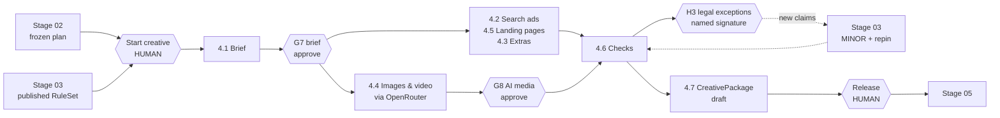
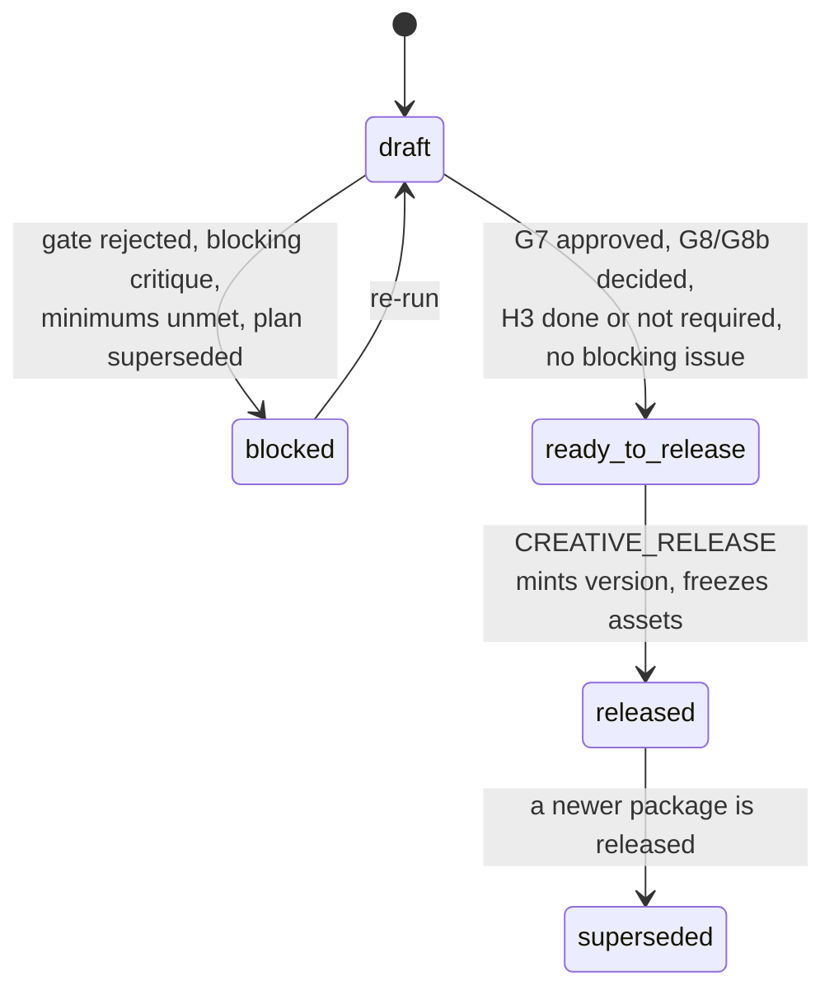

# PRD: Copy & Creative Agent (Stage 04 — Copy & Creative)

**Type:** Internal Tool PRD · **Owner:** Soham Sarker · **Version:** 1.0 · **Date:** 2026-09-24
**Status:** Ready to build
**Depends on:** `PRD-Paid-Ads-Research-Agent.md` (Stage 01) v1.2, `PRD-Campaign-Planning-Agent.md` (Stage 02) v1.0, `PRD-Content-Guidelines-Agent.md` (Stage 03) v1.0 — all shipped
**Runtime dependency:** a **frozen** `CampaignPlan` **and** a **published** `RuleSet`. Both required. Stage 04 is gated.

---

## 0. Assumptions locked in this version

Stage 04 ships into the existing `ads-research-agent` codebase. Nothing here creates a second application.

| # | Assumption | Source |
|---|---|---|
| D1 | Stages 01–03 are shipped. Stage 04 ships into the **same repo, same five Railway services, same auth, same orchestrator, same Evidence store, same export queue, same Stage 03 linter**. No new service, no new volume. | Confirmed |
| D2 | Stage 04 is **gated and manually started.** Preconditions: a frozen, non-superseded `CampaignPlan` (the containers: campaigns, ad groups, keywords, landing URLs) and a published `RuleSet` (the constraints). An `operator` clicks **Start** on the 04 tab. No auto-chain from freeze or publish. | Stage 02 §4 pattern + Stage 03 §16 rule 4 ("404 ⇒ cannot produce creative") |
| D3 | Scope = board tasks **4.1–4.6** plus a **4.7 Package** pair (same pattern as 1.6 / 2.6 / 3.6). Stage 04 **writes nothing to Google Ads, the website, or YouTube.** Loading belongs to Stage 05. | Confirmed (board) |
| D4 | Text surfaces: Search RSAs (primary), sitelinks, callouts, structured snippets, promotion, price and lead-form assets, plus PMax / Demand Gen / Display text sets **only when those types are in the frozen channel slate**. | Inferred — handover says "ads, assets" |
| D5 | **Three stops:** G7 brief (approval), G8 AI-media release (approval, per asset, one regeneration round → G8b), H3 legal exceptions (person-task, only when exceptions exist). The board labels all three APPROVE; H3 is built on Stage 03's **person-task** primitive because licensing a claim must be non-delegable (Law 23). | Confirmed (board) + derived |
| D6 | Image and video generation go through **OpenRouter only**, using the credential already in the vault: `POST /api/v1/images` (synchronous, base64 output) and `POST /api/v1/videos` (asynchronous: submit → poll `GET /api/v1/videos/{id}` → authenticated download from `/content`). Capability discovery via `GET /api/v1/images/models`, `/images/models/{id}/endpoints`, `GET /api/v1/videos/models`. | Confirmed; verified against OpenRouter docs 2026-09-24 |
| D7 | **The user selects image and video models in the UI** from the live catalogue, constrained to an admin allowlist. `IMAGE_GEN` and `VIDEO_GEN` have **no seed default**. Selection is per run, overridable per regeneration. | Confirmed |
| D8 | Stage 04 reads **verdicts** only from the pinned `RuleSet` (Law 27, unchanged) and **guidance** (voice, visual identity, disclosure wording) from a new pinned `CreativeContext` projection of the same published guideline. Additive Stage 03 delta, §4.3. | Derived — resolves the Law 27 gap |
| D9 | 4.5 produces **landing-page patches** (copy blocks, field removals, an HTML snippet), not deployments. It is yellow on the board because it changes a system we do not own. | Inferred |
| D10 | **Models paint pixels; code places brand marks.** Logos, captions, end cards and disclosure labels are composited deterministically. A model never invents the product. | Derived — "the product shown matches the real thing" |
| D11 | Google Ads references video assets by **YouTube video ID**. Stage 04 produces MP4 masters; the YouTube upload is a Stage 05 dependency. | Derived — verify, Q5 |
| D12 | Ad previews are **internal HTML approximations** of Google's layout. Blocking verdicts come only from `RuleSet` specs; pixel truncation is advisory. | Derived |
| D13 | `Dockerfile.worker` adds `ffmpeg`, `libimage-exiftool-perl`, `fonts-inter`, `fonts-noto-core`. `api` is unchanged. | Derived |
| D14 | Stage 04 constants live in `creative_constants.yaml` with `source` + `reviewed_at` (Law 25). Google-shaped values ship `source: unverified`. | Carried from Stage 03 |
| D15 | **No new roles. Two new permissions.** Owners come from Stage 03's `SignOffMatrix`. | Inferred |
| D16 | Platform scope: Google Ads only. | Carried from Stage 02 B11 |
| D17 | **Phase sizing: each build phase completes inside 50–60% of one Claude Code session** — down from ~70% in Stages 01–03. More, smaller phases (§21). | Confirmed |

---

## 1. Executive Summary

Stage 04 turns a frozen plan and a published rulebook into the ads people see and the pages they land on.

The Copy & Creative Agent is a 24-node DAG behind the 04 tab, started by a human once a frozen `CampaignPlan` and a published `RuleSet` exist. It writes a one-page brief from Stages 01–03. After one sign-off it writes the search ads — a headline spread checked in combination, descriptions each bound to a licensed claim, a deliberately different B ad — audits every landing page for message match, writes the extras from live offer data, and produces images and video through OpenRouter using models the user picks in the UI.

Every asset is linted against the pinned `RuleSet` before it exists. Three stops: the brief, AI-made media, and legal exceptions.

Output: a released, immutable `CreativePackage` — ads, media, landing patches and a Google Ads Editor bundle — ready for Stage 05.

---

## 2. Problem & Current Workflow

Stages 01–03 produce research, a plan and a rulebook in under two hours of machine time. Creative is still written from memory, checked by Google after upload, and bottlenecked on a designer.

| Step today | Owner | Time | Failure mode |
|---|---|---|---|
| Write a brief | nobody | 0h | Writers work from a Slack thread. Audience and offer drift per ad group |
| Write RSAs | Soham | 2–3h per 10 ad groups | 6–8 headlines instead of 15, near-duplicates, no category spread |
| Check headline combinations | never | — | Google assembles combinations nobody read. Two CTAs, contradicting offers |
| Put claims in descriptions | from memory | — | Unregistered claims ship; the Stage 03 register exists and is not consulted |
| Write a B ad | rarely | — | No comparison, so no learning |
| Extras (sitelinks, callouts, promotions, prices) | copied from last campaign | 1h | Dead sitelink URLs, stale prices, expired promotion dates |
| Lead form | default template | 0.5h | Every field asked; junk-lead rate ignored |
| Images | designer | 1–2 days | Stretched resizes; text on search images — the most common rejection |
| Video | agency or none | 2–4 weeks | Usually skipped. Brand appears at second 20; unwatchable muted |
| Landing page check | never | — | Ad says "Free trial", page H1 says "Enterprise platform" |
| Pre-upload QA | none | — | Google is the QA. Disapprovals discovered after launch |

**Total ≈ 20–30 hours plus 1–3 weeks of waiting per campaign cycle.**

Three structural failures sit underneath the hours:

1. **Creative is disconnected from its inputs.** The plan, the claims register and the rulebook exist as artifacts; copy is still written against a person's memory of them.
2. **Checking happens after upload.** Every character limit, image rule and claim is verified by Google's rejection, one campaign at a time.
3. **Media is the bottleneck and the risk.** AI generation removes the bottleneck and adds new risk: no provenance, no disclosure label, and a product that does not match the real one.

---

## 3. Proposed Solution

A fourth DAG in the same application, behind the fourth entry in the left panel, **unlocked only when both upstream artifacts exist**.



An `operator` opens **04 Copy & Creative**, reviews the pins (plan version, `ruleset_version`), picks scope and the **image and video models**, sees a pre-flight cost estimate, and clicks **Start**. Node 4.1.1 writes the brief; G7 routes it to the performance owner. **No generation job can be submitted before G7 is approved** — one yes authorises production and its estimated spend.

After G7, copy and media run in parallel. Copy is generated as candidate pools, linted in-process against the pinned `RuleSet`, and selected by deterministic code. Media is generated through OpenRouter, post-produced deterministically (renditions, logo compositing, captions, disclosure metadata), linted, and reviewed per asset at G8. Section 4.6 re-verifies everything, collects exceptions the ruleset cannot license, and routes them to the named legal owner as H3. Cleared claims enter the Stage 03 register, Stage 03 mints a MINOR ruleset, and the run repins and re-lints. Section 4.7 assembles a deterministic `CreativePackage`; a user with `CREATIVE_RELEASE` releases it.

### Design principles

1. **The LLM never sources facts** — carried from Stage 01. Every brief line cites Stage 01–03; copy asserts only licensed claims.
2. **The LLM never does arithmetic** — carried from Stage 02. Prices, dates, discounts, costs and form trade-offs come from `calc/` and `OfferRecord`.
3. **The LLM never adjudicates** — carried from Stage 03. Every verdict comes from the pinned `RuleSet` via `guardrails.linter.lint()`.
4. **The model writes candidates; code selects.** Headline and description selection, pair repair and B-distinctness are deterministic functions over linted pools.
5. **Models paint pixels; code places brand marks.** No generated logo, caption, label or product.
6. **Submit once, verify always.** Media jobs are idempotent across crashes; every output is probed, linted and stamped.
7. **The package is the boundary.** Released is immutable, pinned and re-auditable.

---

## 4. Stage 02 + 03 → Stage 04 Handshake

Stage 02 specified a handshake; Stage 03 specified its absence. Stage 04 is gated again, and harder: it needs **two** frozen artifacts, because copy without ad groups has nowhere to go and copy without rules cannot be checked.

### 4.1 Why Stage 04 is gated

- **The plan supplies the containers.** Every RSA is written into an ad group from `account_structure.campaigns[].ad_groups[]` with its `theme`, `keywords[]`, `landing_url` and `primary_message` (Stage 02 §12.3). There is no meaningful standalone mode.
- **The ruleset supplies the verdicts.** Stage 03 §16 rule 4: no published ruleset ⇒ `404` ⇒ Stage 04 cannot produce creative. "No rules apply" is never a fallback.
- **Research arrives through the plan.** `CampaignPlan.source.research_run_id` is always present on a frozen plan, so the accepted `ResearchReport` is resolvable without a third precondition.

### 4.2 Eligibility — binary preconditions

`GET /projects/{id}/creative/eligibility` returns `{eligible, blockers[], warnings[], pins{}, estimate?}`. The Start button reads that response; it never computes eligibility client-side.

| # | Check | On failure |
|---|---|---|
| CR-E1 | A `CampaignPlan` with `status='frozen'` and `source_superseded=false` exists | `no_frozen_plan` — blocker, names the latest plan's state ("Plan v3 is ready_to_freeze; nobody has frozen it") with a link |
| CR-E2 | A `ContentGuideline` with `status='published'` exists; `GET /guidelines/published/ruleset` returns 200 | `no_published_ruleset` — blocker, links to the 03 tab |
| CR-E3 | Plan `schema_version` ∈ `CREATIVE_SUPPORTED_PLAN_SCHEMAS`; RuleSet `schema_version` ∈ `CREATIVE_SUPPORTED_RULESET_SCHEMAS` | `schema_unsupported` — blocker naming both versions. Caught before a token is spent |
| CR-E4 | The pinned RuleSet has ≥1 rule in `asset_spec` and `claim`; `lexicon`, `policy`, `image`, `disclosure` present | missing `asset_spec`/`claim` → blocker `ruleset_incomplete`; any other missing → warning `ruleset_category_missing` naming it |
| CR-E5 | A current `SignOffMatrix` with brand, legal and performance owners exists | `no_signoff_matrix` — blocker; G7, G8 and H3 cannot route without named owners |
| CR-E6 | No creative run in flight (Redis `project:{id}:creative_lock`) | `creative_in_flight` — blocker, names the holder |
| CR-E7 | An OpenRouter credential resolves for this project | `missing_credential` — blocker |
| CR-E8 | For each enabled modality: a model is selected, is on the allowlist, and is present in the live catalogue | `media_model_unselected` / `media_model_not_allowlisted` / `media_model_unavailable` — blocker naming the modality |
| CR-E9 | Pre-flight estimate ≤ `max_creative_cost_usd` and media estimate ≤ `max_media_cost_usd` | `estimate_exceeds_cap` — blocker with estimate, cap and the scope reduction that would fit |
| CR-E10 | Video enabled and the workspace enforces ZDR | `zdr_blocks_video` — blocker. OpenRouter does not route video under ZDR; the fix is to disable video or ZDR |
| CR-E11 | Volume free space ≥ 2 × the estimated media footprint | `storage_insufficient` — blocker with both numbers |
| CR-E12 | Guideline flags: `signature_stale`, `amendments pending`, open H2 | warnings `claims_unlicensed_stale`, `unreviewed_amendments`, `verification_open_blocks_launch` — never blockers |
| CR-E13 | `OfferRecord` freshest `updated_at` within `offer_max_age_days` | warning `offer_data_stale` — promotion and price assets will be skipped, not guessed |
| CR-E14 | A released package already exists for this plan version | warning `will_mint_new_version` |
| CR-E15 | Actor holds `CREATIVE_EXECUTE` | `403`, missing permission named |

**CR-E1 and CR-E2 are the load-bearing lines.** Any implementation that softens either into a warning has rebuilt Stage 03's independence in the wrong stage.

### 4.3 The crossing contracts — `CreativeInput` and `CreativeContext`

**The Law 27 gap and its resolution.** Law 27 forbids Stage 04 from reading `ContentGuideline.payload`. But voice words, do/don't examples, colour tokens and imagery rules live only there — the `RuleSet` holds matchers, not guidance. Stage 03 therefore gains one read-only projection (`guidelines/projection.py`) served at `GET /guidelines/published/creative-context?project_id=&pin=`. It is derived from the **published** guideline at exactly the pinned version, typed, hashed, and immutable like its source. Law 27's intent is preserved: never a draft, never unpinned, and **enforcement stays exclusively in the RuleSet.**

```python
class CreativeContext(BaseModel):          # Stage 03 delta — projection, not a new source of truth
    schema_version: Literal["1.0"]
    guideline_id: UUID; guideline_version: str; ruleset_version: str
    voice: VoiceProfile                    # 3.1.1 voice_words, definitions, do/dont examples, register, readability
    lexicon_guidance: LexiconGuidance      # 3.1.2 always/never as writer guidance (enforcement is the RuleSet)
    visual_identity: VisualIdentity        # 3.1.3 logo asset refs + variants, clear_space_ratio, min_width_px,
                                           #       colour tokens, permitted/forbidden subjects, stock_policy
    disclosure_rules: list[DisclosureRule] # 3.3.4 required_text, placement, surfaces
    competitor_rules: CompetitorRules      # 3.3.3
    personalization_rules: PersonalizationRules
    hash: str

class MediaModelChoice(BaseModel):
    modality: Literal["image", "video"]
    model_id: str                          # from the live catalogue, ∈ allowlist
    provider_tag: str | None               # pin a provider; None = OpenRouter routes within the model
    capability: dict                       # catalogue record at selection time (supported_parameters |
                                           # supported_durations/resolutions/aspect_ratios, pricing)
    capability_hash: str
    defaults: dict                         # resolution, quality, duration, generate_audio… validated vs capability

class CreativeScope(BaseModel):
    campaign_refs: list[str]               # ⊆ plan.account_structure.campaigns; default all
    images: bool; video: bool
    concepts_per_campaign: Literal[2, 3]

class CreativeInput(BaseModel):
    schema_version: Literal["1.0"]
    project_id: UUID; creative_run_id: UUID
    # pins — all required, all hashed
    plan_ref: PlanRef                      # plan_id, version, schema_version, plan_run_id
    research_ref: ResearchRef              # research_run_id, report_id, acceptance_id (via plan.source)
    ruleset_ref: RuleSetRef                # guideline_id, ruleset_version, hash
    context_ref: CreativeContextRef        # hash
    scope: CreativeScope
    media_models: list[MediaModelChoice]   # empty when scope.images and scope.video are both false

    # Stage 01 (accepted report)
    audience: AudienceSlice                # 1.1.2 best customers, 1.1.3 who we do not want
    differentiation: DifferentiationClaim  # 1.3.4
    competitor_messages: list[MessageCluster]   # 1.3.2/1.3.3 — angles to avoid echoing
    keyword_page_map: list[PageMapping]    # 1.4.5
    landing_audit: list[LandingAuditRef]   # 1.5.1
    # Stage 02 (frozen plan)
    objectives: Objectives                 # 2.1.3
    lead_definition: QualifiedLead         # 2.1.4
    channel_slate: ChannelSlate            # 2.3.1
    account_structure: AccountStructure    # 2.4.2 — the containers
    naming: NamingConvention               # 2.4.1 — ad and asset-group names
    # Stage 03 (published)
    creative_context: CreativeContext
    offer_records: list[OfferRecord]; offer_snapshot_at: datetime
    references: list[MediaReferenceRef]    # product/style refs with rights attestation (§10.3)
    signoff_matrix: SignOffMatrixRef
    inherited_dependencies: list[Dependency]   # plan open_dependencies + guideline open H2
    constants_version: str
```

**Rules on the contract**

1. Assembled once at run start by `orchestrator/creative_input.py`, hashed into `Run.input_hash`, passed read-only to every node. No node re-reads `CampaignPlan`, `ResearchReport` or `ContentGuideline` rows.
2. The linter never receives `CreativeInput`. `creative/lint_adapter.py` loads the RuleSet **by pin** and passes `offer_records` and `now` as arguments, exactly as Stage 03 §9.1 requires.
3. `media_models[].capability` is the catalogue record **at selection time**. Every media request is validated against it before submit (Law 36). A later catalogue change never silently alters a running job.
4. `offer_records` is a snapshot. Promotion and price assets bind to snapshot rows; release re-validates them against live rows (§12.4).
5. Version skew is a `422` at trigger time, never mid-run — the Stage 02 §4.3 rule, not the Stage 03 one, because Stage 04 cannot drop either input.

### 4.4 Pins and repinning

A creative run pins exactly three things at start: plan version, `ruleset_version`, `CreativeContext.hash`. `Run.pins` is an append-only list of `{ruleset_version, reason, at}`.

The **only** event that repins mid-run is H3 completion (§8.6): cleared claims mint a Stage 03 MINOR, the run appends a pin with `reason='h3_clearance'`, and node 4.6.4 re-lints every asset against it. A newer ruleset published for any other reason shows a `newer_ruleset_available` banner and **does not repin** — creative must be reproducible against the rules it was made under.

### 4.5 Upstream changes during or after a run

| Event | Effect |
|---|---|
| A newer plan is frozen | Draft package: `plan_superseded=true`, **release blocked**, banner offers a re-run. Released package: flagged `plan_superseded`, stays valid and resolvable |
| A newer guideline MAJOR is published | Draft or released: `ruleset_superseded=true` banner. No repin, no invalidation. Stage 05 decides whether to re-lint at load |
| A pinned claim expires or is revoked | Release re-lints at `now` (§12.4); an asset asserting it fails release with `409` naming the asset |
| `SignOffMatrix` owner reassigned | Open G7/G8 reroute per Stage 03 §5.2; an open H3 moves via `HumanTaskHandover`, voiding any partial signature |

---

## 5. Users, Roles & Permissions — delta only

Stage 04 adds **no roles** and **two permissions**. Stage 01 §4, Stage 02 §5 and Stage 03 §5 stand unchanged, including the non-delegable rule.

### 5.1 New permissions

| Permission | Granted to | Guards |
|---|---|---|
| `CREATIVE_EXECUTE` | `admin`, `operator` | Start, cancel, retry a creative run; edit copy drafts; regenerate or drop media before G8; upload media references with a rights attestation; withdraw open exceptions |
| `CREATIVE_RELEASE` | `admin`, `approver` | Release a `CreativePackage` |

Reused: `APPROVAL_DECIDE` for G7, G8, G8b; `CLAIM_SIGN` (identity-narrowed to `legal_owner`, step-up) for H3; `SETTINGS_WRITE` for the media-model allowlist and budget caps.

### 5.2 Permission matrix — Stage 04 actions

| Action | admin | operator | approver | viewer |
|---|:--:|:--:|:--:|:--:|
| Read brief, ads, media, landing audits, QA, package | ✅ | ✅ | ✅ | ✅ |
| Export package (JSON / Editor ZIP / PDF / XLSX / MD) | ✅ | ✅ | ✅ | ✅ |
| Run the lint preview in the editor (side-effect free) | ✅ | ✅ | ✅ | ✅ |
| Start / cancel / retry a creative run | ✅ | ✅ | ❌ | ❌ |
| Choose image/video models for a run (from the allowlist) | ✅ | ✅ | ❌ | ❌ |
| Edit copy, regenerate or drop media before G8 | ✅ | ✅ | ❌ | ❌ |
| Upload a media reference with rights attestation | ✅ | ✅ | ❌ | ❌ |
| Decide G7 / G8 / G8b | ✅ | ❌ | ✅ (own gates) | ❌ |
| **Clear legal exceptions (H3)** | **❌** | ❌ | ✅ **named legal owner only** | ❌ |
| Withdraw open exceptions (swap to fallbacks) | ✅ | ✅ | ❌ | ❌ |
| Release a package | ✅ | ❌ | ✅ | ❌ |
| Edit the media allowlist, budget caps, creative constants | ✅ | ❌ | ❌ | ❌ |

**Carried rule:** an `operator` cannot decide a gate, including on a run they started.

### 5.3 Gate and task routing

| Key | Kind | Node | Owner | The act |
|---|---|---|---|---|
| **G7** | approve | 4.1.1 `creative_brief` | `signoff_matrix.performance_owner` | Sign the one-page brief. Authorises production of every downstream asset **and** the estimated spend shown on the card |
| **G8** | approve | 4.4.5 `ai_asset_review` | `signoff_matrix.brand_owner` | Per AI-made asset: approve (checklist complete), reject, or regenerate with a note |
| **G8b** | approve | 4.4.7 `ai_asset_review_final` | `signoff_matrix.brand_owner` | Regenerated assets only: approve or reject. No second regeneration |
| **H3** | person | 4.6.3 `legal_exception_clearance` | `signoff_matrix.legal_owner` **only** | Clear or reject each new claim, disclaimer and image right the ruleset cannot license. Step-up, set-hash-scoped. `not_required` when there are none |

**Why H3 is a person-task although the board says APPROVE.** An ordinary approval degrades to `admin` (Stage 01 §6.1). If H3 were an approval, an administrator could license a claim — precisely what Stage 03 §5.2 exists to prevent. The act is agent-proposed and human-confirmed, but the *consequence* is a `ClaimSignature`, so it must use the identity-bound primitive.

**G7 is hash-scoped.** The approval stores `approved_hash = brief_hash`. `media/jobs.py` refuses any submit for a run whose G7 is not `approved` with a matching hash. An approver may edit the brief before approving; the edited brief is revalidated against `CreativeBrief` and re-hashed.

---

## 6. Architecture — delta only

**No new services.** The same five Railway services, Compose mirror, private network and Volume on `worker`. Stage 04 is new modules inside `apps/api` and new routes inside `apps/web`. Stage 01 §5.2 applies verbatim: bind `::`, read `$PORT`, relative `/api/v1` only, migrations in `preDeployCommand`, all durable bytes through `storage/backend.py`, no `if RAILWAY` branch.

**One image change.** `apps/api/Dockerfile.worker` adds `ffmpeg`, `libimage-exiftool-perl`, `fonts-inter` and `fonts-noto-core` (≈ +300 MB). Video post-production runs one job at a time; the 2 GB worker floor holds for 1080p H.264. `api` stays slim — it never decodes media, it streams bytes from the worker file server.

**One file-server change.** `fileserver.py` gains HTTP `Range` support (`206 Partial Content`) so the browser `<video>` element can seek. HMAC-token auth unchanged.

### 6.1 New modules in `apps/api/src/agent/`

```
agent/
├─ orchestrator/
│  ├─ dag.py                     # EXTENDED: DAGS gains "creative" (24 nodes)
│  └─ creative_input.py          # NEW: builds + hashes CreativeInput, resolves pins
├─ nodes/creative/               # NEW: n4_1_1_creative_brief.py … n4_7_2_creative_critique.py
├─ creative/
│  ├─ constants.py  creative_constants.yaml
│  ├─ lint_adapter.py            # the ONLY Stage 04 caller of guardrails.linter.lint()
│  ├─ select.py                  # quota-constrained max-diversity selection — pure
│  ├─ combinatorics.py           # HH/HD/DD pair enumeration + deterministic pair flags — pure
│  ├─ metrics.py                 # trigram, distinctness, message match — pure, versioned metric ids
│  ├─ offers.py                  # OfferBinding resolution against the snapshot
│  ├─ exceptions.py              # exception collection, fallback mapping, withdraw
│  ├─ repin.py                   # H3 -> Stage 03 MINOR -> Run.pins append -> re-lint trigger
│  ├─ package.py                 # deterministic assembly, manifest hashing
│  └─ release.py                 # transactional release, immutability
├─ media/
│  ├─ catalogue.py               # /images/models (+ /endpoints), /videos/models; Redis cache 10 min
│  ├─ capability.py              # enum/range/boolean descriptors; video supported_* lists; ratio coverage
│  ├─ images.py                  # POST /api/v1/images
│  ├─ videos.py                  # POST /api/v1/videos, GET /videos/{id}, GET /videos/{id}/content
│  ├─ jobs.py                    # submit-once, resume, semaphores, G7 spend gate
│  ├─ budget.py                  # Redis reservation + reconcile against usage.cost
│  ├─ references.py              # MediaReference -> provider payload (base64 data URLs), policy check
│  └─ postprod/
│     ├─ image.py                # uniform scale, saliency crop, logo composite, encode-to-bytes, XMP
│     ├─ video.py                # ffmpeg filtergraph, ASS captions, end card, loudnorm, encode
│     ├─ probe.py                # Pillow + ffprobe facts
│     └─ verify.py               # frame sampling -> Stage 03 image metrics (logo, OCR)
├─ preview/
│  ├─ serp.py                    # Playwright render of ad previews (mobile/desktop)
│  ├─ landing.py                 # Playwright render + DOM extraction for 4.5
│  └─ templates/serp_mobile.html  serp_desktop.html
├─ calc/                         # EXTENDED: media.cost_estimate_v1, media.shot_plan_v1,
│                                #           media.ratio_plan_v1, leadform.field_tradeoff_v1
├─ guidelines/projection.py      # NEW (Stage 03 delta): CreativeContext projection
├─ api/routes_creative.py  routes_media.py
└─ export/
   ├─ editor_zip.py  editor_columns.yaml
   ├─ creative_book_pdf.py  asset_inventory_xlsx.py
   └─ templates/creative_*.jinja
```

### 6.2 New surfaces in `apps/web/`

```
app/(routes)/projects/[id]/
├─ layout.tsx                    # EXTENDED: 04 entry goes live on the stage rail
└─ creative/
   ├─ page.tsx                   # Stage 04 landing
   ├─ packages/[packageId]/page.tsx   # released package — canonical URL
   ├─ compare/page.tsx           # package diff
   └─ runs/[runId]/
      ├─ layout.tsx              # run header + section nav
      ├─ page.tsx                # Creative Console (Run Console, stage-aware)
      ├─ brief/page.tsx  ads/page.tsx  extras/page.tsx  media/page.tsx
      ├─ review/page.tsx         # G8 / G8b workspace
      ├─ landing/page.tsx  qa/page.tsx  package/page.tsx
app/(routes)/settings/models/page.tsx   # EXTENDED: Media generation section
components/creative/
├─ StartCreativeDialog  PinSummary  ScopePicker  CostEstimate
├─ ModelPicker  CapabilityParams  AspectGlyph  MediaAllowlistEditor
├─ BriefDocument  SourceChip  BriefGateCard
├─ SerpPreview  HeadlineMatrix  PairHeatmap  DescriptionTable  VariantCompare  CharCounter  LintChip
├─ ExtensionsPreview  OfferBindingField  LeadFormTradeoffChart
├─ ConceptBoard  RenditionGrid  MediaDetailDrawer  GenerationPanel  JobStatusList  VideoPlayer  FrameCheckStrip
├─ ReviewWorkspace  ReviewChecklist  ReferenceCompare  ReviewFilmstrip
├─ LandingAuditCard  FoldOverlay  WordDiff  PatchViewer
├─ PreviewGrid  SpecConformanceTable  ExceptionList
└─ PackageManifest  LaunchMinimums  ReleaseDialog  PackageDiff
```

### 6.3 What is reused without modification

LLM gateway, cost ledger, model router, SSE channel, retry/repair loop, checkpointing, cancellation, approvals inbox, the person-task subsystem and step-up re-auth (Stage 03), `ClaimSignature`, the linter and image metrics, Evidence store, audit log, credential vault, export queue, file server (plus `Range`), Playwright browser pool. **If a Stage 04 task appears to require changing the executor's core loop, stop.** Media waits are handled inside nodes by idempotent job rows (§8.4); G8's second round is a static DAG node, not a re-opened gate (§8.5).

---

## 7. Data Model — delta only

Ten new tables; `Run`, `Approval`, `Export`, `Project.settings`, `Workspace.settings` altered; four additive Stage 03 deltas. `WorkspaceScopedRepo` on every query, unchanged.

### 7.1 Altered

```python
Run:
  ~ stage enum + 'creative'
  + pins jsonb NULL                 # append-only [{ruleset_version, reason, at}] for stage='creative'
  # source_run_id = the frozen plan's plan_run_id for a creative run.
  # ADD: CHECK (stage <> 'creative' OR source_run_id IS NOT NULL)
  # Existing Stage 03 checks are untouched.

Approval:
  # gate_key gains 'G7', 'G8', 'G8b' (text, no enum change)
  + draft_state jsonb NULL          # a reviewer's saved, unsubmitted per-item decisions (G8/G8b)

Export:
  ~ artifact_type enum + creative_package
  ~ format enum        + editor_zip

Project.settings:
  + media_models        {image: {model_id, provider_tag?, defaults}, video: {...}}   # project defaults
  + media_references_allowed  bool, default false   # may product/style refs be sent to providers?
  + max_creative_cost_usd     default 50.00
  + max_media_cost_usd        default 40.00
  + creative_overrides        # per-project overrides of creative_constants.yaml

Workspace.settings:
  + media_allowlist     {image: [{model_id, provider_tag?, enabled}], video: [...]}

TaskClass (Python enum, llm/router.py):
  + COPYWRITE, VISION, IMAGE_GEN, VIDEO_GEN
  # IMAGE_GEN / VIDEO_GEN are routed ONLY through media/. gateway.complete_structured()
  # raises on them; a CI test asserts it.

# ---- Stage 03 deltas (additive, shipped in Stage 04's revisions) ----
LintTarget.surface  + search_image, pmax_image, display_image, demand_gen_image,
                      video_frame, promotion, price, lead_form        # additive literals
PolicyAmendment.origin enum + creative_exception                     # applied by the H3 transaction
ClaimRecord  + origin text NOT NULL DEFAULT 'harvest'                # 'harvest' | 'creative_exception'
HumanTask.task_key gains 'H3'   # guideline_run_id is a plain FK to Run; it carries the creative
                                # run id for H3. Not renamed — same precedent as PlanCalc.plan_run_id
```

### 7.2 New tables

```python
CreativeBrief(
    id uuid pk, workspace_id fk, project_id fk, creative_run_id fk->Run unique,
    schema_version text, payload jsonb, markdown text,
    brief_hash text,                          # sha256 over canonical payload
    approval_id fk->Approval null,            # G7
    approved_hash text null,                  # must equal brief_hash for any media submit
    created_at, updated_at)
    # BEFORE UPDATE trigger: once approved_hash IS NOT NULL, payload and brief_hash are frozen.

MediaReference(
    id uuid pk, workspace_id fk, project_id fk,
    kind enum[product_reference|style_reference],
    storage_path text, media_type text, width int, height int, bytes int, sha256 text,
    product_ref text null,                    # sku / product_set depicted
    origin enum[own|licensed|third_party],
    rights_statement text NOT NULL, attested_by fk->User NOT NULL, attested_at,
    retired_at null, created_at)
    UNIQUE(project_id, sha256)
    # origin='third_party' is never sent to a provider without a cleared H3 image_right.

CreativeAsset(
    id uuid pk, workspace_id fk, project_id fk, creative_run_id fk->Run, node_id text,
    campaign_ref text, ad_group_ref text null, ad_ref text null,
    kind enum[headline|long_headline|description|path|sitelink|callout|structured_snippet|
              promotion|price|lead_form|business_name|video_script|image|video|logo],
    surface text,                             # a LintTarget.surface literal
    variant enum[A|B] null, category text null,
    text text null, fields jsonb,             # sitelink {link_text,line1,line2,final_url} etc.
    claim_ids uuid[], offer_binding jsonb null, pin_position text null,
    generated_by_ai bool NOT NULL,
    status enum[draft|linted|reserve|awaiting_review|approved|rejected|dropped|
                awaiting_exception|released],
    lint jsonb null, ruleset_version text null,
    lineage jsonb,                            # {origin: generated|human_edit|reserve_swap|regenerated|reused,
                                              #  parent_id, by_user?, node_id}
    content_hash text, frozen_at null, created_at, updated_at)
    # Index: (creative_run_id, kind, status), (creative_run_id, ad_group_ref)
    # BEFORE UPDATE trigger: reject every change once frozen_at IS NOT NULL (set at release).

GenerationJob(
    id uuid pk, workspace_id fk, project_id fk, creative_run_id fk->Run, node_id text,
    asset_id fk->CreativeAsset null, round int default 1,
    modality enum[image|video], model_id text, provider_tag text null, capability_hash text,
    request jsonb,                            # canonical + redacted: references as sha256, never base64
    idempotency_key text UNIQUE NOT NULL,
    openrouter_job_id text UNIQUE NULL,       # video only
    status enum[queued|submitting|submitted|in_progress|completed|failed|cancelled|expired|
                timed_out|blocked_by_budget|unknown_submit_state],
    estimate_usd numeric, cost_usd numeric null,
    attempts int default 0, polls int default 0, next_poll_at null,
    error jsonb null, submitted_at null, completed_at null, created_at, updated_at)
    # Index: (creative_run_id, status), (status, next_poll_at)

MediaArtifact(
    id uuid pk, workspace_id fk, asset_id fk->CreativeAsset, job_id fk->GenerationJob null,
    role enum[candidate|master|rendition|clip|preview|thumbnail|poster|frame_sample],
    storage_path text, media_type text, width int, height int, duration_ms int null,
    bytes int, sha256 text, aspect_ratio text,
    derivation enum[native|relaid|crop|composited|encoded|ingested],
    derived_from fk->MediaArtifact null,
    transform jsonb,                          # {crop_box, sx, sy, logo_box, encoder_args}
    probe jsonb,                              # Pillow / ffprobe output
    disclosure jsonb,                         # {xmp_digital_source_type, mp4_comment, visible_label?}
    created_at)
    # CHECK (transform IS NULL OR (transform->>'sx') = (transform->>'sy'))   -- Law 39 in DDL

AssetDecision(
    id uuid pk, approval_id fk->Approval, asset_id fk->CreativeAsset, round int,
    decision enum[approve|reject|regenerate],
    checklist jsonb,                          # {label_ok, product_match_ok, subjects_ok, rights_ok}
    note text null, model_override text null, params_override jsonb null,
    decided_by fk->User, decided_at)
    UNIQUE(approval_id, asset_id)             # append-only

CreativeException(
    id uuid pk, workspace_id fk, project_id fk, creative_run_id fk->Run,
    kind enum[new_claim|disclaimer|image_right],
    subject_text text null, asset_ids uuid[], occurrences int,
    proposed jsonb,                           # claim: {claim_type, surface_forms[], substantiation}
                                              # disclaimer: {text, placement} · image_right: {basis, flag}
    evidence_ids uuid[], fallback_asset_ids uuid[],
    status enum[open|cleared|rejected|withdrawn],
    human_task_id fk->HumanTask null, claim_record_id fk->ClaimRecord null,
    signature_id fk->ClaimSignature null,
    decided_by fk->User null, decided_at null, decision_note text null,
    set_hash text null, reauth_token_id text null, created_at, updated_at)

LandingPageAudit(
    id uuid pk, creative_run_id fk->Run, url text, final_url text, http_status int,
    ad_group_refs text[], metrics jsonb,      # message_match, fold_px, offer bbox, fields
    patch jsonb, verdict enum[ok|needs_change|blocking_for_launch|unreachable],
    screenshots jsonb, evidence_ids uuid[], created_at)
    UNIQUE(creative_run_id, url)

RenderPreview(
    id uuid pk, creative_run_id fk->Run, ad_ref text, device enum[mobile|desktop],
    combination jsonb, storage_path text, dom_metrics jsonb, spec_diff jsonb,
    visual_diff jsonb null, template_version text,
    verdict enum[pass|warning|blocking|unavailable], created_at)

CreativePackage(
    id uuid pk, workspace_id fk, project_id fk, creative_run_id fk->Run unique,
    schema_version text, version int,
    status enum[draft|blocked|ready_to_release|released|superseded],
    plan_id fk->CampaignPlan, plan_version int,
    guideline_id fk->ContentGuideline, ruleset_version text,
    brief_hash text, payload jsonb, manifest jsonb, package_hash text,
    released_at null, released_by fk->User null, released_approval_ids uuid[] null,
    plan_superseded bool default false, ruleset_superseded bool default false,
    cost_usd numeric, created_at, updated_at)
    UNIQUE(project_id, version)
    # BEFORE UPDATE trigger: once status='released', only status and the two *_superseded
    # flags may change.
```

### 7.3 Evidence usage

No schema change.

| `source` | `kind` | Written by |
|---|---|---|
| `web` | `landing_render`, `landing_dom`, `url_check` | `preview/landing.py`, 4.3.1 |
| `derived` | `calc_media_cost`, `calc_shot_plan`, `calc_ratio_plan`, `calc_leadform`, `metric_message_match`, `metric_distinctness`, `media_probe`, `frame_check` | `calc/`, `creative/metrics.py`, `media/postprod/` |

`PlanCalc` is reused for the four new formulas; its `plan_run_id` is a plain FK to `Run` and accepts a creative run id.

### 7.4 Storage layout and retention

```
$STORAGE_DIR/creative/{run_id}/
├─ media/{asset_id}/{media_id}.{png|jpg|webp|mp4}   # candidates, masters, renditions, clips
├─ previews/{media_id}_{thumb|preview|poster}.{webp|mp4|jpg}
├─ renders/{ad_ref}_{device}.png                    # 4.6.4
├─ landing/{url_hash}_{device}.png                  # 4.5
└─ package/                                         # assembled at release; hashed in manifest
$STORAGE_DIR/references/{project_id}/{sha256}.{ext} # MediaReference
```

A typical run (10 ad groups, 3 concepts, 4 image ratios, 2 video ratios) writes ≈ 300 MB. Unreleased runs' media prune after `unreleased_media_days` (30); superseded packages after `superseded_package_days` (180); released packages and references are never pruned automatically.

### 7.5 Migration notes

1. Two revisions, strict order: `stage04_enums` (`isolation_level="AUTOCOMMIT"`: `run_stage + 'creative'`, `export_artifact_type + 'creative_package'`, `export_format + 'editor_zip'`, `policy_amendment_origin + 'creative_exception'`, plus every new Stage 04 enum type), then `stage04_schema`. `downgrade()` of the enum revision raises — Postgres cannot drop an enum label.
2. The `Run` CHECK is **added**, not replaced. A test asserts: `stage='creative'` with NULL `source_run_id` fails; `stage='guideline'` with NULL still inserts; `stage='plan'` with NULL still fails.
3. Four triggers ship with their tables: `CreativeBrief` post-approval freeze, `CreativeAsset` post-release freeze, `CreativePackage` released immutability, `AssetDecision` append-only. Each has a `pytest` case asserting the `UPDATE` raises.
4. `GenerationJob.idempotency_key UNIQUE` is the database form of Law 37. Never drop it "to allow retries".
5. `MediaArtifact` uniform-scale CHECK is the database form of Law 39.

---

## 8. Orchestration — delta only

One executor runs four stages; `Run.stage` selects the DAG.

### 8.1 Registry and DAG

1. `DAGS = {"research", "plan", "guideline", "creative"}`, all validated acyclic at import. The one-DAG-per-node CI test now covers 84 nodes.
2. `NodeSpec` gains two fields: `media: list[Literal["image","video"]]` — the modalities a node may submit (a submit outside the list raises); `lint_required: bool` — the executor asserts every `CreativeAsset` the node persisted with `status ≠ draft` carries a `LintResult` against the run's current pin.
3. A creative node's `gather()` returns `CreativeInput` slices plus Evidence. `reason()` may call the LLM gateway, `media/jobs.py`, `creative/lint_adapter.py` and pure `creative/` functions — nothing else on the network.

### 8.2 Unchanged mechanics

Topological wavefront with `asyncio.Semaphore(4)`; 3 retries with backoff; one schema-repair pass; `NodeRun` persisted on completion; resume skips `succeeded`; cooperative cancellation; SSE event types plus the 15 s heartbeat; `awaiting_approval` and `awaiting_human_task`.

### 8.3 What is new

| Concern | Behaviour |
|---|---|
| **Creative lock** | Redis `project:{id}:creative_lock`, 3 h TTL refreshed on heartbeat (video polls can be long). Independent of the other three locks |
| **Two budget caps** | `max_creative_cost_usd` (text + media, default $50) and `max_media_cost_usd` (default $40). Media spend is reserved **before** each submit (§9.3) |
| **Spend gate** | `media/jobs.py` rejects any submit unless the run's G7 is `approved` with `approved_hash == brief_hash`. Enforced in the job layer, not in nodes |
| **Media concurrency** | Redis semaphores `media:image` (4) and `media:video` (2), workspace-wide. Playwright stays at concurrency 1 (Stage 01 §9.2) |
| **Cache reuse** | `Run.input_hash` = hash(`CreativeInput`) + constants version. With `reuse_cache=true`, deterministic nodes skip, and a media request whose canonical hash matches a completed job from a prior run reuses its `MediaArtifact` (`lineage.origin='reused'`, cost $0). Gate and person-task nodes are never cache-skipped |
| **Lint on write** | Every text candidate and every image rendition is linted at creation. Only `pass` / `pass_with_warnings` can move past `draft` |
| **Read-only enforcement** | `google_ads` via `ReadOnlyConnector` (Stage 02 §8.3). Playwright issues GETs only and **never submits a form** on a landing page |
| **Terminal states** | A creative run ends `succeeded` with `CreativePackage.status ∈ {ready_to_release, blocked}`. `succeeded` never means released |

### 8.4 Media jobs inside nodes — submit once, resume always

Video generation takes 30 s to several minutes. Nodes wait for it without executor changes because the wait is **re-entrant**: a `GenerationJob` row exists before the network call, so a resumed node finds it and re-polls instead of re-submitting.

```
submit_or_resume(asset_id, round, request) -> GenerationJob
  key = sha256(asset_id | round | canonical_json(request) | model_id | capability_hash)
  row = SELECT … WHERE idempotency_key = key FOR UPDATE
  if row.status is terminal:                  return row
  if row.openrouter_job_id is not NULL:       return row            # resume polling, never re-POST
  if row.status == 'submitting':              mark unknown_submit_state; return row   # see §18
  if row is None: INSERT status='queued'      # committed BEFORE any network call
  assert_g7_approved(run); budget.reserve(estimate) or mark blocked_by_budget
  acquire semaphore(modality)
  UPDATE status='submitting'; COMMIT
  image: POST /api/v1/images -> decode b64_json -> storage.put -> status='completed', cost=usage.cost
  video: POST /api/v1/videos -> 202 {id, polling_url} -> UPDATE openrouter_job_id, status='submitted'

await_video(job):
  poll GET /api/v1/videos/{id}: interval 10 s -> 30 s (+jitter), node.progress on every poll
  pending | in_progress -> continue
  completed -> GET /api/v1/videos/{id}/content?index=i with Authorization, in worker -> storage.put
  failed | cancelled | expired -> terminal, error verbatim
  elapsed > video_job_timeout_s -> 'timed_out' (the OpenRouter job is left alive; "Check again" resumes)
budget.reconcile(job, usage.cost)
```

Four facts from OpenRouter shape this: image generation is all-or-nothing billed and a failed generation returns `502` unbilled, so an image re-POST after a crash is safe; video is billed per job, so a video re-POST is never automatic; video `unsigned_urls` require the API key, so downloads happen only in `worker` and the URL never leaves it; video is not ZDR-eligible (CR-E10).

### 8.5 G8 in two static rounds

The executor halts a gate node once. G8's "regenerate and look again" is therefore modelled as three static nodes, not a re-opened gate:

`4.4.5 ⛳G8` (approve | reject | regenerate) → `4.4.6 asset_regeneration` (regenerates only the `regenerate` items; `not_required` if none) → `4.4.7 ⛳G8b` (approve | reject; `not_required` if 4.4.6 was). A second regeneration does not exist: a rejected G8b item is dropped. This bounds cost and review time by construction.

On resume, the branch receives `edited_proposal.items[]`. Each item is revalidated: `approve` requires every checklist field `true`; `regenerate` is legal only at G8, and its `model_override` must be on the allowlist and its `params_override` must pass capability validation. A failure returns `422` naming the asset; the gate stays pending.

### 8.6 H3 → Stage 03 → repin

H3 submission is one transaction:

1. Verify the step-up token (Stage 03 §5.2) and recompute `set_hash` over the exception set; mismatch → `409`, nothing written.
2. For `new_claim` items: write `ClaimRecord(origin='creative_exception', status=approved|rejected)` and one append-only `ClaimSignature` over the claim subset.
3. For `disclaimer` and `image_right` items: write the decision on `CreativeException`. These clearances are **package-scoped**; promoting a disclaimer into the rulebook is a manual Stage 03 amendment.
4. If any claim was approved: call Stage 03 `publish.mint_minor(origin='creative_exception', reviewed_by=signer)`, compile the RuleSet, and append `{ruleset_version, reason:'h3_clearance'}` to `Run.pins`. The signer's signature is the review; this amendment does not enter the substantive-amendment inbox.
5. Resume the branch. 4.6.4 re-lints every asset against the new pin; assets tied to rejected exceptions swap to `fallback_asset_ids` or drop.

An operator may **withdraw** open exceptions instead (`POST /creative-runs/{id}/exceptions/withdraw`): the H3 task ends `not_required`, dependent assets swap to fallbacks. Withdrawing reduces scope; it never licenses anything.

---

## 9. Media Gateway, Creative Constants & Model Routing

Stage 01 has `llm/` for text; Stage 04 adds `media/` for pixels. The same discipline applies: model IDs are runtime data, every request is schema-checked before it leaves, and every cent lands in the ledger.

### 9.1 The `media/` contract

1. **Catalogue.** `catalogue.py` reads `GET /api/v1/images/models`, `GET /api/v1/images/models/{id}/endpoints` (definitive per-endpoint `supported_parameters`, `pricing` lines, `provider_tag`) and `GET /api/v1/videos/models` (`supported_durations`, `supported_resolutions`, `supported_aspect_ratios`, `supported_sizes`, `pricing_skus`, `allowed_passthrough_parameters`). Cached in Redis 10 min with a `catalogue_hash`. On fetch failure, a last-good snapshot ≤ 24 h is served with a warning; older ⇒ CR-E8 blocker.
2. **Capability validation.** `capability.py` validates every request field against the pinned capability record: `enum` ⇒ value ∈ values; `range` ⇒ min ≤ v ≤ max; `boolean` ⇒ key present; video ⇒ value ∈ `supported_*`. Unsupported ⇒ **our `422` naming the field and the supported values**, before any spend. An absent key means unsupported, never "try it".
3. **Image client.** `POST /api/v1/images` with `model`, `prompt`, and only validated optional fields: `aspect_ratio`, `resolution`, `size`, `quality`, `output_format`, `background`, `n`, `seed`, `input_references[]`, `provider{only|order|allow_fallbacks}`. Output `data[].b64_json` + `media_type`; `usage.cost` to the ledger. Non-streaming in v1.
4. **Video client.** `POST /api/v1/videos` with `model`, `prompt`, `duration`, `resolution`, `aspect_ratio`, `frame_images[]` (image-to-video) or `input_references[]` (reference-to-video), `generate_audio`, `seed`. Polling per §8.4. **No `callback_url` in v1** — polling keeps `api` free of a public webhook route (Q15).
5. **References.** `references.py` sends `MediaReference` bytes as base64 data URLs, never as public URLs (the Volume has none), and only when Law 44 allows. Size-capped per `media.reference_max_bytes`.
6. **No cross-model fallback.** Unlike Stage 01 §16's text fallback list, an unavailable or failing media model is **never** silently replaced by another — the user chose it. Provider-level fallback *within* the chosen model is allowed unless `provider_tag` is pinned (then `allow_fallbacks=false`).
7. **Never log** the key, `unsigned_urls`, or reference base64. `GenerationJob.request` stores references by sha256.

### 9.2 Model selection — where the user chooses

| Surface | Who | What |
|---|---|---|
| `/settings/models` → **Media generation** | `admin` | Two allowlists (image, video) picked from the live catalogue; optional provider pin; workspace default params. Nothing is allowlisted by default |
| Project settings → Media | `admin` | Per-project default model + params per modality |
| **Start dialog** | `operator`, `admin` | Choose one image model and one video model **from the allowlist** for this run; parameters constrained to the capability record; live cost estimate |
| **Regenerate** (Media Library, G8) | `operator` (before G8), brand owner (at G8) | Optionally switch to another allowlisted model for that asset; recorded in provenance |

The chosen `MediaModelChoice` (with capability record and hash) is snapshotted into `CreativeInput`. **Ratio coverage** is computed at selection (`media.ratio_plan_v1`): for every ratio the spec sheet requires, the plan is `native` (supported), `relaid` (image-to-image from the master at a supported ratio), or `crop` (from a larger-coverage generation), and the dialog shows which, so the user sees the consequence of the model choice before spending.

### 9.3 Cost estimation and the budget guard

`calc/media.cost_estimate_v1` prices every planned job from the pinned catalogue record: image `pricing[]` lines (`unit ∈ {image, megapixel, token}`, resolution `variant` tiers; token-priced models use `media.image_tokens_per_megapixel` from constants, confidence `low`) and video `pricing_skus` (per-second, per-resolution variants) × planned duration. Output: `{text_usd, image_usd, video_usd, total_usd, confidence, calc_evidence_id}`.

`budget.py` reserves the job estimate atomically in Redis before submit and reconciles to `usage.cost` on completion. A reservation that would breach either cap marks the job `blocked_by_budget` and the node walks the **degrade ladder** from constants — fewer candidates → drop the third concept → drop video 1:1 → drop video — recording each step in the package. Estimate accuracy (`|actual − estimate| / estimate`) is tracked per model and shown in Settings.

### 9.4 Deterministic post-production

**Images** (`postprod/image.py`, Pillow + OpenCV):

1. **Renditions** follow the ratio plan. `relaid` > `native` > `crop`. A crop window is chosen by `media.crop_window_v1` maximising OpenCV spectral-residual saliency mass; if retained saliency < `crop_min_saliency_retained` (0.85) the rendition is a recorded `gap`, never a bad crop.
2. **Scaling is uniform only**: `resize` preserves ratio; `sx == sy` asserted and persisted (Law 39).
3. **Logos** are composited from Stage 03 registered logo assets on surfaces in `logo.permitted_surfaces` only — never on `search_image`. Variant (light/dark) chosen by measured background luminance to reach ≥ 3:1 contrast; clear space = `clear_space_ratio × logo_height`; width ≥ `min_width_px`.
4. **Encode** to the spec's format; JPEG quality binary-searched down to `jpeg_quality_floor` (80) to fit `max_bytes`, else gap.
5. **Stamp**: strip EXIF/GPS; write XMP `Iptc4xmpExt:DigitalSourceType` = `trainedAlgorithmicMedia` (or `compositeWithTrainedAlgorithmicMedia` when a logo was composited) via `exiftool`; add any visible label Stage 03 disclosure rules require at their placement.
6. **Lint** every rendition via `lint_adapter` with `image_ref` and `generated_by_ai=True` (text coverage, logo presence, disclosure).

**Video** (`postprod/video.py`, ffmpeg):

1. **Script first.** `VideoScript{duration_s, beats[]{t0, t1, visual, voiceover?, on_screen_text?}, captions[]{t0, t1, text}, cta}`. Schema rule: every `voiceover` interval is fully covered by captions, and the CTA appears as on-screen text — "works with sound off" as a validator.
2. **Shot plan**: `media.shot_plan_v1` partitions `duration_s` into clips whose durations ∈ the model's `supported_durations`.
3. **Assemble**: concat clips (`setsar=1`, uniform scale + crop, never stretch) → logo overlay `enable='between(t,0.5,4.5)'` with clear space (brand visible inside `brand_within_ms`, 5000) → captions burned via libass from a generated `.ass` (Inter SemiBold, height `caption_height_pct` of frame, 60%-opacity box so contrast holds on any frame, bottom margin inside the surface's safe zone) → end card (`end_card_ms`, brand colour token + logo + CTA, rendered by Pillow) → audio `loudnorm=I=-16:TP=-1.5` when present, silent AAC track otherwise → `libx264 -profile:v high -pix_fmt yuv420p -crf 18 -movflags +faststart`, `target_fps` 30.
4. **Verify**: `ffprobe` facts vs spec; sample frames at 1 fps over [0, 5 s] → Stage 03 logo metrics ⇒ `brand_first_at_ms`; OCR each caption interval's midpoint frame ⇒ normalised similarity ≥ `caption_ocr_min_similarity` (0.85). Failure ⇒ blocking.
5. **Stamp**: MP4 `comment` metadata + XMP DigitalSourceType; 480p preview proxy and poster frame for the UI.

### 9.5 `creative_constants.yaml`

Same discipline as Stage 02 §9.3 and Stage 03 §9.6: every constant carries `value`, `source`, `reviewed_at`; a missing `source` fails startup naming the key; `version` is stamped on every package.

```yaml
version: "2026.09.1"
copy:
  headline_pool_size:          { value: 25,   source: internal, reviewed_at: 2026-09-24 }
  headline_quotas:             { value: {keyword: 3, benefit: 3, offer: 2, proof: 2, objection: 2, cta: 2},
                                 source: internal, reviewed_at: 2026-09-24 }
  description_pool_size:       { value: 8,    source: internal, reviewed_at: 2026-09-24 }
  near_duplicate_trigram:      { value: 0.80, source: internal, reviewed_at: 2026-09-24 }
  variant_min_distance:        { value: 0.65, source: internal, reviewed_at: 2026-09-24 }  # 1 − similarity
  pair_repair_rounds:          { value: 1,    source: internal, reviewed_at: 2026-09-24 }
  temperature_copywrite:       { value: 0.7,  source: internal, reviewed_at: 2026-09-24 }
landing:
  message_match_min:           { value: 0.55, source: internal, reviewed_at: 2026-09-24 }
  viewport_mobile:             { value: "390x844",  source: internal, reviewed_at: 2026-09-24 }
  viewport_desktop:            { value: "1280x800", source: internal, reviewed_at: 2026-09-24 }
offers:
  offer_max_age_days:          { value: 7,    source: internal, reviewed_at: 2026-09-24 }
extras:
  snippet_headers:             { value: [...], source: unverified, reviewed_at: 2026-09-24 }
  lead_form_question_types:    { value: [...], source: unverified, reviewed_at: 2026-09-24 }
media:
  candidates_per_concept:      { value: 2,     source: internal, reviewed_at: 2026-09-24 }
  ratio_tolerance:             { value: 0.005, source: internal, reviewed_at: 2026-09-24 }
  crop_min_saliency_retained:  { value: 0.85,  source: internal, reviewed_at: 2026-09-24 }
  jpeg_quality_floor:          { value: 80,    source: internal, reviewed_at: 2026-09-24 }
  reference_max_bytes:         { value: 8388608, source: internal, reviewed_at: 2026-09-24 }
  image_tokens_per_megapixel:  { value: 1300,  source: unverified, reviewed_at: 2026-09-24 }
  semaphore_image:             { value: 4,     source: internal, reviewed_at: 2026-09-24 }
  semaphore_video:             { value: 2,     source: internal, reviewed_at: 2026-09-24 }
  video_poll_initial_s:        { value: 10,    source: "openrouter docs", reviewed_at: 2026-09-24 }
  video_poll_max_s:            { value: 30,    source: "openrouter docs", reviewed_at: 2026-09-24 }
  video_job_timeout_s:         { value: 900,   source: internal, reviewed_at: 2026-09-24 }
  degrade_ladder:              { value: [candidates, third_concept, video_square, video],
                                 source: internal, reviewed_at: 2026-09-24 }
video:
  brand_within_ms:             { value: 5000,  source: "stage board 4.4", reviewed_at: 2026-09-24 }
  end_card_ms:                 { value: 2000,  source: internal, reviewed_at: 2026-09-24 }
  caption_height_pct:          { value: 0.055, source: internal, reviewed_at: 2026-09-24 }
  caption_ocr_min_similarity:  { value: 0.85,  source: internal, reviewed_at: 2026-09-24 }
  target_fps:                  { value: 30,    source: internal, reviewed_at: 2026-09-24 }
  loudness_lufs:               { value: -16,   source: internal, reviewed_at: 2026-09-24 }
  generate_audio_default:      { value: false, source: internal, reviewed_at: 2026-09-24 }
logo:
  permitted_surfaces:          { value: [pmax_image, display_image, demand_gen_image, video],
                                 source: unverified, reviewed_at: 2026-09-24 }
exceptions:
  max_exceptions_per_run:      { value: 20,    source: internal, reviewed_at: 2026-09-24 }
retention:
  unreleased_media_days:       { value: 30,    source: internal, reviewed_at: 2026-09-24 }
  superseded_package_days:     { value: 180,   source: internal, reviewed_at: 2026-09-24 }
preview:
  serp_template_version:       { value: "2026.09", source: unverified, reviewed_at: 2026-09-24 }
```

Google character limits, asset counts, ratios, pixel minimums and file-size caps are **not** here — they come from the pinned `RuleSet.asset_specs` (Stage 03 §9.6). A surface Stage 04 needs that the spec sheet lacks (promotion, price, lead form, video durations) produces `spec_missing`, never a guess (Q6).

### 9.6 Model routing

Same `llm/router.py`, same runtime-hydrated IDs, same per-project override. Four new task classes.

| Task class | Stage 04 usage | Seed model |
|---|---|---|
| `SYNTHESIZE` | Brief (4.1.1), visual concepts (4.4.1) | `anthropic/claude-opus-4.6` |
| `COPYWRITE` **new** | Headline and description pools, variant B, extras text, video scripts, proposed landing H1s | `anthropic/claude-opus-4.6`, `temperature` from constants |
| `CLASSIFY` | Pair labels (4.2.3), form-field → lead-signal mapping (4.5.2) | `anthropic/claude-haiku-4.5`, `temperature=0` |
| `VISION` **new** | Advisory only: master ranking (4.4.2), review notes and rights flags (4.4.5, 4.6.2). Router rejects a model whose `input_modalities` lacks `image` | `google/gemini-2.5-flash` |
| `CRITIQUE` | Brief-adherence review in 4.7.2 — **warnings only** | `openai/gpt-5.2` |
| `IMAGE_GEN` **new** | 4.4.2, 4.4.3, 4.4.6 via `media/images.py` | **none — user-selected (Law 36)** |
| `VIDEO_GEN` **new** | 4.4.4, 4.4.6 via `media/videos.py` | **none — user-selected (Law 36)** |

---

## 10. Data Inputs & Connectors

Stage 04 adds **no connector**. It adds one upload kind, extends Playwright usage, and reads everything else through `CreativeInput`.

### 10.1 Input map

| Input | Source | Feeds |
|---|---|---|
| Audience, exclusions, differentiation, competitor message clusters, page map | `CreativeInput` ← accepted `ResearchReport` | 4.1.1, 4.2.1, 4.2.4 |
| Objectives, lead definition, channel slate, account structure, naming | `CreativeInput` ← frozen `CampaignPlan` | 4.1.1, 4.2.*, 4.3.3, 4.5.2, 4.7.1 |
| Voice, lexicon guidance, visual identity, disclosure wording | `CreativeContext` (pinned projection) | 4.1.1, 4.2.*, 4.4.*, 4.3.* |
| Verdicts, asset specs, claims index, logo templates | pinned `RuleSet` via `lint_adapter` | every node |
| Offer records | `OfferRecord` snapshot (Stage 03 `csv_ingest` map) | 4.1.1, 4.3.2, release re-validation |
| CRM junk-lead rates by form length | `csv_ingest` `crm_won`/`crm_lost` aggregates (Law 20) | 4.3.3 |
| Landing pages | Playwright render (worker, concurrency 1) | 4.5.1, 4.5.2, 4.3.1 |
| Product and style references | `MediaReference` uploads (§10.3) | 4.4.1–4.4.4, G8 compare |
| Registered logos | Stage 03 3.1.3 logo assets (`CreativeContext.visual_identity`) | compositing, `logo` assets |

### 10.2 Playwright usage — landing pages and previews

- `preview/landing.py` loads each distinct `landing_url` at `viewport_mobile` and `viewport_desktop`, waits for `networkidle` (timeout 20 s), and extracts: `h1` text, visible text nodes with bounding boxes, the fold line (`window.innerHeight`), form controls (`input|select|textarea`: name, label, type, required), final URL after redirects and HTTP status. It **never clicks consent banners and never submits a form.** DOM boxes are measured independently of overlays; a fixed overlay covering > 30% of the viewport is recorded as `obscured_by_overlay`.
- `preview/serp.py` renders ad previews from versioned HTML templates (`serp_template_version`), measuring overflow per element (`scrollWidth > clientWidth`).
- Screenshots are written through `StorageBackend`; DOM facts become `Evidence(source='web', kind='landing_dom')`.

### 10.3 Uploads — `MediaReference`

`POST /projects/{id}/media-references` (multipart) takes a PNG/JPEG/WebP ≤ `reference_max_bytes`, `kind ∈ {product_reference, style_reference}`, `product_ref`, `origin ∈ {own, licensed, third_party}` and a **required** rights statement the uploader confirms. The uploader is recorded as `attested_by`. References are retired, never deleted, so provenance on old assets stays resolvable.

A reference reaches a provider only when **all** hold: `project.settings.media_references_allowed = true`, `origin ≠ third_party` (or a cleared H3 `image_right` exists for it), and the selected model's capability accepts image input. Otherwise `product_depiction` resolves to `composited_real` or `none` (§11, 4.4.1).

### 10.4 Outputs

| Output | Consumer |
|---|---|
| **`CreativePackage` JSON** | **Stage 05** — `GET /packages/released`, pinned |
| Editor ZIP (CSVs + media folder) | Google Ads Editor import; manual load |
| Media files (manifest paths, sha256) | Stage 05 asset upload; YouTube upload for video |
| Landing-page patches (HTML + JSON) | Whoever owns the site |
| Creative book PDF | Stakeholder review, sign-off record |
| Asset inventory XLSX | Audit: every asset, char count, lint verdict, pin |

---

## 11. Agent Nodes — the creative DAG

24 nodes: 22 production plus 2 package. Gates **⛳**, person-task **🔒**. IDs follow the board; **edges, not numbering, define execution order.** Within 4.2, descriptions (4.2.2) are written before the combination check (4.2.3) so the check covers headline × description pairs as Google serves them.

### Stage 4.1 — Write the brief

| ID | Node | Inputs | Output (core fields) |
|---|---|---|---|
| 4.1.1 ⛳ | `creative_brief` | `audience`, `differentiation`, `competitor_messages`, `objectives`, `lead_definition`, `account_structure`, `creative_context`, licensed `claims_index`, `offer_records`, `scope`, `media_models` | `CreativeBrief` (§12.1): objective, audience[], exclusions[], angle, proof_points (licensed `claim_ids` only), offer (`OfferBinding`), non_negotiables, ad_groups[], visual_constraints, media_plan (planned jobs + estimate `calc_evidence_id`), `brief_hash`. **Every line carries ≥1 `SourceRef`; rendered ≤ 600 words** — "one page" as a validator. **G7 → performance owner. No media submit before G7** |

### Stage 4.2 — Write the search ads

| ID | Node | Inputs | Output (core fields) |
|---|---|---|---|
| 4.2.1 | `headline_spread` | 4.1.1, ad-group `keywords[]` (2.4.2), `asset_specs` | Per ad group: `candidates[headline_pool_size]{text, category ∈ {keyword, benefit, offer, proof, objection, cta}, keyword_ref?, claim_ids[], dki bool}`, each linted; `selected[≤15]` via `select.headlines_v1` (quota-constrained max-diversity — deterministic); `reserve[]`; `quota_report`. DKI `{KeyWord:default}` validated on the **default text's** length. **The model writes candidates; code selects** |
| 4.2.2 | `claim_bound_descriptions` | 4.1.1, `claims_index`, `asset_specs` | Per ad group: `descriptions[≤4]{text, claim_ids[≥1], claim_span, lint}`, `paths[2]`, `reserve[]`, `exception_candidates[]{span, occurrences}`. **`claim_ids ⊆ licensed(pin)` is a validator; a description with no licensed claim fails schema.** Unlicensed claim-shaped spans are never shipped — they become exception candidates |
| 4.2.3 | `combination_coherence` | 4.2.1, 4.2.2 | `pairs[]{a, b, kind ∈ {HH, HD, DD}, flags[] ∈ {duplicate, near_duplicate, offer_conflict, cta_collision, claim_conflict, keyword_stuffing}, label ∈ {reads_well, redundant, contradictory, order_dependent}}`, `swaps[]{out, in_from_reserve, why}`, `pins[]{asset_id, position, why}`. Deterministic flags (`combinatorics.py`) are blocking; `CLASSIFY` labels (batched 50 pairs/call) drive **one** repair round from reserves. Pin only `order_dependent` pairs, never to force a message |
| 4.2.4 | `variant_b` | 4.1.1, 4.2.3 | A second RSA per ad group through the 4.2.1–4.2.3 path with a **different brief angle**: `ad_b`, `distinctness_vs_a` (`copy.distinctness_v1` ≥ `variant_min_distance`), `hypothesis`, `primary_metric`. **A B that paraphrases A fails validation** |
| 4.2.5 | `asset_group_text` | 4.1.1, `channel_slate` | Per PMax / Demand Gen / Display asset group: `headlines[]`, `long_headlines[]`, `descriptions[]` (incl. the short-description rule from specs), `business_name`, all linted. `not_required` when the slate has none of those types |

### Stage 4.5 — Get the landing page right *(runs after 4.2.3, before 4.3)*

| ID | Node | Inputs | Output (core fields) |
|---|---|---|---|
| 4.5.1 | `landing_message_match` | final A headlines (4.2.3), `landing_url` per ad group, 1.5.1 audit | `pages[]{url, final_url, http_status, ad_group_refs[], h1{mobile, desktop}, message_match{score, metric: 'match.token_trigram_v1', threshold, verdict}, proposed_h1{text, lint}?, screenshots{mobile, desktop}, fold_px{mobile, desktop}}` — "the page headline echoes the ad headline" as a measured score, with a linted fix when it does not |
| 4.5.2 | `landing_offer_and_form` | 4.5.1, brief `offer`, `lead_definition` (2.1.4) | `pages[]{offer_above_fold{phrase, found, bbox, device}, form{fields[]{name, label, type, required, mapped_signal?}, minimal_set[], remove[], keep_reason[]}, patch: LandingPagePatch{h1?, offer_block?, remove_fields[], html_snippet}, verdict ∈ {ok, needs_change, blocking_for_launch, unreachable}}`. Offer match is **normalised exact phrase** in a text node whose box top < fold. Field → signal mapping is `CLASSIFY`; the minimal set is computed in code: fields mapped to `required_signals` ∪ consent/privacy ∪ the routing contact field |

### Stage 4.3 — Write the extras

| ID | Node | Inputs | Output (core fields) |
|---|---|---|---|
| 4.3.1 | `sitelinks_callouts_snippets` | 4.5.1 pages, `web` Evidence, `asset_specs` | `sitelinks[]{link_text, line1, line2, final_url, url_check{status, final_url_after_redirects}}` — on-domain, 2xx, unique per campaign; `callouts[]`; `snippets[]{header ∈ snippet_headers, values[]}`. All linted |
| 4.3.2 | `offer_assets` | `offer_records` (fresh ≤ `offer_max_age_days`), `asset_specs` | `promotions[]{occasion?, discount_kind, bound{percent_off \| money_off, currency, promo_code?, orders_over?}, start, end, final_url, text}`, `prices[]{type, qualifier, items[]{header, description, bound{price, currency, unit}, final_url}}`. **Every number and date is an `OfferBinding` field reference; the model writes header text only.** `not_required` when no fresh offers; `spec_missing` when the spec sheet lacks the surface |
| 4.3.3 | `lead_form_asset` | 4.5.2, `lead_definition`, CRM aggregates, `objectives` | `form{headline, description, questions[]{type ∈ lead_form_question_types \| custom, text, options[]?, qualifies_signal?}, privacy_policy_url, cta}`, `tradeoff{fields_n, expected_leads, expected_qualified, calc_evidence_id}` via `leadform.field_tradeoff_v1` over historical junk-lead rates. `not_required` unless a campaign objective is `lead_gen`. No question may target a GDPR Art. 9 category (Stage 02 blocklist) |

### Stage 4.4 — Produce images and video

| ID | Node | Inputs | Output (core fields) |
|---|---|---|---|
| 4.4.1 | `creative_concepts` | 4.1.1, `visual_identity`, `media_models`, `references` | Per campaign: `concepts[concepts_per_campaign]{id, name, rationale→angle, subject, setting, composition_by_ratio{}, palette_tokens[], product_depiction ∈ {reference_guided, composited_real, none}, prompt, negative_constraints[], surfaces[]}`. **`product_depiction` is resolved in code** from capability × references × Law 44 — never chosen by the model. Search-surface prompts carry "no text, no logos, no watermark" negatives |
| 4.4.2 | `image_masters` | 4.4.1, `IMAGE_GEN` choice | Per concept: `candidates[candidates_per_concept]{job_id, media_id, seed?, lint, vision_advisory}`; candidates failing image lint are discarded **before** ranking; `master{media_id, why}` (VISION ranks, advisory). All candidates failing ⇒ one retry with strengthened negatives, then `gap` |
| 4.4.3 | `image_renditions` | 4.4.2, `asset_specs` (every required ratio × min px × max bytes × format), ratio plan | `renditions[]{surface, ratio, px, derivation ∈ {native, relaid, crop}, scale{sx, sy}, logo_composited, bytes, lint, disclosure}`, `logos[]` (registered logos fitted to logo specs by **padding**, never stretching), `gaps[]{surface, ratio, why}` |
| 4.4.4 | `video_production` | 4.1.1, 4.4.1, `VIDEO_GEN` choice, video specs | `script` (validated sound-off coverage), `shot_plan` (`media.shot_plan_v1`), `clips[]{job_id}`, `renditions[]{ratio, px, duration_ms, derivation, brand_first_at_ms ≤ 5000, captions_burned: true, caption_ocr_min_similarity, has_audio, bytes, disclosure}`, `verification{logo_frames[], caption_frames[]}`. `not_required` when video is off or no video surface is in the slate |
| 4.4.5 ⛳ | `ai_asset_review` | 4.4.3, 4.4.4 | `items[]{asset_id, renditions[], disclosure, product_refs[], vision_advisory{notes[], flags[]}}` — **G8 → brand owner**: approve (checklist complete) \| reject \| regenerate(note, model?, params?) |
| 4.4.6 | `asset_regeneration` | G8 decisions | Regenerates only `regenerate` items through the 4.4.2–4.4.4 pipeline functions, honouring `model_override` / `params_override`. `not_required` when none |
| 4.4.7 ⛳ | `ai_asset_review_final` | 4.4.6 | **G8b → brand owner**: approve \| reject. `not_required` when 4.4.6 was. Rejected ⇒ `dropped` |

### Stage 4.6 — Check before anything goes live

| ID | Node | Inputs | Output (core fields) |
|---|---|---|---|
| 4.6.1 | `spec_conformance` | every non-dropped asset, `asset_specs` | `checks[]{asset_id, constraint, expected, measured, source ∈ {lint, pillow, ffprobe}, verdict}` — every character count, pixel size, ratio, byte size, format, duration, fps and codec |
| 4.6.2 | `editorial_lint_and_exceptions` | every asset, pinned RuleSet, `offer_records` | A full `LintResult` per target (every Google editorial, policy, lexicon, claim, disclosure rule the RuleSet carries) and `exceptions[]{kind ∈ {new_claim, disclaimer, image_right}, subject, asset_ids[], occurrences, evidence_ids[], proposed{…}, fallback_asset_ids[]}`, capped at `max_exceptions_per_run`, ranked by occurrences. **Only items not already cleared** — "the agent flags only the exceptions" |
| 4.6.3 🔒 | `legal_exception_clearance` | 4.6.2, `signoff_matrix` | `not_required` when `exceptions` is empty. Otherwise **H3 → named legal owner only**, step-up, set-hash-scoped (§8.6). Claim subset ⇒ `ClaimSignature` ⇒ Stage 03 MINOR ⇒ repin |
| 4.6.4 | `final_lint_and_render` | 4.6.3, final pin | Re-lint everything against the final pin; swap or drop assets tied to rejected exceptions; `previews[]{ad_ref, device, combination, screenshot, dom{truncated[], overflow_px[]}, spec_diff{missing[], extra[], mismatched[]}, visual_diff_vs_previous?}` for the three highest-likelihood combinations plus the longest-string combination of every RSA |

### Stage 4.7 — Package

| ID | Node | Output |
|---|---|---|
| 4.7.1 | `package_assembly` | The `CreativePackage` (§12.3). **Deterministic code, no LLM.** Launch-minimum check per campaign against Stage 03 3.4.2; manifest with sha256 per file; `package_hash` |
| 4.7.2 | `creative_critique` | `issues[]{severity, section, finding, fix}`. The **blocking** checks below are code assertions; the `CRITIQUE` model adds brief-adherence findings at `warning` or `note` only. Any blocking issue ⇒ package `blocked`. 4.7.1 is not re-run — it is deterministic, so re-running changes nothing |

**The blocking checklist is fixed and asserted in tests:**

1. G7 `approved`; `package.brief_hash == approved_hash`.
2. Every non-dropped asset has a `LintResult` against the final pin with verdict ≠ `fail`.
3. Every RSA: headline and description counts within `asset_specs`; category quotas met; no unresolved deterministic pair flag.
4. Every description: ≥1 `claim_id`, all licensed at the final pin.
5. Every variant B: `distinctness_vs_a ≥ variant_min_distance` and a `hypothesis`.
6. Every promotion/price numeric and date field equals its bound `OfferRecord` field; offer window contains `now`.
7. Every sitelink: on-domain, 2xx at check time, unique within its campaign.
8. Every AI media asset: `approve` at G8 or G8b, a disclosure stamp, complete provenance (model, job id, seed if any, cost).
9. Every rendition: `sx == sy`, ratio within `ratio_tolerance`, bytes ≤ spec, format allowed.
10. Every video: `brand_first_at_ms ≤ brand_within_ms`, captions burned, caption OCR ≥ threshold, duration within spec.
11. Every campaign meets its launch minimum set or carries a named `blocking_for: launch` dependency.
12. H3 `completed` or `not_required`; no asset depends on an `open` exception.
13. No email, phone, postal address, raw CRM value, brand-book binary, OpenRouter URL or key anywhere in the payload.

### DAG edges

```
4.1.1←{} ⛳G7

4.2.1←{4.1.1}       4.2.2←{4.1.1}       4.2.3←{4.2.1,4.2.2}
4.2.4←{4.2.3}       4.2.5←{4.1.1}
4.5.1←{4.2.3}       4.5.2←{4.5.1}
4.3.1←{4.5.1}       4.3.2←{4.1.1}       4.3.3←{4.5.2}
4.4.1←{4.1.1}       4.4.2←{4.4.1}       4.4.3←{4.4.2}       4.4.4←{4.4.1}
4.4.5←{4.4.3,4.4.4} ⛳G8                 4.4.6←{4.4.5}       4.4.7←{4.4.6} ⛳G8b
4.6.1←{4.2.4,4.2.5,4.3.1,4.3.2,4.3.3,4.4.7}
4.6.2←{4.6.1,4.5.2}  4.6.3←{4.6.2} 🔒H3  4.6.4←{4.6.3}
4.7.1←{all}          4.7.2←{4.7.1}
```

Execution follows the stated order — brief → search ads → landing page → extras — with media running in parallel from G7. The critical path is **G7 → 4.4.4 (video latency) → G8 → G8b → 4.6.x → H3 → 4.7.1**; copy finishes long before it. A slow G8 reviewer delays the package, never the copy.

---

## 12. Contracts

### 12.1 `CreativeBrief`

```python
class SourceRef(BaseModel):
    stage: Literal["S1", "S2", "S3"]; node_id: str
    evidence_ids: list[UUID] = []; rule_id: str | None = None; field: str | None = None

class BriefLine(BaseModel):
    text: str
    sources: list[SourceRef] = Field(min_length=1)     # Law 1, applied to the brief

class AdGroupBrief(BaseModel):
    campaign_ref: str; ad_group_ref: str; theme: str
    primary_message: BriefLine; top_keywords: list[str]
    landing_url: HttpUrl; kpi: str; angle_b: BriefLine    # the variant-B angle, decided up front

class CreativeBrief(BaseModel):
    schema_version: Literal["1.0"]
    creative_run_id: UUID; plan_ref: PlanRef; ruleset_ref: RuleSetRef
    objective: BriefLine
    audience: list[BriefLine]; exclusions: list[BriefLine]
    angle: BriefLine
    proof_points: list[ClaimRef]            # licensed at pin; nothing else may be asserted
    offer: OfferBinding | None
    non_negotiables: NonNegotiables         # voice_words, never_terms, required_terms, disclosures
    ad_groups: list[AdGroupBrief]
    visual_constraints: VisualConstraints   # permitted/forbidden subjects, palette tokens, product_depiction
    media_plan: MediaPlanSummary            # planned job counts per modality/ratio + estimate calc_evidence_id
    rendered_word_count: int = Field(le=600)
    brief_hash: str
```

### 12.2 Asset contracts

```python
class OfferBinding(BaseModel):
    offer_record_id: UUID; sku_or_set: str
    fields: dict[str, str]                  # {"price": "current_price", "ends_at": "ends_at"} — references only
    resolved: dict[str, str]                # rendered values, re-derived at release, never model-written

class TextAsset(BaseModel):
    asset_id: UUID
    kind: Literal["headline","long_headline","description","path","sitelink","callout",
                  "structured_snippet","promotion","price","lead_form","business_name","video_script"]
    surface: LintSurface; campaign_ref: str; ad_group_ref: str | None
    text: str | None; fields: dict = {}
    category: Literal["keyword","benefit","offer","proof","objection","cta"] | None = None
    claim_ids: list[UUID] = []              # ⊆ licensed(pin); min 1 for kind='description'
    offer_binding: OfferBinding | None = None
    pin_position: Literal["H1","H2","H3","D1","D2"] | None = None
    variant: Literal["A","B"] | None = None
    lint: LintResultRef; ruleset_version: str
    lineage: Lineage; generated_by_ai: bool

class ResponsiveSearchAd(BaseModel):
    ad_ref: str; campaign_ref: str; ad_group_ref: str
    variant: Literal["A","B"]; angle: str; hypothesis: str | None     # required when variant='B'
    headlines: list[UUID]; descriptions: list[UUID]                    # bounds from asset_specs
    paths: tuple[str | None, str | None]; final_url: HttpUrl
    pair_report: PairReport; distinctness_vs_a: float | None

class MediaRendition(BaseModel):
    media_id: UUID; surface: LintSurface; aspect_ratio: str
    width: int; height: int; bytes: int; media_type: str; sha256: str
    derivation: Literal["native","relaid","crop"]; scale: tuple[float, float]   # sx == sy
    logo_composited: bool; lint: LintResultRef; disclosure: DisclosureStamp

class MediaAsset(BaseModel):
    asset_id: UUID; modality: Literal["image","video","logo"]
    campaign_ref: str; concept_id: str | None
    renditions: list[MediaRendition]
    provenance: Provenance        # model_id, provider, seed?, prompt_hash, reference_sha256s[],
                                  # job_ids[], openrouter_generation_ids[], cost_usd
    product_depiction: Literal["reference_guided","composited_real","none"]
    video: VideoFacts | None      # duration_ms, brand_first_at_ms, captions_burned,
                                  # caption_ocr_min_similarity, has_audio, loudness_lufs?
    review: AssetReviewRef        # gate, round, decision, decider, decided_at
```

### 12.3 `CreativePackage` — the Stage 05 contract

```python
class CampaignCreative(BaseModel):
    campaign_ref: str; campaign_type: str
    ads: list[ResponsiveSearchAd]
    asset_groups: list[AssetGroupCreative]      # PMax / Demand Gen / Display text + media refs
    extensions: Extensions                      # sitelinks, callouts, snippets, promotions, prices, lead_form
    media: list[MediaAsset]; logos: list[MediaAsset]
    launch_minimums: MinimumCheck               # vs Stage 03 3.4.2

class CreativePackage(BaseModel):
    schema_version: Literal["1.0"]
    package_id: UUID; project_id: UUID; creative_run_id: UUID; version: int
    status: Literal["draft","blocked","ready_to_release","released","superseded"]
    pins: Pins                                  # plan_id, plan_version, ruleset_version (final),
                                                # context_hash, constants_version, catalogue_hash
    brief_hash: str
    campaigns: list[CampaignCreative]
    landing_patches: list[LandingPatchRef]
    decisions: list[GateDecision]               # G7, G8, G8b
    human_tasks: list[HumanTaskRef]             # H3
    exceptions: list[ExceptionRef]              # cleared / rejected / withdrawn, package-scoped
    open_dependencies: list[Dependency]         # youtube_upload, H2, landing patches — each with blocking_for
    lint_summary: LintSummary                   # per verdict and rule, against pins.ruleset_version
    manifest: list[ManifestEntry]               # relative path, sha256, bytes, media_type
    cost: CostSummary                           # text, image, video, estimate vs actual
    package_hash: str                           # sha256 over the sorted manifest + canonical payload
```

**Stage 05 reads exactly one thing from Stage 04:** a `CreativePackage` with `status='released'`, via `GET /packages/released?project_id=&pin=`, plus the files its manifest lists. It never reads a draft, never reads `CreativeAsset` rows, and never regenerates. `404` means "nothing to load", never "load the draft".

### 12.4 Release semantics



Release is one transaction that: asserts the §11 blocking checklist again **at `now`** (claims can expire and offers can end between assembly and release); re-resolves every `OfferBinding` against live `OfferRecord` rows and fails with `409` naming the asset on any drift; asserts `plan_superseded = false`; mints `version = max(version)+1`; sets `frozen_at` on every included `CreativeAsset`; writes the package files under `package/` and asserts their sha256 against the manifest; marks the prior released package `superseded`; writes an `AuditLog` row. Concurrent releases: `UPDATE … WHERE status='ready_to_release'` — the loser gets `409`.

---
## 13. Compliance, Rights & Data Protection

Stage 04 is the first stage that writes words in the company's name and the first that makes synthetic media. Its handling has to be stricter than anything upstream, because its output is what a regulator, a platform reviewer or a customer actually sees.

| Concern | Where it bites | Requirement |
|---|---|---|
| **AI disclosure** | 4.4.3, 4.4.4, G8 | Every AI-made or AI-modified file carries machine-readable provenance written **by code**: XMP `Iptc4xmpExt:DigitalSourceType` (`trainedAlgorithmicMedia` / `compositeWithTrainedAlgorithmicMedia`) and, for MP4, a `comment` atom — via `exiftool`, verified by re-reading after write. Any visible label the pinned Stage 03 disclosure rules require is composited at its specified placement. `generated_by_ai` is set by the pipeline, never by a model or a user; a human edit of AI text keeps it `true`. Unstamped media cannot reach `approved` (blocking #8). C2PA manifests are Q7 |
| **Product fidelity** | 4.4.1, G8 | `product_depiction` is resolved in code. `reference_guided`: generation conditioned on an attested product reference; G8 renders `ReferenceCompare` and `product_match_ok` must be ticked. `composited_real`: the model paints the scene only; the real product photo is composited by `postprod/image.py`. `none`: prompts forbid depicting the product; a VISION flag for a product-like object is surfaced to the reviewer. **A model never invents packaging, labels, UI screenshots, certificates or a product that does not exist** |
| **Reference rights** | 10.3, 4.6.2 | Upload requires a rights statement and records `attested_by`. `origin='third_party'` never reaches a provider without a cleared H3 `image_right`. References are retired, never deleted. `Provenance.reference_sha256s[]` makes every asset traceable to its inputs |
| **People, marks, competitors** | 4.4.1, 4.2.*, 4.6.2 | Prompts and copy never name a real person, a celebrity or a competitor unless Stage 03 `competitor_rules` permit it. Negative constraints forbid recognisable real persons, third-party logos and competitor products. VISION flags for any of these become `image_right` exceptions in 4.6.2, never silent passes |
| **Personalisation** | 4.2.*, 4.3.* | Stage 03 `personalization_rules` apply to every text surface through the linter. Copy never implies knowledge of a viewer attribute ("Struggling with debt?") where the ruleset prohibits it |
| **Provider exposure** | `media/` | What leaves the building: brief-derived prompt text (PII-free by construction — it is built from `CreativeInput`, which carries aggregates only) and, when Law 44 allows, attested reference images. **Never:** the brand-book binary, logo files (composited locally), CRM rows, landing screenshots, lead-form data. `media_references_allowed` defaults to `false`. Video is not ZDR-eligible on OpenRouter; CR-E10 blocks video under a ZDR workspace |
| **Claims, default deny** | 4.2.2, 4.6.2 | Law 34. A claim-shaped span without a licence at the pin never ships; it becomes an exception with a pre-computed fallback. Licensing happens only through H3, which writes a `ClaimSignature` — the same liability record Stage 03 created |
| **Offer integrity** | 4.3.2, release | Law 35. Every number and date in a promotion or price asset is an `OfferBinding` field reference. Release re-resolves every binding against live `OfferRecord` rows at `now`; drift or an ended window is `409` naming the asset. A countdown or "ends" text always derives from a real `ends_at` |
| **Landing pages** | 4.5, 4.3.1 | GET only. Playwright never clicks consent, never submits a form, persists no cookies beyond the render context, and runs at concurrency 1. Patches are proposals delivered to the site owner; Stage 04 never deploys anything |
| **Lead forms** | 4.3.3 | `privacy_policy_url` is required and must resolve 2xx on-domain. No question targets a GDPR Art. 9 category (Stage 02 blocklist). No question collects data outside `lead_definition.required_signals` ∪ routing contact ∪ consent |
| **Secrets** | `media/`, file server | The OpenRouter key is read from the vault inside `api`/`worker` only. Video `unsigned_urls` require the key and are therefore fetched only in `worker`; they never enter a log, a response, a payload or the database. Media reaches the browser only through HMAC-signed file-server URLs with a 300 s TTL |
| **Audit position** | everything | For any shipped asset the system answers without reconstruction: which brief (hash) authorised it, which model, provider, job, seed and cost produced it, which rules at which pin it passed, which human approved it, and which signature licensed each claim in it |

---

## 14. Export System

Same mechanism as Stage 01 §12, Stage 02 §14 and Stage 03 §14: `POST /creative-packages/{id}/export?format=…` enqueues an arq job, returns `202 {job_id}`, generation runs in `worker`, output lands at `$STORAGE_DIR/exports/{creative_run_id}/`, `GET /exports/{id}/download` streams through the file server.

| Format | Library | Contents |
|---|---|---|
| **JSON** | `CreativePackage.payload` | **The Stage 05 handoff.** Validated against the published JSON Schema; `package_hash` included |
| **EDITOR_ZIP** | `editor_zip.py` + `editor_columns.yaml` | One CSV per entity type (responsive search ads, asset-group text, sitelinks, callouts, structured snippets, promotions, prices, lead forms), keyed by the frozen plan's campaign and ad-group names; `media/` with every rendition named `{campaign}_{concept}_{ratio}_{w}x{h}.{ext}`; `README.md` listing open dependencies (YouTube upload, landing patches, H2). Column headers and encoding come from `editor_columns.yaml` (`source: unverified` until Q4 is closed). **Released packages only** |
| **PDF** (creative book) | WeasyPrint | Cover with pins and version; the brief; per ad group the SERP preview renders (mobile and desktop), the headline matrix with categories and character counts, descriptions with their claim chips, variant B with its hypothesis; extras; a media contact sheet with provenance per asset; landing audits with before/after; the exception list with the H3 receipt; a sign-off page listing G7, G8, G8b and H3 with decider, method and timestamp |
| **XLSX** (asset inventory) | `openpyxl` | Sheet `text`: one row per text asset — id, kind, surface, campaign, ad group, text, chars / limit, lint verdict, rule ids, claim ids, `ruleset_version`, `generated_by_ai`, lineage origin. Sheet `media`: one row per rendition — ratio, px, bytes / limit, derivation, `sx`/`sy`, sha256, model, cost, disclosure. Conditional format on chars ≥ 90% of limit and on any `warning` |
| **MD** | Jinja2 | Source of truth for the PDF |

Landing patches and media masters are package files (manifest-listed), not separate export formats.

### Draft vs released

Exports of a non-released package are watermarked `DRAFT — NOT RELEASED` on every PDF page and in the XLSX header row, with `status` and `creative_run_id` in the footer. **`EDITOR_ZIP` of an unreleased package returns `409 package_not_released`** — a draft that can be imported into Google Ads Editor is the most dangerous artifact this stage could produce.

### Acceptance (binary)

1. JSON validates against its schema; recomputing `package_hash` over the export equals the database row.
2. Every column in the Editor CSVs exists in `editor_columns.yaml`; every media path referenced in a CSV exists in the ZIP; every text cell is within its `asset_specs` limit.
3. The golden-fixture `EDITOR_ZIP` imports into the current Google Ads Editor with zero errors — a recorded manual check in `docs/stage-04.md` until Q4 is closed.
4. Two exports of the same released package are byte-identical (ZIP entries sorted, fixed mtimes; PDF metadata dates pinned to `released_at`).
5. PDF ≤ 25 MB for 10 ad groups × 2 RSAs, 3 concepts and 4 videos (posters only).
6. A draft PDF is watermarked on page 1 and every subsequent page.

---

## 15. Frontend Specification

Same stack, same tokens (zinc neutrals, accent `#2563EB`, status blue/emerald/amber/rose/zinc, Inter, type scale 12/14/16/20/28/36, radius 10 px, 8 px grid, shadow on overlays only, light + dark), same `SessionProvider`, same `<Can>` wrapper, same relative-path rule. Stage 04 is the most visual stage in the product; it is also where generic AI-product styling would do the most damage. §15.2 makes the difference testable.

### 15.1 Stage navigation — the left panel

```
01 Research                ✓ v3
02 Campaign Planning       ⬤ frozen v2
03 Content Guidelines      ⬤ published v1.4
04 Copy & Creative         ⬤ ready to release        ← live
05–07                      — coming
```

1. **The 04 entry locks on eligibility blockers** (read from `GET /creative/eligibility`, never computed client-side). A locked entry is still clickable and opens the landing page, whose Action block names the blocker in words — "Needs a frozen plan · Plan v3 is ready to freeze" — with a link to the stage that fixes it. A lock icon with no sentence is a bug.
2. **Status chip:** `Not started` · `Running 14/24` · `Awaiting brief sign-off` · `Awaiting media review` · `Awaiting legal` · `Ready to release` · `Released v2` · `Blocked`.
3. **Badges:** red dot when the current user owns an open G7, G8, G8b or H3 on this project; amber dot for `plan_superseded`, `newer_ruleset_available`, or a released package whose bound offer ends within 7 days.
4. Deep link: `/projects/[id]/creative`. Stages 05–07 stay disabled placeholders.

### 15.2 Design laws — no AI slop, enforced

Every rule below is binary and checkable in review or CI. A screen that breaks one does not merge.

1. **The artifact is the interface.** Copy is shown as it will render (SERP preview), images at their true aspect ratio, video with its real timing. Explanatory chrome is secondary. There is no chat box, no "Ask AI" field, no assistant avatar anywhere in Stage 04.
2. **Tokens only.** No raw hex, no arbitrary Tailwind values (`[#…]`, `[13px]`), no gradients, no glassmorphism (`backdrop-blur`), no glow, no drop shadow on in-flow elements. Enforced by a stylelint + ESLint rule set shipped in S4-P2.
3. **No AI iconography or copy.** Banned: lucide `Sparkles`, `Wand2`, `Bot`, `BrainCircuit`, `Stars`; emoji in UI strings; the words "magic", "AI-powered", "effortless", "unleash", "supercharge"; exclamation marks. Generated content is labelled plainly — `AI-generated` as a zinc chip with the model name on hover. A CI grep over `apps/web/components/creative/**` enforces the list.
4. **Tables for data, cards for decisions.** A list of 15 headlines is a table, not 15 cards. A card exists only when it holds a decision (G7 card, audit verdict, exception).
5. **Numbers are precise and aligned.** `font-variant-numeric: tabular-nums` on every number; currency to 2 dp; IDs and hashes in the mono stack, truncated middle (`a41f…9c2e`) with copy-on-click; relative time always paired with an absolute tooltip.
6. **Character counters everywhere text has a limit:** `27/30`, zinc < 90%, amber ≥ 90%, rose > limit. The count is display; the verdict is the server's (§15.5).
7. **Sentence case.** Buttons are verb + object: `Approve 14 assets`, `Release v3`, `Regenerate image`. Never `Submit`, `OK`, `Go`.
8. **Consequences in numbers before commitment.** Every spending or irreversible action states what it does: "Regenerating 4 assets spends ≈ $2.40 · $12.60 of $40.00 media budget remains", "Withdrawing 3 exceptions swaps 7 assets to fallbacks and drops 1".
9. **Errors name the cause and the fix:** "Model `x` does not support 4:5. Choose 1:1 and relay, or pick a model that supports 4:5." Never "Something went wrong".
10. **Loading states say what is happening, with counts and money:** "Generating 6 of 12 images · $1.84 so far". Skeletons match the final layout exactly; CLS ≤ 0.02. No spinners longer than 400 ms without text.
11. **Empty states say what to do next,** with the one action that fixes it.
12. **Motion ≤ 150 ms, ease-out, opacity/transform only.** `prefers-reduced-motion` removes all of it. No shimmer, no confetti, no typewriter text.
13. **Keyboard parity.** Every action reachable by keyboard; visible focus ring (2 px accent, 2 px offset); shortcuts listed on `?`.
14. **WCAG 2.2 AA.** Contrast ≥ 4.5:1 text / 3:1 UI; status never by colour alone (chip text + icon); axe-clean.
15. **Density with hierarchy.** 14 px body in tools, 16 px in documents (brief, audit prose); one primary button per view; whitespace from the 8 px grid, never padding to fill.
16. **Light and dark are both first-class,** visually regression-tested (§15.5).

### 15.3 New routes

| Route | Auth | Purpose |
|---|---|---|
| `/projects/[id]/creative` | any | Stage 04 landing |
| `/projects/[id]/creative/runs/[runId]` | any | Creative Console — the Run Console, stage-aware |
| `…/runs/[runId]/brief` | any | Brief document + G7 card |
| `…/runs/[runId]/ads` | any | Ad Studio — RSAs, pairs, variant B, asset-group text |
| `…/runs/[runId]/extras` | any | Sitelinks, callouts, snippets, promotions, prices, lead form |
| `…/runs/[runId]/media` | any | Media Library — concepts, renditions, jobs, regeneration |
| `…/runs/[runId]/review` | any | G8 / G8b review workspace (decide controls for the brand owner only) |
| `…/runs/[runId]/landing` | any | Landing audits and patches |
| `…/runs/[runId]/qa` | any | Previews, spec conformance, exceptions, launch minimums |
| `…/runs/[runId]/package` | any | Package manifest and release |
| `/projects/[id]/creative/packages/[packageId]` | any | **Released package — the canonical URL** |
| `/projects/[id]/creative/compare?a=&b=` | any | Package diff |
| `/settings/models` → Media generation | admin | Allowlists, provider pins, defaults, estimate accuracy |

H3 appears in the existing `/approvals` **Signatures & attestations** tab. G7, G8 and G8b appear in **Decisions**. No new inbox.

### 15.4 Key screens

**A. Stage 04 landing.** Four blocks, Stage 03 pattern. *Status* — latest package, its pins, and launch readiness per campaign as a compact table (`ready` / `blocked: youtube_upload`). *Action* — Start, or the blockers in words with links. *Attention* — open gates and H3 with owner names, `newer_ruleset_available`, `plan_superseded`, offers ending soon. *History* — packages newest first with version, status, cost, released by, compare checkbox.

**B. Start dialog — where the user picks the models.** A full-height sheet, three sections.
- *Pins* — plan `v2`, ruleset `1.4`, context hash, read-only, each linking to its source.
- *Scope* — campaign checklist, `Images` and `Video` switches, concepts `2 | 3` segmented control.
- *Models* — one `ModelPicker` per enabled modality: a `cmdk` combobox over allowlist ∩ live catalogue. Each row: model name, provider, capability chips (`1K 2K 4K`, `4–8 s`, `audio`, `image input`), **`AspectGlyph`s** — small rectangles drawn at the true ratio of every ratio the spec sheet requires, solid when native, outlined when relaid or cropped, struck through when a gap — and the price line (`$0.04 / image at 1K`, `$0.10 / s at 720p`) with its estimate-accuracy history. Unavailable models are listed, disabled, with the reason. Selecting a model renders `CapabilityParams`: **only the parameters that model supports**, as the right control per descriptor (enum → segmented control or select, range → slider with numeric input, boolean → switch). Unsupported parameters are absent, not disabled. Below: the ratio-coverage table (ratio → `native` / `relaid` / `crop` / `gap` → consequence) and `CostEstimate`, a single stacked bar (text / image / video) against both caps with confidence. The primary button reads `Start run · est. $31.20`; over cap it is disabled and the smallest fitting scope reduction is offered as one click.

**C. Creative Console.** The Run Console with `stage="creative"`: left rail 4.1 → 4.7 with 24 nodes, centre reactflow DAG with the media branch visibly parallel, right panel with the existing tabs plus **Assets** (what this node produced, each with its lint chip) and **Jobs** (`GenerationJob`s: model, status, elapsed, polls, estimate vs actual, `Check again` on `timed_out`). The header carries two spend meters — total and media — each showing spent and reserved as two segments against the cap.

**D. Brief + G7.** A document at 72ch measure, 16 px. Every line ends in a `SourceChip` (`S1 · 1.3.4`) that opens its evidence in a popover; proof points render with their claim chip and expiry; the offer renders from its binding with a `live` tag and `ends 12 Oct 2026`. Word count `512/600` in the header. A sticky right-column `BriefGateCard` for the performance owner: what approving authorises, in numbers — "Authorises 20 RSAs, 36 images, 4 videos and up to $38.40 of media spend" — `brief_hash` in mono, `Approve brief` / `Reject with note`, and `Edit` (inline, revalidated and re-hashed on save).

**E. Ad Studio.** Ad-group list left. Centre: `SerpPreview` with a mobile/desktop toggle, showing the currently selected combination at true width with truncation marked. Below it, the `HeadlineMatrix` — a 15-row table: text (inline-editable), category chip, `CharCounter`, pin, `LintChip`, claim chips; a quota bar per category; reserves collapsed beneath with keyboard swap. `PairHeatmap` — an H×H and H×D grid, cells coloured by the worst flag, click a cell to load that pair into the preview. `DescriptionTable` with the bound claim beside each line. `VariantCompare` — A and B side by side with `distinctness 0.71 ≥ 0.65` and the hypothesis. Every edit runs a debounced lint preview (250 ms) and persists with `lineage.origin='human_edit'`.

**F. Extras.** Tables for sitelinks (with URL-check status and final URL), callouts and snippets, and an `ExtensionsPreview` under the SERP preview. `OfferBindingField` renders bound values read-only with a link to the `OfferRecord` and the window: `20% off · ends 12 Oct 2026 · 18 days`. `LeadFormTradeoffChart` (recharts): fields on x, expected leads and expected qualified leads on y, the chosen point marked, the calc evidence one click away.

**G. Media Library.** `ConceptBoard` — one column per concept: name, rationale linked to the brief angle, palette token swatches, `product_depiction` chip, master image. `RenditionGrid` — grouped by surface, **aspect-true tiles** (never `object-cover`; letterboxed on a neutral checkerboard), each labelled ratio, px, `bytes/limit`, derivation chip and lint chip; gaps render as dashed outlines stating why. `MediaDetailDrawer` — full resolution with 100% zoom and pan, provenance (model, provider, seed, job id, cost), disclosure stamp as read back from the file, lint findings, lineage tree. `GenerationPanel` — regenerate with a note, optional allowlisted model switch through the same `ModelPicker`, constrained params, and the cost of this regeneration against the remaining budget. `VideoPlayer` — muted by default, preview proxy streamed with `Range`, a timeline showing the 0–5 s brand window as a band, logo-detected frames as ticks, caption intervals with their OCR score, and the end-card region; `FrameCheckStrip` shows the 1 fps samples from the first five seconds with match scores.

**H. G8 / G8b review.** One asset at a time, full-bleed centre. Left: a filmstrip queue with per-item decision state. Right: `ReferenceCompare` (product reference and generated asset with synchronised zoom), the four-item `ReviewChecklist` (`label correct`, `product matches`, `subjects allowed`, `rights clear`) — **`Approve` is disabled until all four are ticked explicitly** — and VISION notes under a plain `Advisory` label. Keyboard: `A` approve, `R` reject, `G` regenerate (opens note), `J`/`K` next/previous, `1`–`4` checklist. Decisions autosave to `draft_state`. Submit shows the tally and its cost — "Approve 14 · Reject 2 · Regenerate 3 (≈ $1.80)". G8b is identical without `Regenerate`.

**I. H3 exceptions.** In the Signatures tab, for the legal owner: one row per exception — kind, subject, where it appears (asset count with inline previews), proposed substantiation, evidence, and **what ships if rejected** (the fallback, rendered). Clear / reject per row; no bulk "clear all unseen". Submit opens the Stage 03 step-up dialog with `set_hash` in mono; the result is a receipt. Everyone else sees `Awaiting {legal owner}` and, for `CREATIVE_EXECUTE`, a `Withdraw exceptions` action whose confirmation states the swap/drop counts.

**J. Landing audit.** One `LandingAuditCard` per URL: mobile and desktop screenshots with `FoldOverlay` (fold line, offer bounding box, `obscured_by_overlay` marked), a `WordDiff` of ad headline vs page H1 with `match 0.41 < 0.55`, the form-field table (keep / remove, with the lead signal each field maps to), and `PatchViewer` (HTML snippet with copy, JSON). Verdict chip top-right.

**K. QA.** `PreviewGrid` — every RSA's rendered combinations, phone and desktop, at true scale with truncation marked. `SpecConformanceTable` — virtualised, filterable by verdict: constraint, expected, measured, source. `ExceptionList`. Launch minimums per campaign.

**L. Package & release.** `PackageManifest` (file tree, bytes, sha256), `LaunchMinimums`, open dependencies with `Blocks launch` chips, lint summary by verdict, cost estimate vs actual. `ReleaseDialog` lists G7, G8, G8b and H3 with decider and time, the pins, and the version to mint; requires typing `v3`; states that a released package is immutable. `PackageDiff` at `/compare`: added, removed and changed assets with text diffs and side-by-side media.

### 15.5 Frontend non-functional

1. **No verdict logic in TypeScript.** Counters are display; `LintChip` reflects `POST /creative-runs/{id}/lint-preview`. A fixture test asserts the client counter equals the server count for 200 strings including emoji, CJK and DKI tokens.
2. Grids never load masters: tiles use `preview` WebP proxies with `loading="lazy"` and `decoding="async"`; `RenditionGrid` renders 500 tiles at ≤ 16 ms frame budget, virtualised.
3. Video uses `preload="metadata"` and the 480p proxy; masters load only in the detail drawer.
4. Decide, clear and release controls are **absent**, not disabled, for anyone who cannot act. The API enforces regardless.
5. `zod` schemas generated from the API's JSON Schema; SSE reconnects with `Last-Event-ID`; every mutation carries `X-CSRF-Token`.
6. Playwright visual regression over the 12 screens above × light/dark × 390/1280 px; axe with zero serious or critical violations; a keyboard-only test reviews 20 assets at G8.
7. Route-level code splitting: `reactflow` and `recharts` load only on the routes that use them.

---

## 16. API Contract — new endpoints only

Everything under `/api/v1`, served by `api`, reachable only through the `web` rewrite. Every route declares `require(Permission)`; the CI route-guard check covers them from the first commit.

```
# Entry — gated by two frozen artifacts
GET    /projects/{id}/creative/eligibility             READ              # {eligible, blockers[], warnings[], pins{}, estimate?}
POST   /projects/{id}/creative/estimate                READ              # {scope, media_models[]} -> estimate + ratio plan. No spend
POST   /projects/{id}/creative/runs                    CREATIVE_EXECUTE  # {scope, media_models[], reuse_cache?} -> 202 {run_id}
GET    /projects/{id}/creative                         READ              # runs + package history

# Runs — reuse the Stage 01 run surface unchanged
GET    /runs/{id}                                      READ              # stage='creative'
GET    /runs/{id}/events                               READ              # unchanged SSE channel
POST   /runs/{id}/cancel                               CREATIVE_EXECUTE
POST   /runs/{id}/retry-failed                         CREATIVE_EXECUTE

# Brief, assets, lint
GET    /creative-runs/{id}/brief                       READ
GET    /creative-runs/{id}/assets?kind=&ad_group_ref=&status=   READ
PATCH  /creative-assets/{id}                           CREATIVE_EXECUTE  # text edit; re-lints; lineage human_edit; 409 asset_frozen
POST   /creative-assets/{id}/swap                      CREATIVE_EXECUTE  # {with_reserve_id}
POST   /creative-assets/{id}/drop                      CREATIVE_EXECUTE  # {reason}
POST   /creative-assets/{id}/regenerate                CREATIVE_EXECUTE  # media, before G8: {note, model_override?, params_override?}
                                                                         #   -> 202 {job_id}; capability + budget checked first
POST   /creative-runs/{id}/lint-preview                READ              # {targets[]} -> LintResult at run pin. No side effects

# Media
GET    /media/models?modality=image|video              READ              # allowlist ∩ live catalogue: capability, pricing, ratio coverage
GET    /media/catalogue?modality=                      SETTINGS_WRITE    # full catalogue, for the allowlist editor
GET    /settings/media                                 READ
PUT    /settings/media                                 SETTINGS_WRITE    # allowlists, provider pins, workspace defaults
PATCH  /projects/{id}/settings/media                   SETTINGS_WRITE    # project defaults, media_references_allowed, caps
GET    /media/{media_id}/content?variant=preview|poster|master   READ    # 302 -> HMAC file-server URL (TTL 300 s), Range-capable
GET    /creative-runs/{id}/generation-jobs             READ
POST   /generation-jobs/{id}/check                     CREATIVE_EXECUTE  # re-poll a timed_out or unknown_submit_state job
POST   /generation-jobs/{id}/cancel                    CREATIVE_EXECUTE  # stop polling locally; committed spend reconciled
GET    /projects/{id}/media-references                 READ
POST   /projects/{id}/media-references                 CREATIVE_EXECUTE  # multipart + {kind, product_ref, origin, rights_statement}
POST   /media-references/{id}/retire                   CREATIVE_EXECUTE

# Gates — reuse the approvals surface
POST   /approvals/{id}/decide                          APPROVAL_DECIDE   # G7 (edited_proposal = edited brief), G8, G8b (items[])
PUT    /approvals/{id}/draft                           APPROVAL_DECIDE   # G8/G8b draft_state autosave; decider identity asserted

# H3 — legal exceptions (non-delegable)
GET    /creative-runs/{id}/exceptions                  READ
POST   /creative-runs/{id}/exceptions/clear            CLAIM_SIGN        # legal_owner only: {decisions[], statement, set_hash, reauth_token}
POST   /creative-runs/{id}/exceptions/withdraw         CREATIVE_EXECUTE  # {exception_ids[]} -> H3 not_required when none remain

# Landing and QA
GET    /creative-runs/{id}/landing-audits              READ
GET    /landing-audits/{id}/patch?format=html|json     READ
GET    /creative-runs/{id}/previews?ad_ref=&device=    READ
GET    /creative-runs/{id}/conformance?verdict=        READ

# Package, release and the Stage 05 contract
GET    /creative-runs/{id}/package                     READ
GET    /creative-packages/{id}                         READ
GET    /creative-packages/{id}/files/{path}            READ              # manifest file, HMAC redirect
POST   /creative-packages/{id}/release                 CREATIVE_RELEASE  # {confirm_version}
GET    /packages/released?project_id=&pin=             READ              # *** STAGE 05 CONTRACT ***
GET    /creative-packages/{id}/diff?against={id}       READ
POST   /creative-packages/{id}/export?format=json|editor_zip|pdf|xlsx|md   READ   # 202 {job_id}

# Stage 03 delta
GET    /guidelines/published/creative-context?project_id=&pin=   READ    # CreativeContext projection
```

**Contract rules**

1. Errors are RFC 9457 `application/problem+json`. Eligibility separates `blockers[]` from `warnings[]`; the UI renders both and never re-derives either.
2. **Every spending route validates before it enqueues:** capability (`422 capability_unsupported {field, supported[]}`), allowlist (`422 media_model_not_allowlisted`), G7 (`409 brief_not_approved`), budget (`422 estimate_exceeds_cap {estimate, remaining, cap}`). Nothing reaches OpenRouter on a failing request.
3. `POST /creative-runs/{id}/lint-preview` makes zero LLM calls and zero writes; safe per keystroke with 250 ms debounce and safe for `viewer`.
4. `exceptions/clear` is idempotent on `set_hash` (identical set ⇒ `200` with the existing signature); a mismatched `set_hash` ⇒ `409`, nothing written; a missing or reused re-auth token ⇒ `401`; anyone other than the named legal owner — **including `admin`** — ⇒ `403`. `POST /human-tasks/{id}/submit` for an H3 task returns `409 use_exceptions_clear`.
5. `release` is guarded by `UPDATE … WHERE status='ready_to_release'`; the loser gets `409`. Offer drift, claim expiry or `plan_superseded` at `now` ⇒ `409` naming each offending asset.
6. `GET /packages/released` returns `404` when nothing is released — Stage 05 must treat that as "nothing to load". `pin=` returns the exact version even when superseded.
7. `api` never decodes media; content routes redirect to the file server. No response ever contains the OpenRouter key, a provider URL, `unsigned_urls`, reference base64, `password_hash`, a re-auth token or a brand-book binary.
8. `PATCH` on a frozen asset or a decided gate item ⇒ `409`. Text edits after G7 never re-open G7 — the brief authorises the plan of work, not each string; edits are linted and recorded in lineage.

---

## 17. Non-Functional Requirements

| # | Requirement | Threshold |
|---|---|---|
| CC1 | Full 24-node run, 10 ad groups, 3 concepts, video on, **excluding human wait** | ≤ 45 min wall clock; copy track (G7 → 4.3.3 complete) ≤ 12 min |
| CC2 | Cost per run | Text ≤ $6 at default routing. Media per estimate. Hard caps `max_creative_cost_usd` ($50) and `max_media_cost_usd` ($40) never exceeded — reservation precedes submit |
| CC3 | Estimate accuracy | `|actual − estimate| / estimate ≤ 0.25` for ≥ 80% of runs per model; tracked in Settings |
| CC4 | **Lint coverage** | 100% of non-dropped assets carry a `LintResult` against the final pin; executor assertion + blocking check #2 |
| CC5 | **Submit once** | Worker `kill -9` injected at each of the five `submit_or_resume` states ⇒ zero duplicate video POSTs (mock OpenRouter counts them); image re-POST only when no `completed` row exists |
| CC6 | Geometry | 100% of renditions: `sx == sy`, ratio within `ratio_tolerance`, bytes ≤ spec. Proven by DB CHECK plus a property test over 1,000 random crop/scale inputs |
| CC7 | Video | 100% of renditions: `brand_first_at_ms ≤ 5000`, captions burned with OCR ≥ 0.85, `yuv420p`, `+faststart`, duration within spec |
| CC8 | Offer integrity | 100% of promotion/price numerics and dates equal their bound `OfferRecord` field; a fixture that mutates an offer between assembly and release makes release `409` |
| CC9 | **Determinism** | Identical `CreativeInput` + recorded model outputs (cassettes) ⇒ byte-identical `package_hash` across two processes. `select.py`, `combinatorics.py`, `metrics.py` are pure; a CI check fails on `httpx`/`sqlalchemy`/`datetime.now` imports inside them |
| CC10 | Security | `admin` clearing H3 ⇒ `403`; non-owner approver ⇒ `403`; stale `set_hash` ⇒ `409`; reused token ⇒ `401`; `operator` deciding a gate ⇒ `403`; a media submit before G7 ⇒ refused in the job layer; the 4-role × mutating-route matrix is green |
| CC11 | Data hygiene | Canaries — a brand-book marker, a CRM email, the API key, a video `unsigned_url` — appear in zero prompts, zero provider requests, zero payloads, zero logs. `GenerationJob.request` never holds base64 |
| CC12 | Resume | Zero completed nodes re-execute after an `api` or `worker` crash; zero decided G8 items are re-asked; an in-flight video job resumes polling |
| CC13 | Immutability | `UPDATE` on an approved brief's payload, a frozen asset, a released package or an `AssetDecision` raises at the database level |
| CC14 | Frontend | Console LCP ≤ 2.5 s; `RenditionGrid` 500 tiles ≤ 16 ms/frame; lint preview for one RSA ≤ 400 ms p95 round trip; axe zero serious/critical across §15.4 in both themes |
| CC15 | Test coverage | ≥ 85% on `creative/` pure modules and `media/`; ≥ 80% on `nodes/creative/`, `preview/`, `export/` |
| CC16 | Golden fixtures | 3 golden `CreativeInput` fixtures (search-only lead-gen; search + PMax e-commerce with offers; full slate with video) produce packages passing every §11 blocking check on every CI run, against cassettes |

---

## 18. Failure Modes

| Failure | Handling |
|---|---|
| Selected media model removed from the catalogue mid-run | Pending jobs for it fail `media_model_unavailable`; completed artifacts stand. The Media Library offers regeneration with another allowlisted model — **never an automatic swap** (§9.1 rule 6) |
| Provider rejects a parameter the capability record listed (`400`, catalogue drift) | Job `failed` with the provider error verbatim; catalogue refreshed; capability re-validated; the user re-submits with corrected params. No silent param stripping |
| Image generation `502` | Unbilled by OpenRouter. Retried up to 3× with backoff under the same idempotency key, then `failed` |
| Video job `failed` / `cancelled` / `expired` | Terminal, error verbatim, reservation released minus `usage.cost`. Node records a `gap` for that clip; the operator may regenerate. No automatic re-POST |
| Video job exceeds `video_job_timeout_s` | `timed_out`; the OpenRouter job is left alive. `Check again` resumes polling and may still complete and download |
| Worker killed while polling | Resume finds `openrouter_job_id` and re-polls. Never re-POSTs |
| Crash after `submitting` committed, before the job id was persisted | `unknown_submit_state`. Images: safe to re-POST (unbilled on failure, idempotency key reused). Video: **never auto-resubmitted** — the Jobs tab shows the row with `Check again` and `Submit again (may double-bill ≈ $x)` for `CREATIVE_EXECUTE` |
| Reservation would breach a cap | `blocked_by_budget`; the node walks the degrade ladder and records every step in the package. The Console header shows which step was taken and why |
| Every image candidate fails lint (text on a search image) | One retry with strengthened negatives, then `gap` naming the rule. A gap is visible in the grid, in QA and in launch minimums |
| OCR or logo matcher unavailable | Verdict `indeterminate` (Law 31) ⇒ blocking. The asset cannot be approved |
| No supported ratio for a required surface and crop retains < 0.85 saliency | `gap` for that surface; the ratio-coverage table at Start should have shown it — a gap never becomes a stretched or bad crop |
| No references, or references not allowed | `product_depiction` resolves to `composited_real` (if a real product photo is registered) or `none`. Never `reference_guided` without an allowed reference |
| Landing page unreachable, `4xx/5xx`, or blocked by bot protection | `LandingPageAudit.verdict='unreachable'`; 4.3.1 sitelinks to it fail; the ad group carries `blocking_for: launch`. Copy is still produced |
| Offer data stale (> `offer_max_age_days`) | CR-E13 warning; 4.3.2 `not_required` with reason. Nothing is guessed |
| No licensed claim applicable to an ad group | 4.2.2 cannot satisfy its schema ⇒ the ad group gets exception candidates only and is marked `blocked: no_licensed_claim` until H3 clears one or Stage 03 licenses one. Q16 asks whether that rule should soften |
| Legal owner never acts on H3 | Run stays `awaiting_human_task`; the reminder cadence from Stage 03 applies. An operator may withdraw the exceptions to ship with fallbacks |
| Newer ruleset published during a run | `newer_ruleset_available` banner; no repin (§4.4) |
| Newer plan frozen before release | `plan_superseded=true`; release `409`; a re-run is offered with `reuse_cache=true` so unchanged media is reused at $0 |
| A pinned claim expires between assembly and release | Release re-lints at `now` ⇒ `409` naming each asset; the operator swaps to reserves or re-runs 4.6 |
| Two approvers release at once | `UPDATE … WHERE status='ready_to_release'`; the loser gets `409` |
| Volume fills during post-production | Encode aborts; job `failed: storage_full`; CR-E11 should have prevented it — the check is re-run before each video assembly |
| Playwright crashes on a page | One retry with a fresh context, then `unreachable` for that URL only |
| G8 rejects every asset | Media section of the package is empty; the text package stays releasable; launch minimums flag any campaign type that requires images |
| `ffmpeg` exits non-zero | Stderr tail stored on the artifact; rendition `failed`; one retry with conservative encoder args, then `gap` |
| SERP template stale vs Google's live layout | Previews are advisory (D12); `serp_template_version` shown on every preview. Blocking verdicts never depend on pixel truncation |
| OpenRouter key missing or revoked mid-run | Remaining media jobs `failed: auth`; CR-E7 on the next start. Text nodes that route through OpenRouter fail and retry per Stage 01 |

---

## 19. Non-Goals & Scope Boundaries

| Not doing | Why | Where it belongs |
|---|---|---|
| Uploading ads, assets or video to Google Ads or YouTube | Stage 04 produces a package; loading it is a separate, reversible-by-design step | Stage 05 |
| Deploying landing-page changes | We do not own the site. We produce patches | Site owner |
| Creating or restructuring campaigns, ad groups or keywords | The frozen plan owns structure | Stage 02 |
| Editing rules, licensing claims outside H3, or amending the rulebook by hand | The rulebook is Stage 03's; H3 is the one sanctioned write path | Stage 03 |
| Silent cross-model fallback for media | The user chose the model; a substitute is a different creative decision | — |
| Model fine-tuning, LoRA training, brand-specific model hosting | Out of scope; OpenRouter models only | v2 |
| Music generation or licensed stock audio | Rights surface we do not control; `generate_audio` defaults off | Q9 |
| Machine translation of copy | Copy is written natively per market language from the brief, or not at all | Q13 |
| A general-purpose DAM | We store what the package needs, with provenance | — |
| LLM adjudication of compliance or quality | Verdicts come from the RuleSet; VISION and CRITIQUE are advisory | — |
| Performance prediction for copy or media | We ship A/B structure and a hypothesis; Stage 06 measures | Stage 06 |
| Platforms other than Google Ads | Specs, previews and Editor export are Google-shaped | v2 |
| New roles, a new inbox, a new service | Two permissions, one inbox, same five services | — |

---

## 20. Success Metrics

| Metric | Today | Target | Measured by |
|---|---|---|---|
| Time from frozen plan + published ruleset to a released package | 1–3 weeks | **≤ 1 working day**, of which ≤ 45 min is machine time | `released_at − run.started_at` |
| Human hours per campaign cycle | 20–30 h | **≤ 2 h**: one brief read, one media review, exceptions only | Timesheet sample, first three cycles |
| Headlines per RSA | 6–8 | **15**, quotas met on 100% of RSAs | Blocking check #3 |
| Descriptions with a licensed claim | unmeasured | **100%** | Blocking check #4 |
| Ad groups with a deliberate B ad | rare | **100%** with `distinctness ≥ 0.65` and a hypothesis | Blocking check #5 |
| Disapprovals per 100 uploaded ads (first 30 days) | unmeasured | **≤ 1** | Stage 03 `DisapprovalEvent` joined to package asset ids |
| Image rejections for text or logos on search images | most common rejection | **0** | Same join, filtered by policy topic |
| Stretched or off-ratio renditions shipped | common | **0** | CC6 |
| Videos with brand in the first 5 s and burned-in captions | ~0 | **100%** | CC7 |
| Landing pages with message match ≥ threshold at release | unmeasured | **≥ 80%**, the rest carrying a patch | `LandingPageAudit` |
| Media spend per run vs estimate | n/a | within ±25% on ≥ 80% of runs | CC3 |
| G8 first-round approval rate | n/a | **≥ 70%** by the third run — the signal that concepts and model choice are right | `AssetDecision` |

---

## 21. Build Phases

**Twenty-five phases, each sized to finish inside 50–60% of one Claude Code session** — deliberately smaller than the ~70% phases of Stages 01–03. Stage 04 has more moving parts per concern (a new external API with async jobs, binary media, ffmpeg, Playwright rendering, and the densest UI in the product); smaller phases keep every session well inside the range where the model reads, reasons and writes without drifting.

### 21.1 Phase sizing rules

1. **One concern per phase.** A phase touches at most one of: an Alembic revision, an external API client, a DAG stage group, a frontend route group.
2. **≤ 14 files created or modified** and **≤ ~1,500 lines of new code including tests.** A phase that needs more is split before it starts, not during.
3. **Designed to exit at ~50% of the session; 60% is the hard ceiling.** The remaining headroom is for test failures, a migration surprise, or a review pass — not for more scope.
4. Every phase ends **green and runnable**: `pytest`, `mypy src/agent`, `pnpm tsc --noEmit`, `pnpm lint`, route-guard check, and a Railway deploy that boots.

### 21.2 Session protocol

1. **Paste exactly:** §22, the phase row below, and the PRD sections in its *Paste* column. For S4-P0 and S4-P1, paste the §23 / §23.1 brief instead of the row. Nothing else — no whole PRD, no prior PRDs.
2. **Read only the files the phase names and the modules they directly import.** No repo-wide exploration, no "let me look at the whole codebase first".
3. **Commit after each deliverable** with its tests green. Commit messages name the phase: `S4-P5: combinatorics — HH/HD/DD enumeration`.
4. **Checkpoint at ~50%.** If the exit criteria are not in sight, stop writing code; write `docs/stage-04-progress.md` (done, remaining, failing tests, the exact next step), commit, end the session. Continue in a fresh session as `S4-Pn.b` with §22 + the progress file + the phase row.
5. **Never cross 60%. Never start the next phase in the same session.** A fresh session per phase is the point.
6. Anything that seems missing is written to `docs/stage-04-questions.md`, not built.

### 21.3 Phases

| Phase | Scope | Exit criteria (binary) | Paste | Files |
|---|---|---|---|---|
| **S4-P0 — Schema, permissions, entry** | Two revisions (`stage04_enums`, `stage04_schema`), 10 tables + 4 triggers, added `Run` CHECK, altered columns, Stage 03 deltas, two permissions, `CreativeInput` family, `guidelines/projection.py` + creative-context route, `creative_input.py`, eligibility CR-E1–E7 & E10–E15 (E8/E9 stub `media_not_configured`), run creation + lock, 2-node dummy DAG | See §23 | §23 | ~14 |
| **S4-P1 — Media gateway** | `media/catalogue.py`, `capability.py`, `images.py`, `videos.py`, `jobs.py` (`submit_or_resume`, `await_video`), `budget.py`, `calc/media.cost_estimate_v1` + `media.ratio_plan_v1`, `routes_media.py` (models, catalogue, settings), estimate route, real CR-E8/E9, respx mock of OpenRouter with recorded catalogue fixtures | See §23.1 | §23.1 | ~14 |
| **S4-P2 — FE foundations** | Design-law lint (stylelint + ESLint rules + `scripts/check_design_laws.ts` grep, §15.2 items 2–3), 04 entry on the stage rail (lock sentence, chip, badges), Stage 04 landing (§15.4 A), `/settings/models` Media generation section + `MediaAllowlistEditor`, zod regen | The 04 tab locks on a project with no frozen plan and its landing names the blocker in a sentence with a link; an admin allowlists one image and one video model from the mocked catalogue; `pnpm lint` fails on a planted gradient, raw hex and `Sparkles` import; axe clean in both themes | §15.1–15.3, §15.4 A, §9.2 | ~10 |
| **S4-P3 — FE Start dialog** | `StartCreativeDialog`, `PinSummary`, `ScopePicker`, `ModelPicker`, `CapabilityParams`, `AspectGlyph`, `CostEstimate`, ratio-coverage table | An operator starts a run from the UI choosing both models; only supported params render (fixture model without `quality` shows no quality control); an over-cap estimate disables Start and offers the one-click reduction; a `422 capability_unsupported` renders the field and supported values; keyboard-only completion works | §15.2, §15.4 B, §9.2–9.3, §16 media | ~11 |
| **S4-P4 — DAG wiring, brief, G7** | `creative_constants.yaml` + `constants.py` (startup validation), `NodeSpec.media`/`lint_required`, `DAGS["creative"]` skeleton with all 24 node stubs, `lint_adapter.py`, new `TaskClass` members + router guard, node 4.1.1, brief Jinja template, G7 hash scope, spend gate wired in `jobs.py` | A run halts on G7 with a brief ≤ 600 words whose every line has a `SourceRef`; an operator deciding G7 gets `403`; a media submit before G7 is refused in the job layer; editing the brief at decision re-hashes it; a constant without `source` fails startup naming the key; `gateway.complete_structured(IMAGE_GEN)` raises | §8, §9.5–9.6, §11 (4.1), §12.1 | ~13 |
| **S4-P5 — Headlines & combinations** | `select.py` (`headlines_v1`), `combinatorics.py`, `metrics.py` (trigram, distinctness), nodes 4.2.1 and 4.2.3 with one repair round | Every RSA has 15 headlines meeting quotas; a planted near-duplicate is never selected; a planted offer conflict is flagged and swapped from reserve; DKI is validated on default text; selection is byte-identical across two processes; purity CI check fails on a planted `httpx` import | §11 (4.2), §9.5 copy | ~11 |
| **S4-P6 — Descriptions, B ad, asset-group text** | Nodes 4.2.2, 4.2.4, 4.2.5; exception-candidate collection in `exceptions.py` | Every description carries ≥1 claim licensed at the pin; an unlicensed claim span becomes an exception candidate and never an asset; a B that paraphrases A fails validation; 4.2.5 is `not_required` on a search-only slate | §11 (4.2), §12.2 | ~11 |
| **S4-P7 — Landing pages** | `preview/landing.py`, `match.token_trigram_v1`, field → signal mapping, minimal-set computation, `LandingPagePatch` builder, nodes 4.5.1–4.5.2, landing routes | Against three fixture pages: a mismatched H1 scores below threshold with a linted proposed H1; offer below the fold is detected per device; a 9-field form reduces to the computed minimal set; no request other than GET is issued (asserted by route interception) | §10.2, §11 (4.5), §13 landing | ~11 |
| **S4-P8 — Extras** | `offers.py`, URL checker, `leadform.field_tradeoff_v1`, nodes 4.3.1–4.3.3 | Sitelinks are on-domain, 2xx and unique; every promotion number and date is a binding (a model-written digit fails schema); stale offers ⇒ `not_required`; lead form has a resolving privacy URL and no Art. 9 question; tradeoff calc writes evidence | §11 (4.3), §12.2 OfferBinding | ~11 |
| **S4-P9 — Worker image, references, concepts, masters** | `Dockerfile.worker` layers, `media/references.py`, reference upload/retire routes, nodes 4.4.1–4.4.2 | Worker image builds and boots on Railway with `ffmpeg -version` and `exiftool -ver` in the healthcheck log; `product_depiction` resolves in code across the 6-case fixture table; a third-party reference is never sent without a cleared `image_right`; a failing-lint candidate is discarded before ranking | §9.1, §10.3, §11 (4.4.1–4.4.2), §13 | ~11 |
| **S4-P10 — Image renditions** | `postprod/image.py`, `probe.py`, `media.crop_window_v1`, logo compositing, encode-to-bytes, XMP stamp, node 4.4.3 | Every required ratio is `native`, `relaid`, `crop` or a recorded `gap`; property test over 1,000 inputs keeps `sx == sy`; no logo on any `search_image`; XMP DigitalSourceType reads back; a 60%-saliency crop becomes a gap | §9.4 images, §11 (4.4.3) | ~10 |
| **S4-P11 — Video generation** | `VideoScript` schema + validator, `media.shot_plan_v1`, clip submission and polling inside 4.4.4 up to downloaded clips | Script validator rejects voiceover not covered by captions; shot plan uses only `supported_durations`; `kill -9` during polling resumes without a second POST (mock counts); a `timed_out` job completes on `Check again` | §8.4, §9.4 video 1–2, §11 (4.4.4) | ~9 |
| **S4-P12 — Video post-production** | `postprod/video.py` (filtergraph, ASS captions, end card, loudnorm, x264), `verify.py`, stamp, poster/proxy, `fileserver.py` `Range` | Fixture clips assemble into 16:9 and 9:16 masters with `brand_first_at_ms ≤ 5000`, caption OCR ≥ 0.85, `yuv420p`, `+faststart`; a silent-track video still carries an AAC track; `curl -r 0-1023` returns `206` | §9.4 video 3–5 | ~9 |
| **S4-P13 — G8, regeneration, G8b** | Nodes 4.4.5–4.4.7, `AssetDecision` writes, item revalidation, `PUT /approvals/{id}/draft`, `POST /creative-assets/{id}/regenerate` | `approve` without all four checklist fields ⇒ `422`; `regenerate` with a non-allowlisted model ⇒ `422`; only `regenerate` items are regenerated; G8b offers no regeneration; a rejected G8b item is `dropped`; draft state survives reload | §8.5, §11 (4.4.5–4.4.7) | ~10 |
| **S4-P14 — Conformance, exceptions, H3, repin** | Nodes 4.6.1–4.6.3, `exceptions/clear` and `withdraw`, `repin.py` → Stage 03 `mint_minor` | `admin` clearing ⇒ `403`; stale `set_hash` ⇒ `409` writing nothing; a cleared claim mints a MINOR and appends a pin; a rejected claim swaps its assets to fallbacks; withdraw ends H3 `not_required` | §8.6, §11 (4.6.1–4.6.3), §16 H3 | ~12 |
| **S4-P15 — Final lint & previews** | `preview/serp.py`, versioned templates, node 4.6.4, `RenderPreview` | Every asset re-linted at the final pin; previews rendered for the top-3 + longest combination per RSA on both devices; overflow measured per element; a 31-char headline shows as overflow in the preview and fails in conformance | §10.2, §11 (4.6.4) | ~9 |
| **S4-P16 — Package, release, Stage 05 contract** | `package.py`, `release.py`, nodes 4.7.1–4.7.2, release route, `GET /packages/released`, diff, JSON export | A golden run produces a package passing all 13 blocking checks; release is transactional; a mutated offer or expired claim makes release `409` naming the asset; concurrent release yields one `200`, one `409`; `GET /packages/released` returns `404` before release and the exact version by `pin=` after | §12.3–12.4, §11 (4.7), §16 package | ~12 |
| **S4-P17 — Exports** | `editor_zip.py` + `editor_columns.yaml`, `creative_book_pdf.py`, `asset_inventory_xlsx.py`, MD template, watermarking | All §14 acceptance items 1, 2, 4, 5, 6 pass; Editor ZIP of an unreleased package ⇒ `409` | §14 | ~10 |
| **S4-P18 — FE Console, brief, G7** | Console `stage="creative"` with Assets + Jobs tabs and split spend meters, `BriefDocument`, `SourceChip`, `BriefGateCard` | The performance owner approves a brief from the UI and sees the authorised spend in numbers; everyone else sees no decide control; Jobs tab shows estimate vs actual and `Check again`; visual regression baselines recorded | §15.4 C–D | ~11 |
| **S4-P19 — FE Ad Studio** | `SerpPreview`, `HeadlineMatrix`, `CharCounter`, `LintChip`, `PairHeatmap`, `DescriptionTable`, `VariantCompare` | Editing a headline to 31 chars turns the counter rose and the chip `fail` within 400 ms; a heatmap cell loads its pair into the preview; reserve swap works by keyboard; counter parity test (200 strings) passes | §15.2, §15.4 E | ~11 |
| **S4-P20 — FE Extras & Landing** | `ExtensionsPreview`, `OfferBindingField`, `LeadFormTradeoffChart`, `LandingAuditCard`, `FoldOverlay`, `WordDiff`, `PatchViewer` | Bound offer values are read-only with their window; the tradeoff chart marks the chosen point; the fold overlay aligns with the offer box on both fixture devices; patch copies to clipboard | §15.4 F, J | ~10 |
| **S4-P21 — FE Media Library** | `ConceptBoard`, `RenditionGrid`, `MediaDetailDrawer`, `GenerationPanel`, `JobStatusList`, `VideoPlayer`, `FrameCheckStrip` | 500 tiles at ≤ 16 ms/frame, aspect-true, no master loaded in the grid; regeneration shows cost vs remaining before submit; the player shows the 0–5 s band and caption markers, muted by default, seeking via `Range` | §15.4 G, §15.5 | ~11 |
| **S4-P22 — FE review & exceptions** | `ReviewWorkspace`, `ReviewChecklist`, `ReferenceCompare`, `ReviewFilmstrip`, H3 exception rows + step-up + receipt, withdraw dialog | Keyboard-only review of 20 assets end to end; Approve disabled until four ticks; the legal owner clears a 3-item set and gets a receipt; nobody else sees the control; withdraw states swap/drop counts before confirm | §15.4 H–I | ~11 |
| **S4-P23 — FE QA, package, compare** | `PreviewGrid`, `SpecConformanceTable`, `ExceptionList`, `PackageManifest`, `LaunchMinimums`, `ReleaseDialog`, `PackageDiff` | An approver releases v1 from the UI by typing the version; the released URL is canonical and read-only; diff shows changed text and side-by-side media | §15.4 K–L | ~11 |
| **S4-P24 — Hardening** | 3 golden fixtures + cassettes, 4-role authz matrix over every new route, canaries, `kill -9` injection suite, cost-cap tests, determinism across processes, coverage gates, visual regression + axe in CI, `docs/stage-04.md` runbook | Every §17 threshold has a test that fails if regressed; CC5, CC9, CC10, CC11 green; coverage gates met | §17, §18 | ~12 |

**Total ≈ 275 files across 25 phases.** Order is strict along the dependency lines: P1 needs P0; P2 needs P0; P3 needs P1 + P2; P4 needs P0 + P1. After P4 there are **two parallel tracks** — copy (P5 → P6 → P7 → P8) and media (P9 → P10 → P11 → P12 → P13) — which can run in separate sessions. P14 needs both. Each frontend phase P18–P23 needs only the backend phase that serves it. **Ship the `Dockerfile.worker` change (P9) to Railway early and on its own commit** — a broken worker build discovered at P12 blocks everything behind it.

---

## 22. Global Build Context (paste at the top of every phase session)

```
PROJECT: ads-research-agent — Stage 04, the Copy & Creative Agent.
        SAME repo, SAME five Railway services (web, api, worker, postgres,
        redis), SAME auth, SAME orchestrator, SAME Evidence store, SAME export
        queue, SAME Stage 03 linter. Not a new application.
        ONE workspace, MANY users, invite-only, 4 roles:
        admin | operator | approver | viewer. No multi-tenancy.

STACK: Python 3.12 + FastAPI + SQLAlchemy 2.0 + Alembic + arq + pandas,
       Postgres 16 (pgvector/pgvector:pg16), Redis 7.
       Worker image adds ffmpeg, libimage-exiftool-perl, fonts-inter,
       fonts-noto-core (tesseract already present from Stage 03).
       Frontend: Next.js 15 App Router, TS strict, Tailwind v4, shadcn/ui,
       TanStack Query v5, Zustand, reactflow, recharts.
DEPLOY: Railway — the same 5 services. No new service, no new volume.
        Worker owns the Volume at /data; fileserver.py :8081, HMAC tokens,
        now with HTTP Range.
LLM:   OpenRouter only. Strict JSON-schema structured outputs. Model IDs are
       runtime config, never hardcoded. Per-task-class routing.
MEDIA: OpenRouter only. POST /api/v1/images (sync, b64_json).
       POST /api/v1/videos (async) -> poll GET /api/v1/videos/{id}
       -> download GET /api/v1/videos/{id}/content with Authorization, in
       worker only. Capabilities from /images/models(/{id}/endpoints) and
       /videos/models. No webhooks in v1.

STAGE 01 LAWS 1–11, STAGE 02 LAWS 12–20 AND STAGE 03 LAWS 21–31 APPLY IN FULL.
On top of them:

 32. STAGE 04 IS GATED BY TWO FROZEN ARTIFACTS. A creative run needs a
     frozen, non-superseded CampaignPlan AND a published RuleSet. Both are
     pinned into CreativeInput at start. CR-E1 and CR-E2 are blockers, never
     warnings. Manual start only — no auto-chain from freeze or publish.
 33. NOTHING IS EMITTED UNLINTED. Every text candidate and every image
     rendition is linted via creative/lint_adapter.py against the run's
     current pin AT CREATION. Only pass / pass_with_warnings leaves `draft`.
     lint_adapter is the ONLY Stage 04 caller of guardrails.linter.lint().
     Never reimplement a matcher, a char limit or a spec in Stage 04 code.
 34. NO CLAIM WITHOUT A LICENCE. Every description carries >=1 claim_id
     licensed at the pin. An unlicensed claim-shaped span never ships — it
     becomes a CreativeException with a precomputed fallback. H3 is the ONLY
     path that licenses anything, and it writes a ClaimSignature.
 35. THE LLM NEVER WRITES A NUMBER OR A DATE IN AN OFFER. Promotion and price
     assets bind every numeric and date field to an OfferRecord field
     (OfferBinding). The model writes header text only. Release re-resolves
     bindings against live rows at `now`; drift is a 409.
 36. MEDIA MODELS ARE USER-SELECTED AND CAPABILITY-VALIDATED. IMAGE_GEN and
     VIDEO_GEN have NO seed default. The user picks from the admin allowlist
     ∩ live catalogue. Every request field is validated against the pinned
     capability record BEFORE spend; unsupported => our 422 naming the field
     and supported values. No silent cross-model fallback, ever.
 37. SUBMIT ONCE. A GenerationJob row with a UNIQUE idempotency_key is
     COMMITTED before any network call. Resume re-polls a known
     openrouter_job_id; it NEVER re-POSTs a video. `unknown_submit_state`
     is surfaced to a human, not retried. Do not drop the UNIQUE constraint.
 38. MODELS PAINT PIXELS; CODE PLACES MARKS. Logos, captions, end cards and
     disclosure labels are composited deterministically in postprod/.
     product_depiction is resolved in code, never by a model. A model never
     invents the product, its packaging, a UI screenshot or a certificate.
     No logo on search_image.
 39. RELAY OUT, NEVER STRETCH. Every rendition is native, relaid or a
     saliency crop with sx == sy (DB CHECK). Retained saliency < 0.85 is a
     recorded gap, never a bad crop.
 40. THREE STOPS, NO MORE: G7 brief (approve, hash-scoped, performance
     owner) — no media spend before it; G8 per-asset AI media (approve |
     reject | regenerate, brand owner) then G8b (approve | reject, no second
     regeneration); H3 legal exceptions (PERSON-TASK, named legal owner
     only, step-up, set_hash). admin can NOT clear H3. No auto-approve.
 41. STAGE 04 WRITES NOTHING OUTSIDE THIS APP. No Google Ads mutation, no
     YouTube upload, no website deploy. Playwright issues GETs only, never
     submits a form, never clicks consent. Landing changes ship as patches.
 42. A RELEASED PACKAGE IS IMMUTABLE. Release mints a version, freezes every
     included asset (DB trigger) and hashes a manifest. Stage 05 reads ONLY
     GET /packages/released. The only mid-run repin is H3 clearance; a newer
     ruleset for any other reason shows a banner and does NOT repin.
 43. BUDGET IS RESERVED BEFORE SPEND. budget.py reserves the estimate in
     Redis before every submit and reconciles to usage.cost. A breach walks
     the degrade ladder and records it. Two caps: max_creative_cost_usd,
     max_media_cost_usd.
 44. NOTHING PRIVATE GOES TO A MEDIA PROVIDER. No PII, no CRM row, no
     brand-book binary, no logo file, no landing screenshot. Reference
     images go only when media_references_allowed = true, the uploader
     attested rights, origin != third_party (or an H3 image_right is
     cleared), and the model accepts image input. Never log the key,
     unsigned_urls or reference base64.

UI LAWS (every frontend phase): the artifact is the interface; tokens only —
no raw hex, arbitrary values, gradients, blur, glow; no Sparkles/Wand/Bot
icons, no emoji, no "AI-powered"/"magic" copy, no exclamation marks; tables
for data, cards only for decisions; tabular-nums, mono IDs; char counters
"27/30"; sentence-case verb+object buttons; consequences in numbers before
any spend or irreversible action; errors name cause and fix; motion
<= 150 ms and off under prefers-reduced-motion; keyboard parity; WCAG 2.2
AA, axe-clean; light and dark visually regression-tested. No verdict logic
in TypeScript. Decide controls are ABSENT, not disabled, for non-deciders.

SESSION RULES: this phase must finish inside 50–60% of this session. Read
only the files the phase names and what they import. Commit after each
deliverable with tests green. At ~50% with exit criteria not in sight: stop,
write docs/stage-04-progress.md, commit, end the session. Never cross 60%.
Never start the next phase in this session.

SCOPE DISCIPLINE: build exactly the current phase. Do not scaffold future
phases. Do not add hardening, abstraction or features not in the phase block.
If something seems missing, append it to docs/stage-04-questions.md instead
of building it.
```

---

## 23. Claude Code Build Brief — Phase S4-P0

```
Build Phase S4-P0 of ads-research-agent: Stage 04's schema, permissions,
contracts and gated entry. Stages 01–03 are shipped — schema, auth,
orchestrator, connectors, linter, person-tasks, exports, Railway deploy.
Read the global build context in section 22 first. BACKEND ONLY.
Budget: this phase must finish inside 50–60% of this session.

THE ONE THING THAT MAKES THIS PHASE DIFFERENT FROM S3-P0: Stage 04 IS gated,
by TWO artifacts. CR-E1 (frozen, non-superseded plan) and CR-E2 (published
ruleset) are BLOCKERS. Do not soften either into a warning — that would
rebuild Stage 03's independence in the wrong stage.

DELIVERABLES
1. Alembic revision `stage04_enums`, isolation_level="AUTOCOMMIT", nothing
   else in it:
   - ALTER TYPE run_stage ADD VALUE 'creative'
   - ALTER TYPE export_artifact_type ADD VALUE 'creative_package'
   - ALTER TYPE export_format ADD VALUE 'editor_zip'
   - ALTER TYPE policy_amendment_origin ADD VALUE 'creative_exception'
   - CREATE TYPE for every new enum in PRD §7.2 (asset kind, asset status,
     asset variant, generation modality, generation status, artifact role,
     artifact derivation, decision, exception kind, exception status,
     audit verdict, preview device, preview verdict, package status,
     reference kind, reference origin).
   downgrade() raises NotImplementedError with a comment explaining that
   Postgres cannot drop an enum label.
2. Alembic revision `stage04_schema`, depends on the above:
   - Run: + pins jsonb NULL.
     ADD CHECK (stage <> 'creative' OR source_run_id IS NOT NULL).
     ADD — do NOT drop or replace any existing constraint.
   - Approval: + draft_state jsonb NULL.
   - ClaimRecord: + origin text NOT NULL DEFAULT 'harvest'.
   - The ten tables exactly as PRD §7.2: CreativeBrief, MediaReference,
     CreativeAsset, GenerationJob, MediaArtifact, AssetDecision,
     CreativeException, LandingPageAudit, RenderPreview, CreativePackage.
   - UNIQUE: GenerationJob(idempotency_key); GenerationJob(openrouter_job_id);
     CreativeBrief(creative_run_id); CreativePackage(creative_run_id);
     CreativePackage(project_id, version); MediaReference(project_id, sha256);
     LandingPageAudit(creative_run_id, url); AssetDecision(approval_id, asset_id).
   - Indexes: CreativeAsset(creative_run_id, kind, status),
     CreativeAsset(creative_run_id, ad_group_ref),
     GenerationJob(creative_run_id, status), GenerationJob(status, next_poll_at).
   - CHECK on media_artifact:
       transform IS NULL OR (transform->>'sx') = (transform->>'sy')
     with a comment pointing at Law 39.
   - Four BEFORE UPDATE triggers:
     a) creative_brief: when OLD.approved_hash IS NOT NULL, reject any change
        to payload, markdown or brief_hash.
     b) creative_asset: reject every change when OLD.frozen_at IS NOT NULL.
     c) creative_package: when OLD.status = 'released', reject any change
        except status, plan_superseded, ruleset_superseded.
     d) asset_decision: reject every UPDATE (append-only).
3. auth/rbac.py: CREATIVE_EXECUTE (admin, operator) and CREATIVE_RELEASE
   (admin, approver). Extend the Law 23 regression test: admin is still
   absent from ROLE_PERMISSIONS[CLAIM_SIGN]. Add asserts that approver lacks
   CREATIVE_EXECUTE and operator lacks CREATIVE_RELEASE.
4. schemas/creative_input.py: CreativeContext, MediaModelChoice,
   CreativeScope, CreativeInput exactly as PRD §4.3, plus their Ref types.
   config: CREATIVE_SUPPORTED_PLAN_SCHEMAS={'1.0'},
   CREATIVE_SUPPORTED_RULESET_SCHEMAS={'1.0'}, MAX_CREATIVE_COST_USD=50.00,
   MAX_MEDIA_COST_USD=40.00, CREATIVE_LOCK_TTL_SECONDS=10800.
5. guidelines/projection.py (Stage 03 delta):
   build_creative_context(guideline_id, ruleset_version) -> CreativeContext
   from the PUBLISHED guideline at exactly that pin; hash = sha256 over
   canonical JSON. Never reads a draft.
   Route: GET /guidelines/published/creative-context?project_id=&pin= [READ].
   404 when nothing is published; pin= returns the historical projection.
6. orchestrator/creative_input.py:
   build_creative_input(project_id, scope, media_models) -> (CreativeInput, sha256)
   - Resolve the frozen, non-superseded plan; research via plan.source;
     the published ruleset + creative context at the SAME pin; OfferRecord
     snapshot with offer_snapshot_at; non-retired MediaReferences; current
     SignOffMatrix; inherited dependencies (plan open_dependencies +
     guideline open H2).
   - Version skew => 422 naming both versions (Stage 02 §4.3 rule).
   - No network calls, no LLM.
   - media_models: this phase accepts [] only; non-empty => 422
     media_not_configured. S4-P1 replaces this.
7. api/routes_creative.py:
   - GET /projects/{id}/creative/eligibility [READ]
     -> {eligible, blockers[], warnings[], pins{}}
     CR-E1..E7 and E10..E15 per PRD §4.2. CR-E8/E9: when the project's
     default scope enables a media modality, emit blocker
     media_not_configured (S4-P1 replaces). blockers[] and warnings[] are
     SEPARATE arrays. No writes.
   - POST /projects/{id}/creative/runs [CREATIVE_EXECUTE]
     {scope, media_models, reuse_cache?}. Re-checks eligibility server-side;
     SETNX project:{id}:creative_lock with CREATIVE_LOCK_TTL_SECONDS;
     creates Run(stage='creative', source_run_id = plan.plan_run_id,
     input_hash, pins=[{ruleset_version, reason:'start', at}]); enqueues the
     arq job; returns 202 {run_id}. 409 naming holder and run id if locked.
   - GET /projects/{id}/creative [READ] — runs and package history.
8. orchestrator/dag.py: register DAGS["creative"] with exactly two dummy
   nodes (nodes/creative/_dummy.py) so stage='creative' runs end to end over
   the existing SSE channel. Real nodes start in S4-P4.
9. Tests:
   - THE HEADLINE TEST: test_gated_by_two_frozen_artifacts — four fixtures
     (neither; frozen plan only; published ruleset only; both). Only "both"
     is eligible; the other three name the right blocker code.
   - One test per CR-E code, asserting blockers vs warnings land correctly.
   - Run CHECK: stage='creative' + NULL source_run_id fails;
     stage='guideline' + NULL inserts; stage='plan' + NULL still fails.
   - Each of the four triggers raises on the forbidden UPDATE and allows the
     permitted one.
   - media_artifact with sx != sy fails the CHECK.
   - A duplicate GenerationJob.idempotency_key fails.
   - Projection: after a newer publish, pin= still returns the old context;
     the hash is identical across two processes.
   - Two concurrent POST /creative/runs create one Run and one 409.
   - 4-role authz matrix over every new mutating route.

ACCEPTANCE (binary)
- `alembic upgrade head` then `downgrade -1` on the schema revision both
  succeed against a copy of a populated Stage 03 database; the enum
  revision's downgrade raises with its explanatory message.
- test_gated_by_two_frozen_artifacts passes.
- On the "both" fixture, eligibility returns eligible=true with zero
  blockers; POST /creative/runs returns 202 and the dummy DAG reaches its
  terminal node over SSE.
- The four trigger tests, the uniform-scale CHECK test and the
  idempotency-key test all pass.
- A stage='plan' Run with NULL source_run_id is still rejected.
- An approver and a viewer get 403 on POST /creative/runs; all four roles
  get 200 on GET /creative/eligibility.
- GET /guidelines/published/creative-context returns 404 on a project with
  no published guideline.
- scripts/check_route_guards.py passes with the new routes included.
- mypy src/agent exits 0.

START WITH: stage04_enums (AUTOCOMMIT) -> db/models.py -> stage04_schema ->
the CHECK and trigger tests -> rbac.py -> schemas/creative_input.py ->
guidelines/projection.py -> orchestrator/creative_input.py -> routes ->
dummy DAG -> remaining tests. Commit after each, tests green.

NOTE: S4-P0 is schema and entry only. Do not build media/, creative/
modules, any real node, constants, the linter adapter, exports or any
frontend. The frontend entry is S4-P2; the media gateway is S4-P1.
```

---

## 23.1 Claude Code Build Brief — Phase S4-P1

```
Build Phase S4-P1 of ads-research-agent: the media gateway. S4-P0 is green.
Read section 22 first. BACKEND ONLY.
Budget: this phase must finish inside 50–60% of this session.

THE ONE THING: this is the first code in the product that spends money on
pixels, and video is billed per job. Law 36 (capability-validated before
spend) and Law 37 (submit once) ARE the phase. No test may call the live
OpenRouter API — respx mocks and recorded fixtures only.

DELIVERABLES
1. tests/fixtures/openrouter/: recorded JSON for GET /api/v1/images/models,
   one /images/models/{id}/endpoints, GET /api/v1/videos/models, one image
   response, and a video submit -> pending -> in_progress -> completed
   sequence. Record once by hand; commit; never refresh in CI.
2. media/catalogue.py:
   fetch_image_models(), fetch_image_endpoints(model_id), fetch_video_models()
   normalised to CapabilityRecord{modality, model_id, provider_tag?,
   params: {name: Descriptor(kind: enum|range|boolean, values?|min?|max?)},
   video: {durations[], resolutions[], aspect_ratios[], sizes[]},
   pricing: list[PriceLine{unit, variant?, usd}], input_modalities[]}.
   Redis cache 10 min with catalogue_hash. On fetch failure serve a
   last-good snapshot <= 24 h old with a warning; older raises
   CatalogueUnavailable.
3. media/capability.py (PURE):
   validate(request, capability) -> list[FieldError{field, value, supported}]
   ratio_coverage(required_ratios, capability) -> {ratio: native|relaid|crop|gap}
   An absent key means unsupported — never "try it".
4. media/images.py: generate(request) -> ImageResult{images[{bytes,
   media_type}], cost_usd}. POST /api/v1/images with only validated fields;
   decode data[].b64_json; 502 retried x3 with backoff (unbilled); any 4xx
   raises ProviderRejected carrying the body verbatim. Same auth headers as
   llm/gateway.py.
5. media/videos.py: submit(request) -> {id, polling_url};
   poll(id) -> {status, unsigned_urls?, usage?, error?};
   download(id, index) streams GET /api/v1/videos/{id}/content?index= with
   Authorization into storage.put. unsigned_urls NEVER logged or persisted.
   No callback_url.
6. media/budget.py: reserve(run_id, modality, usd) -> bool via one Lua
   script checking spent + reserved against BOTH caps atomically;
   reconcile(job_id, actual_usd); release(job_id).
7. media/jobs.py: submit_or_resume and await_video exactly as PRD §8.4.
   assert_g7_approved(run): CreativeBrief.approved_hash == brief_hash, else
   raise BriefNotApproved (tests use a fixture brief). Redis semaphores
   media:image (4), media:video (2). No cross-model fallback anywhere.
8. calc: media.cost_estimate_v1 (image unit image | megapixel | token, the
   last with image_tokens_per_megapixel and confidence 'low'; video
   per-second SKUs x duration) and media.ratio_plan_v1, registered in the
   calc registry, writing PlanCalc + Evidence(kind='calc_media_cost' |
   'calc_ratio_plan').
9. api/routes_media.py: GET /media/models [READ], GET /media/catalogue
   [SETTINGS_WRITE], GET /settings/media [READ], PUT /settings/media
   [SETTINGS_WRITE], PATCH /projects/{id}/settings/media [SETTINGS_WRITE],
   POST /projects/{id}/creative/estimate [READ] (no spend, no job rows).
10. Replace the S4-P0 stubs: CR-E8 (media_model_unselected |
    media_model_not_allowlisted | media_model_unavailable), CR-E9
    (estimate_exceeds_cap with the smallest fitting scope reduction),
    CR-E10 (zdr_blocks_video). creative_input.py accepts media_models,
    validates each against allowlist + catalogue, snapshots capability and
    capability_hash into MediaModelChoice.
11. Tests:
    - Capability table: enum in/out, range bounds, boolean presence, video
      durations/resolutions/ratios, absent key. The 422 names field and
      supported values.
    - Image: 502, 502, 200 => one ledger entry, one stored image.
    - KILL INJECTION at five points — queued; submitting before POST;
      submitting after POST before job id persisted (=> unknown_submit_state);
      submitted; in_progress. The mock's video POST count is exactly 1 in
      every case. Name it test_video_submit_once_under_crash.
    - Timeout => timed_out; a later check => completed and downloaded.
    - 50 concurrent reserve() calls never exceed either cap.
    - Estimate formula for each pricing unit, against hand-computed values.
    - A submit before G7 approval raises BriefNotApproved and issues no HTTP.
    - A model_unavailable error never produces a request to another model.
    - Canary: the API key and an unsigned_url appear in no log record
      (caplog) and in no GenerationJob.request.

ACCEPTANCE (binary)
- pytest media/ calc/ green; coverage on media/ >= 85%.
- test_video_submit_once_under_crash passes for all five injection points.
- An unsupported aspect_ratio returns 422 capability_unsupported naming the
  field and the supported values, and zero requests reach the mock.
- GET /creative/eligibility on a project whose default video model is not
  allowlisted returns blocker media_model_not_allowlisted naming 'video'.
- POST /creative/estimate returns {text_usd, image_usd, video_usd,
  total_usd, confidence, calc_evidence_id} and writes no GenerationJob.
- An admin can PUT an allowlist; an operator gets 403.
- scripts/check_route_guards.py passes; mypy src/agent exits 0.

START WITH: fixtures -> capability.py (pure, tests first) -> catalogue.py ->
images.py -> videos.py -> budget.py -> jobs.py -> calc -> routes ->
eligibility wiring -> remaining tests. Commit after each, tests green.

NOTE: no nodes, no post-production, no ffmpeg, no frontend. Nodes call
jobs.py from S4-P9 onward; the model picker UI is S4-P3.
```

---

## 24. Open Questions

Ordered by what they block. Q1–Q6 need answers before S4-P9.

| # | Question | Blocks | Default if unanswered |
|---|---|---|---|
| Q1 | **Is the performance owner the right G7 signer?** The brief authorises all downstream spend and message; some teams want the brand owner or a marketing lead to sign it | G7 routing, S4-P4 | `signoff_matrix.performance_owner`, as specified |
| Q2 | **Which models go on the first allowlist?** Nothing is allowlisted by default (§9.2); a run with media enabled cannot start until an admin picks at least one per modality | CR-E8, first media run | Admin picks one image and one video model from the live catalogue after a paid test on a golden fixture |
| Q3 | **May product and brand photos be sent to media providers?** `reference_guided` gives the best product fidelity but sends images to a third party | `media_references_allowed`, 4.4.1, S4-P9 | `false`: `composited_real` or `none` only |
| Q4 | **Exact Google Ads Editor CSV headers, encoding and image import path.** `editor_columns.yaml` ships `source: unverified` | EDITOR_ZIP, S4-P17 | Build to the current Editor documentation; a manual import of the golden fixture closes it |
| Q5 | **Which YouTube channel hosts video assets, and who owns the upload?** Google Ads references video by YouTube ID; Stage 04 produces MP4 masters only | Video launch, Stage 05 | `youtube_upload` open dependency with `blocking_for: launch` on every video asset |
| Q6 | **Where do promotion, price, lead-form and video-duration specs come from?** Stage 03's spec sheet may not carry them; Stage 04 never guesses | 4.3.2, 4.3.3, 4.4.4 | `spec_missing` and the surface is skipped until a Stage 03 amendment adds the spec |
| Q7 | **Disclosure mechanism: XMP only, a visible label, or C2PA?** XMP is cheap and invisible; C2PA is the emerging standard and needs signing keys | 4.4.3, 4.4.4, §13 | XMP DigitalSourceType + MP4 comment; a visible label only where Stage 03 rules require it |
| Q8 | **Budget defaults.** $50 total / $40 media are guesses until real per-model pricing is observed | CR-E9, §9.3 | As seeded; reviewed after three runs against CC3 |
| Q9 | **Generated audio or music in video?** `generate_audio` raises rights and brand-voice questions we cannot verify | 4.4.4 | `false`; videos ship with a silent AAC track and burned-in captions |
| Q10 | **Who owns landing-page patches, and does an unapplied patch block launch?** | 4.5.2 verdicts, Stage 05 | Patches are advisory; only `unreachable` and a missing offer above the fold are `blocking_for: launch` |
| Q11 | **How much preview fidelity is enough?** Internal HTML templates approximate Google's layout and drift | 4.6.4 | Advisory only; blocking verdicts come from specs, never pixels |
| Q12 | **Headline category quotas.** 3/3/2/2/2/2 is a reasoned default, not a measured one | 4.2.1 | As seeded; tuned from Stage 06 asset performance labels |
| Q13 | **Which languages per market?** Copy is written natively from the brief, never machine-translated | 4.2.*, 4.3.* | One language per campaign, taken from the plan's market; others out of scope in v1 |
| Q14 | **Retention for masters and the non-ZDR video exposure.** OpenRouter video is not ZDR-eligible, and masters are large | §7.4, CR-E10 | Retention as in §7.4; video blocked under ZDR workspaces |
| Q15 | **Webhooks instead of polling for video?** Webhooks cut latency but need a public route on `api` | §9.1 | Polling with 10–30 s backoff; revisit if CC1 is missed |
| Q16 | **Must every description carry a licensed claim?** This is the strictest reading of the board ("each description tied to an approved claim"); it can block an ad group with no licensable proof | 4.2.2, blocking check #4 | Yes; the ad group is `blocked: no_licensed_claim` until H3 or Stage 03 licenses one |
